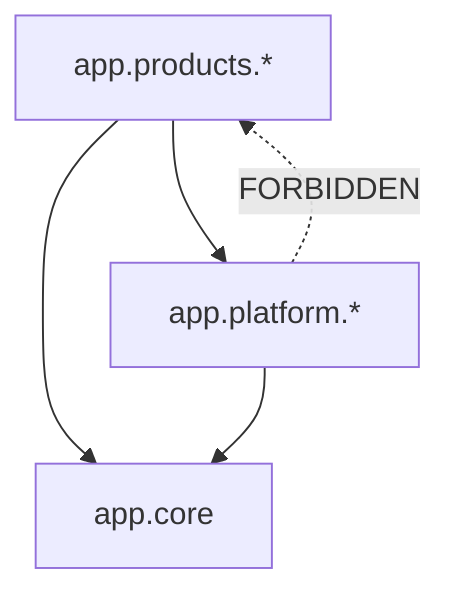

# Architecture Boundaries

Binding module-boundary rules for the S3K backend (task `P0-W01-AR-02`).
Authority: `docs/architecture/16-ARCHITECTURE-DECISION-RECORDS.md` —
ADR-001 (modular monolith), ADR-003 (Platform boundaries), ADR-004 (CRM
boundaries), ADR-007 (shared-schema tenancy).

These are not style preferences. The modular monolith only stays extractable
if the boundaries hold from the first commit.

## Layers

```
app/core/       Infrastructure: config, database, redis, logging, exceptions
app/platform/   Shared Platform: auth, organizations, authorization,
                documents, audit, notifications
app/products/   Products: crm/{accounts,contacts,leads,opportunities,
                activities,tasks,notes,dashboard}
```

## Allowed dependency directions



| From | May import | Must never import |
|------|-----------|-------------------|
| `app.core` | stdlib, third-party | `app.platform`, `app.products` |
| `app.platform.*` | `app.core`, other Platform modules' **services** | **any** `app.products.*` |
| `app.products.crm.*` | `app.core`, Platform **services**, sibling CRM **services** | other products, Platform internals |

## Rules

1. **Platform must never import a product.** No `from app.products...` may
   appear anywhere under `app/platform/`. Platform code that appears to need a
   CRM concept has a design error: invert it with a domain event (ADR-013) or a
   Platform-owned abstraction.
2. **Products consume Platform through service interfaces only.** Import
   `app.platform.<module>.service`. Never import another module's
   `repository.py` or `models.py`, and never query another module's tables
   directly.
3. **No CRM entity in the Platform layer.** `Account`, `Contact`, `Lead`,
   `Opportunity`, `Activity` and friends belong to CRM (ADR-004, ADR-008).
   Conversely, no Platform-specific column may be added to a CRM table.
4. **No microservices.** One deployable FastAPI application (ADR-001).
   Extraction is reconsidered only at the ADR-001 revisit trigger: CRM schema
   > 500 GB or > 15 backend engineers.
5. **One database, one schema, one migration history.** Platform and CRM share
   a PostgreSQL database with `organization_id` + RLS for isolation (ADR-007).
   Do not create a second database, a second `MetaData`, or per-module
   Alembic trees.
6. **Cross-module writes go through the owning service.** A module owns its
   tables. Reads that span modules use the other module's service or a
   dedicated read model, not a foreign query.
7. **Products do not import each other.** CRM must not import a future Books
   or Projects module. Cross-product flows go through Platform services or
   events.

## Module shape

Every business module under `app/platform/` and `app/products/` has the same
seven files, so any engineer can navigate any module:

| File | Responsibility |
|------|----------------|
| `router.py` | FastAPI routes; HTTP concerns only, no business rules |
| `service.py` | Use cases and business rules — **the module's public interface** |
| `repository.py` | Data access; the only layer that builds ORM queries |
| `schemas.py` | Pydantic v2 request/response contracts |
| `models.py` | SQLAlchemy 2.0 ORM models |
| `policies.py` | Authorization predicates per action (ADR-010) |
| `events.py` | Domain events published via the outbox (ADR-013) |

Call direction inside a module is strictly one-way:
`router → service → repository`. A router must never touch a repository, and a
repository must never call a service.

## Enforcement

- **Automated:** Ruff `flake8-tidy-imports` bans `app.products` as an import
  target (`pyproject.toml`, `[tool.ruff.lint.flake8-tidy-imports.banned-api]`),
  with an allowance for the product tree itself, and `ban-relative-imports`
  keeps every import path explicit and greppable.
- **Manual:** a PR that adds an import crossing a boundary in the wrong
  direction is rejected, not waived. Record any genuine exception as a new ADR.

Current state: the module tree is scaffolded and empty. Authentication,
organizations, RBAC, tenant context, RLS and all CRM business logic are
implemented in later tasks.
