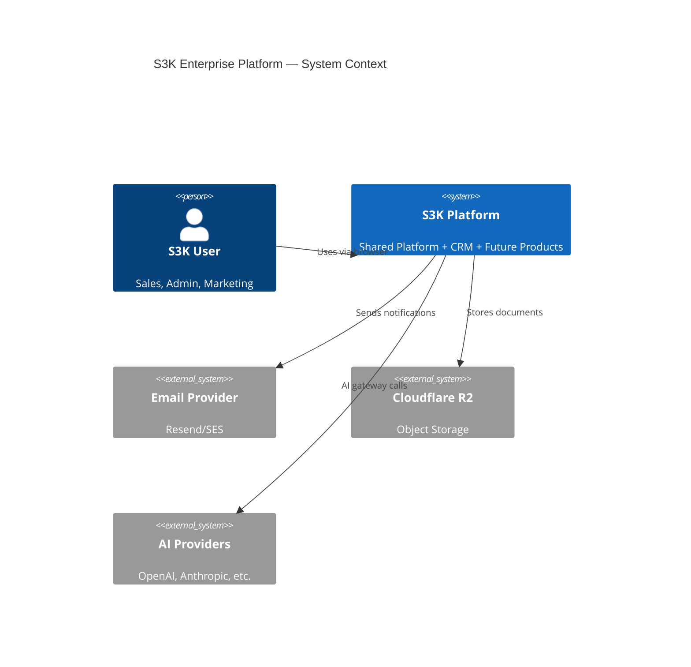
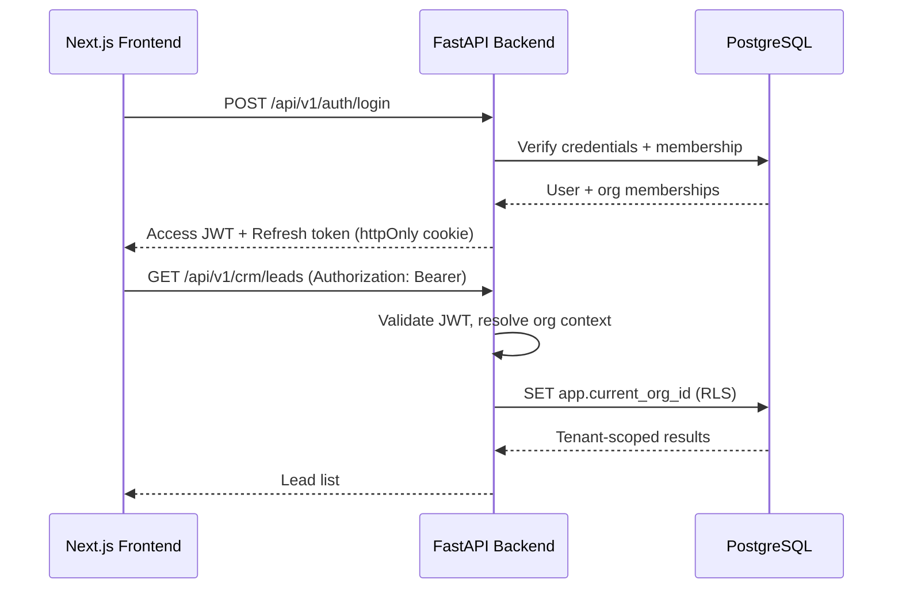

# Shared Platform Architecture

**Layer:** A — Shared Platform  
**Scope:** Identity, access, org management, cross-product infrastructure  
**Implementation phase:** Phase 0–1 (before CRM business data)

---

## Vision

The Shared Platform is the **common foundation** for all S3K enterprise products. It owns identity, tenancy, authorization, documents, audit, notifications, and integration infrastructure. No product-specific business logic belongs here.

```
┌──────────────────────────────────────────────────────────────┐
│                     S3K Shared Platform                       │
├──────────────┬──────────────┬──────────────┬─────────────────┤
│ Identity &   │ Organization │ Authorization│ Cross-Cutting    │
│ Access       │ Management   │              │ Services         │
├──────────────┼──────────────┼──────────────┼─────────────────┤
│ Auth         │ Organizations│ Roles        │ Documents        │
│ Sessions     │ Memberships  │ Permissions  │ Notifications    │
│ Users        │ Teams        │ Product Access│ Audit Logs       │
│ Profiles     │ Departments  │ Record-level │ Settings         │
│ MFA (roadmap)│ Org settings │ Field-level  │ Feature Flags    │
│ SSO (roadmap)│ Org switching│              │ Integrations     │
│ API Keys     │              │              │ Webhooks         │
│              │              │              │ Background Jobs  │
│              │              │              │ Shared AI Gateway│
└──────────────┴──────────────┴──────────────┴─────────────────┘
```

---

## Module Specifications

### Authentication

| Aspect | Design |
|--------|--------|
| **Protocol** | JWT access tokens (15 min, EdDSA) + rotating refresh tokens |
| **Password** | argon2-cffi hashing |
| **MFA** | TOTP + recovery codes (Phase 2 roadmap) |
| **SSO** | Deferred — WorkOS/Keycloak when enterprise customer requires |
| **Sessions** | Stored hashed refresh tokens in PostgreSQL; reuse detection revokes family |
| **Service accounts** | API key model with scoped permissions |

**Frontend evidence:** No auth exists. Admin security page (`admin/security/page.tsx`) shows MFA/password UI only.

### Users & Profiles

| Field | Source |
|-------|--------|
| email, name, status | Platform |
| department, team | Platform (org structure) |
| avatar, timezone, locale | UserProfile |
| CRM owner references | CRM links via `userId` FK |

**Canonical rule:** Platform `User` is the single identity. CRM "owner" fields reference `User.id`, not display names.

### Organizations & Tenancy

| Concept | Design |
|---------|--------|
| **Organization** | Top-level tenant boundary |
| **Membership** | User ↔ Organization with role assignments |
| **Org switching** | User may belong to multiple orgs; active org in session context |
| **Hierarchy** | Parent org support for enterprise (deferred MVP) |

**Tenant field:** `organizationId` on every tenant-scoped entity. Enforced via RLS.

### Teams & Departments

| Entity | Purpose |
|--------|---------|
| **Department** | Org structure (Sales, Marketing, Support) |
| **Team** | Working group within department |
| **TeamMembership** | User ↔ Team assignment |

**Frontend evidence:** `admin/users/page.tsx` — department/team as form fields; `admin/teams/page.tsx` — 3 mock teams.

### Authorization (RBAC + Product Access)

| Layer | Mechanism |
|-------|-----------|
| **Product access** | User must have `ProductAccess` for `s3k-crm` before any CRM API |
| **Module permissions** | Role → Permission matrix (V/C/E/D per module) |
| **Record-level** | Owner + team visibility rules |
| **Field-level** | Deferred except PII masking in AI context |

**Implementation:** Hand-rolled policy functions (per foundation plan). Not a rules engine at MVP scale.

**Frontend evidence:** `admin/roles/page.tsx` — modules: Dashboard, Leads, Accounts, Contacts, Opportunities, Meetings, Campaigns, Qualification, AI Features, Reports, Admin.

### Documents & File Storage

| Aspect | Design |
|--------|--------|
| **Storage** | Cloudflare R2 (S3-compatible) via boto3 |
| **Metadata** | Platform `Document`, `DocumentVersion`, `FileObject` |
| **Linking** | `DocumentLink` — typed association to product entities |
| **Upload** | Pre-signed URLs |
| **Access** | Org-scoped + product permission check |

See `09-SHARED-SERVICES-DOCUMENTATION.md`.

### Notifications

| Channel | MVP | Future |
|---------|-----|--------|
| In-app | Yes | — |
| Email | Resend/SES | — |
| SMS | MSG91 | — |
| WhatsApp | Meta Cloud API | — |

### Audit Logs

Every sensitive action logged: auth events, permission changes, CRUD on business entities, document access, AI invocations.

**Frontend evidence:** `admin/audit-logs/page.tsx` — columns: Timestamp, User, Action, Module, IP, Status.

### Shared AI Services

Gateway abstraction for model providers. CRM consumes via approved APIs only.

**Frontend evidence:** Full AI settings console exists but is static. Defer backend until CRM core is stable.

### Background Jobs

| Component | Choice (Foundation Plan) |
|-----------|-------------------------|
| Queue | ARQ (Redis-backed, async-native) |
| Scheduler | ARQ built-in cron |
| Use cases | Email, imports, report generation, AI batch jobs |

---

## Deployment Boundaries

| Boundary | MVP | Future Extraction |
|----------|-----|-------------------|
| Shared Platform + CRM | Single FastAPI monolith | Extract auth service first if needed |
| Database | Single PostgreSQL | Read replicas → reporting DB |
| File storage | R2 bucket per environment | Per-tenant prefixes |
| Redis | Shared instance | Dedicated for high-volume tenants |

---

## Future Extraction Strategy

1. **Phase 1–3:** Modular monolith with explicit module imports
2. **Trigger for auth extraction:** SSO enterprise requirement + dedicated team
3. **Trigger for CRM extraction:** Independent scaling or separate release cadence
4. **Always:** Cross-product references via API/events, never direct DB writes

---

## System Context Diagram



---

## Authentication Flow


