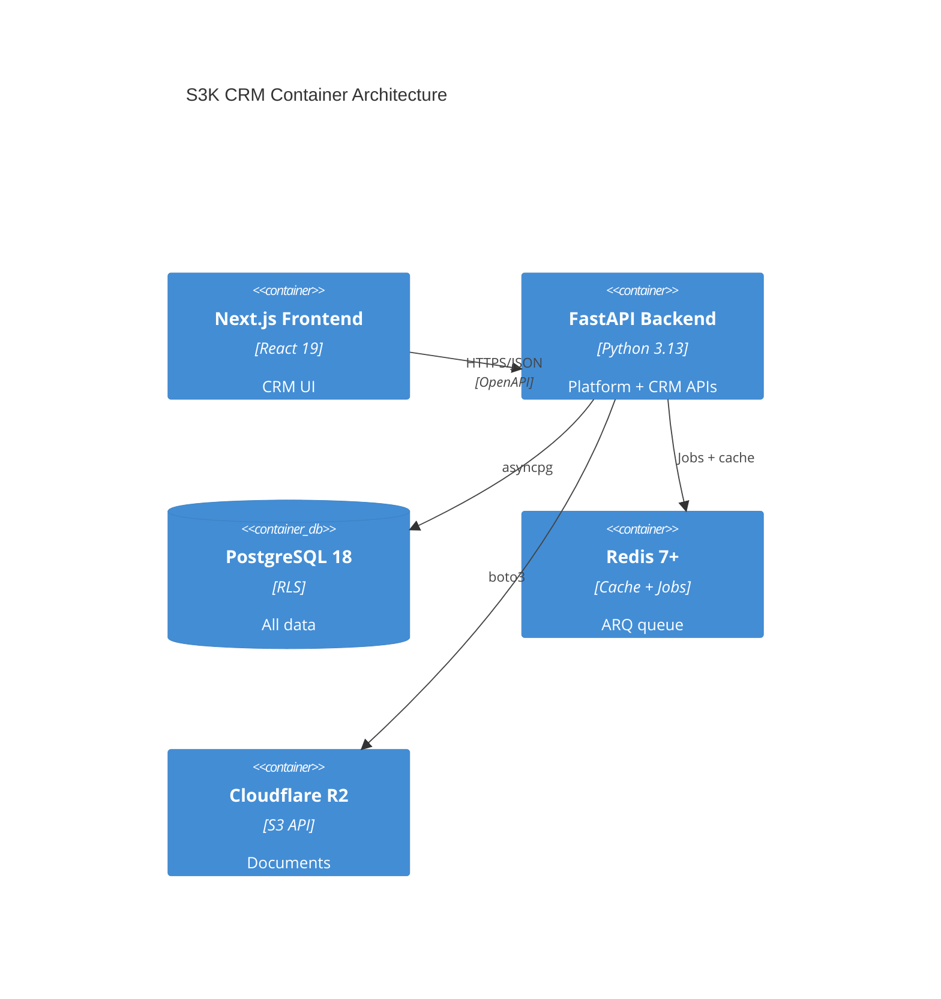

# S3K CRM Architecture

**Layer:** B — S3K CRM Product Domain  
**Scope:** Customer relationship management only  
**Dependencies:** Shared Platform (Phase 1 must complete first)

---

## CRM Product Boundary

S3K CRM owns the **customer relationship lifecycle** from lead acquisition through opportunity closure. It does **not** own finance, projects, contracts, HR, support tickets, or payroll.

### In Scope

| Module | Frontend Route | Status |
|--------|---------------|--------|
| Dashboard | `/dashboard` | Mock KPIs |
| Lead Sources | `/lead-sources` | Implemented UI |
| Leads | `/leads`, `/leads/[id]` | Implemented UI |
| Campaigns | `/campaigns`, `/campaigns/[id]` | Implemented UI |
| Meetings | `/meetings`, `/meetings/[id]` | Implemented UI |
| Accounts | `/accounts`, `/accounts/[id]` | Implemented UI |
| Contacts | `/contacts`, `/contacts/[id]` | Implemented UI |
| Opportunities | `/opportunities`, `/opportunities/[id]` | Implemented UI |
| Qualification | `/qualification`, `/qualification/[id]` | Implemented UI |
| Admin (CRM settings) | `/admin/crm-settings` | Partial UI |
| Reports | — | **Not implemented** (RBAC reference only) |
| Global Search | — | **Not implemented** (Cmd+K in starter only) |

### Explicit Exclusions

- Accounting, invoicing, payments → S3K Books
- Projects, milestones, time entries → S3K Projects
- Contracts, signatures → S3K Contracts
- Employees, leave, payroll → S3K HR
- Support tickets, SLAs → S3K Support
- Enterprise AI products → S3K AI (uses Shared AI Gateway)

---

## Canonical Terminology Decision

| Frontend Term | Canonical Backend Entity | Rationale |
|---------------|-------------------------|-----------|
| Account | `Account` | UI consistently uses Account routes/types |
| Customer (copy only) | — | Business language; maps to Account |
| Contact | `Contact` | Person linked to Account |
| Lead | `Lead` | Pre-conversion prospect |
| Qualification | `QualificationRecord` | BANT/MEDDICC assessment linked to Lead |

**Decision:** Do **not** create a separate `Customer` table. `Account` is the B2B customer organization entity.

---

## CRM Service Architecture

```
backend/
├── platform/                    # Shared Platform modules
│   ├── auth/
│   ├── organizations/
│   ├── authorization/
│   ├── documents/
│   ├── audit/
│   └── notifications/
└── products/
    └── crm/                     # CRM domain (strict boundary)
        ├── accounts/
        ├── contacts/
        ├── leads/
        ├── lead_sources/
        ├── campaigns/
        ├── qualifications/
        ├── opportunities/
        ├── activities/
        ├── meetings/
        ├── tasks/
        ├── notes/
        ├── dashboard/
        ├── reports/
        └── search/
```

Each CRM module contains: `router.py`, `service.py`, `repository.py`, `schemas.py`, `policies.py`, `events.py`.

---

## CRM Data Ownership

| Entity | Owner | Cross-Product Reference |
|--------|-------|------------------------|
| Account | CRM | Books/Projects/Contracts read via API |
| Contact | CRM | Same |
| Lead | CRM | — |
| LeadSource | CRM | — |
| Campaign | CRM | — |
| QualificationRecord | CRM | — |
| Opportunity | CRM | Projects may reference via API |
| Activity | CRM | — |
| Meeting | CRM | Activity subtype |
| Task | CRM | — |
| Note | CRM | — |
| Pipeline/Stage | CRM | — |

---

## CRM API Architecture

**Base path:** `/api/v1/crm/`  
**Auth:** Bearer JWT + `X-Organization-Id` header (validated against membership)  
**Format:** REST JSON, OpenAPI 3.1 auto-generated

Example endpoints:

```
GET    /api/v1/crm/accounts
POST   /api/v1/crm/accounts
GET    /api/v1/crm/accounts/{id}
PATCH  /api/v1/crm/accounts/{id}
DELETE /api/v1/crm/accounts/{id}

GET    /api/v1/crm/leads
POST   /api/v1/crm/leads/{id}/convert

GET    /api/v1/crm/opportunities
PATCH  /api/v1/crm/opportunities/{id}/stage

GET    /api/v1/crm/dashboard/summary
GET    /api/v1/crm/search?q=
```

Full inventory: `11-API-AND-EVENT-ARCHITECTURE.md`.

---

## CRM Events

| Event | Trigger |
|-------|---------|
| `crm.lead.created` | Lead POST |
| `crm.lead.qualified` | Qualification status → Qualified |
| `crm.lead.converted` | Lead conversion |
| `crm.opportunity.stage_changed` | Stage PATCH |
| `crm.opportunity.won` | Stage → Closed Won |
| `crm.opportunity.lost` | Stage → Closed Lost |
| `crm.account.created` | Account POST |

Consumers (future): S3K Projects (on opportunity.won), S3K Books (on account.created).

---

## Activity Model Design

**Recommendation:** Unified `Activity` table with `type` enum; `Meeting` extends with meeting-specific fields.

```
Activity (base)
├── type: CALL | EMAIL | MEETING | NOTE | TASK | OTHER
├── relatedEntityType + relatedEntityId (polymorphic link)
├── dueDate, completedAt, outcome
└── Meeting (1:1 extension when type=MEETING)
    ├── meetingType: ONLINE | IN_PERSON | CALL
    ├── location, meetingLink
    ├── startTime, endTime
    └── participants[]
```

**Task:** Separate `Task` entity (frontend has dedicated TaskCard on dashboard). Tasks can optionally create linked Activity records.

---

## Frontend Integration Plan

| Step | Action |
|------|--------|
| 1 | Generate TypeScript client from OpenAPI spec |
| 2 | Create `features/shared/services/api-client.ts` |
| 3 | Extract types from page files → `features/shared/types/crm.ts` |
| 4 | Replace `INITIAL_DATA` with React Query/SWR hooks |
| 5 | Wire `[id]` pages to `GET /crm/{entity}/{id}` |
| 6 | Add loading/error states (currently missing) |
| 7 | Replace string owners with User ID + display name from API |

---

## Container Diagram



---

## Shared Platform Dependencies

CRM cannot function without:

1. Authentication + session management
2. Organization + membership resolution
3. RBAC + product access (`s3k-crm` entitlement)
4. Audit logging
5. Document storage (for attachments)
6. Notification delivery (for task/reminder alerts)
