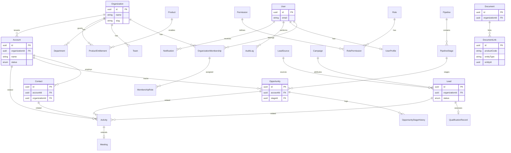
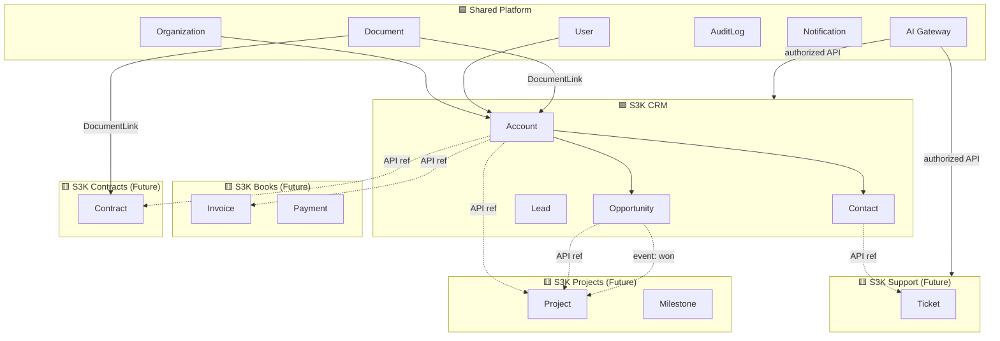
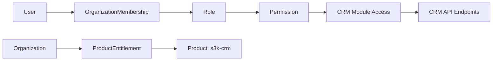
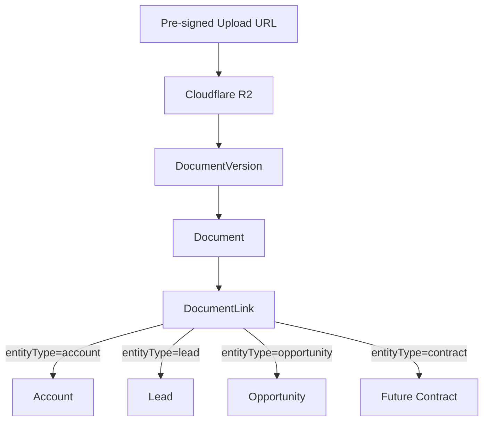
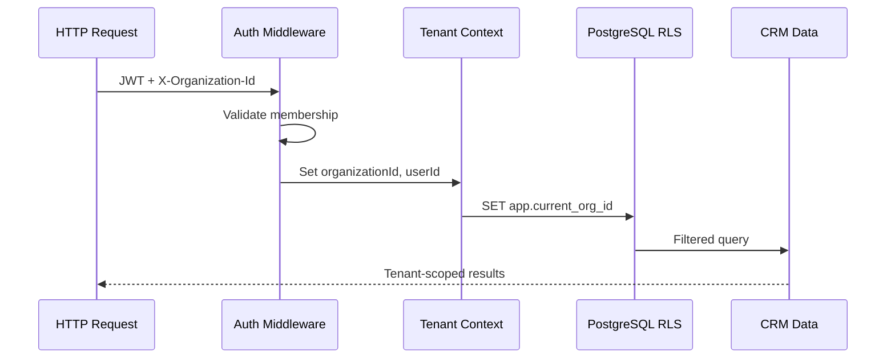

# Cross-Product Entity Relationship Diagram

**Purpose:** Visualize ownership, direct DB relationships, API references, and event-based links across S3K products.

---

## Legend

| Symbol | Meaning |
|--------|---------|
| Solid line | Direct FK within same database |
| Dashed line | API reference (stable UUID, no FK) |
| Dotted line | Event-driven projection |
| 🟦 | Shared Platform ownership |
| 🟩 | S3K CRM ownership |
| 🟨 | Future product ownership |

---

## Platform + CRM Core ERD

---

## Cross-Product Reference Diagram

---

## Product Access Relationships

---

## Document Linking Model

**Security:** DocumentLink creation requires product permission check on target entity.

---

## Tenant Ownership Flow

---

## Relationship Type Summary

| From | To | Type | Access Method |
|------|-----|------|---------------|
| Organization | Account | Direct FK | Same DB |
| Account | Contact | Direct FK | Same DB |
| Account | Opportunity | Direct FK | Same DB |
| CRM Account | Books Invoice | API ref | `accountId` UUID validation |
| CRM Opportunity | Projects Project | API ref + event | `crm.opportunity.won` |
| CRM Account | Contracts Contract | API ref | REST lookup |
| Platform Document | CRM Account | DocumentLink | Platform service |
| Platform User | CRM Lead.owner | Direct FK | Same DB |
| S3K AI | CRM entities | API only | Never direct DB |
