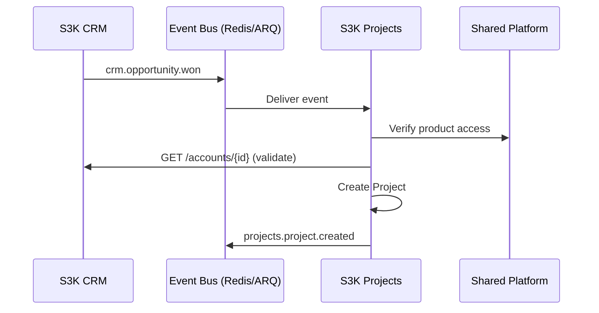

# Future Product Integration Strategy

**Scope:** Architecture and integration planning only. No implementation in current CRM phase.

---

## Integration Principles

1. **Source of truth** — Each product owns its domain entities
2. **No cross-product DB writes** — Products communicate via APIs and events
3. **Stable UUIDs** — Cross-product references use immutable entity IDs
4. **Eventual consistency** — Acceptable for non-critical cross-product projections
5. **Product entitlements** — User must have product access before cross-product API calls
6. **Fail gracefully** — CRM functions if Books/Projects are unavailable

---

## Reference Strategy Comparison

| Approach | When to Use | Example |
|----------|-------------|---------|
| **Direct FK (same DB)** | Same product, same schema | Contact → Account |
| **Stable ID, no FK** | Future product, same deployment | CRM Account ID stored in Books |
| **API validation** | Cross-product create/update | Projects validates Account exists |
| **Event projection** | Read-heavy cross-product views | Books caches Account name |
| **Integration record** | External system sync | Salesforce Account → CRM Account |
| **Read model / replica** | Analytics, search across products | Reporting DB |

**MVP recommendation:** Stable UUID + API validation. Add event projections when second product ships.

---

## Shared Entity Source-of-Truth Rules

| Entity | Source of Truth | Read | Write |
|--------|----------------|------|-------|
| Organization | Platform | All products | Platform only |
| User | Platform | All products | Platform only |
| Account | CRM | Books, Projects, Contracts, Support | CRM only |
| Contact | CRM | Books, Support | CRM only |
| Document | Platform | All products | Platform (via product APIs) |
| Opportunity | CRM | Projects | CRM only |
| Invoice | Books | CRM (read via API) | Books only |
| Project | Projects | CRM (read via API) | Projects only |

---

## S3K Books Integration

**Consumes:** Organization, User, Account, Contact, Document, Audit, ProductAccess  
**Owns:** Accounts (ledger), JournalEntry, Invoice, Payment, Tax, Expense, FinancialPeriod

| Integration Point | Method |
|-------------------|--------|
| Customer billing | Books reads Account via `GET /api/v1/crm/accounts/{id}` |
| Invoice creation | Books publishes `books.invoice.created`; CRM may display link (future) |
| Account deactivation | CRM publishes `crm.account.archived`; Books blocks new invoices |

**Failure handling:** If CRM API unavailable, Books uses cached Account projection (max 24h stale).

---

## S3K Projects Integration

**Consumes:** Organization, User, Team, Account, Contact, Opportunity, Document, Notifications

| Integration Point | Method |
|-------------------|--------|
| Project from won deal | Event: `crm.opportunity.won` → Projects creates project |
| Customer context | API: `GET /crm/accounts/{id}`, `GET /crm/contacts/{id}` |
| Document sharing | Platform DocumentLink with `productCode: s3k-projects` |

**Do not:** Add project fields to Opportunity table. Use `externalReference` JSON if link needed:

```json
{ "productCode": "s3k-projects", "entityType": "project", "entityId": "uuid" }
```

---

## S3K Contracts Integration

**Consumes:** Organization, User, Account, Contact, Opportunity, Document, Audit

| Integration Point | Method |
|-------------------|--------|
| Contract from opportunity | API trigger or `crm.opportunity.stage_changed` (Contract Review) |
| Signed documents | Platform Document + DocumentLink |
| Renewal alerts | Contracts publishes events; CRM dashboard widget (future) |

---

## S3K HR Integration

**Consumes:** Organization, User, Department, Team, Document, Notifications  
**Owns:** Employee, EmploymentRecord, Leave, Attendance, Performance, Recruitment

| Integration Point | Method |
|-------------------|--------|
| User provisioning | Platform UserCreated event → HR creates Employee record |
| Org structure | Shared Department/Team entities |

**Boundary:** HR Employee ≠ CRM Contact. Link only via explicit `platformUserId`.

---

## S3K Support Integration

**Consumes:** Organization, User, Account, Contact, Document, Notifications  
**Owns:** Ticket, Queue, SLA, Escalation, SupportKnowledge

| Integration Point | Method |
|-------------------|--------|
| Ticket from contact | API: validate Contact exists in CRM |
| Customer context panel | API: Account + Contact + recent Activities |
| Account health | CRM Account healthScore exposed via API |

---

## S3K AI Integration

**All access via Shared AI Gateway:**

```
User Request → AI Gateway → Permission Check → Product API (retrieval) → Model → Response
                                    ↓
                              AIUsageLog + AuditLog
```

| Rule | Detail |
|------|--------|
| No direct DB access | AI retrieves via approved product APIs |
| Tenant isolation | Retrieval filtered by organizationId + permissions |
| Product isolation | CRM AI cannot read Books data without entitlement |
| PII redaction | Applied before model call |
| Human approval | Required for automated actions (future) |

---

## Domain Event Catalog (Cross-Product)

### Platform Events (Consumers: All Products)

| Event | Payload Keys |
|-------|-------------|
| `platform.user.created` | userId, email |
| `platform.organization.created` | organizationId, name |
| `platform.product_access.granted` | organizationId, productCode |
| `platform.document.uploaded` | documentId, organizationId, links[] |

### CRM Events (Consumers: Projects, Books, Contracts, AI)

| Event | Payload Keys |
|-------|-------------|
| `crm.account.created` | accountId, organizationId, name |
| `crm.account.archived` | accountId, organizationId |
| `crm.lead.converted` | leadId, accountId, contactId |
| `crm.opportunity.won` | opportunityId, accountId, dealValue |
| `crm.opportunity.stage_changed` | opportunityId, fromStage, toStage |

---

## Product Onboarding Checklist (Future)

1. Register Product in Platform (`Product` table)
2. Define Permission modules
3. Create default Role templates
4. Define API namespace (`/api/v1/{product}/`)
5. Register event subscriptions
6. Document shared entity consumption
7. Implement product entitlement check middleware
8. Add to organization provisioning flow

---

## Consistency Requirements

| Relationship | Consistency | Max Staleness |
|-------------|-------------|---------------|
| CRM Account name in Books | Eventual | 24 hours |
| Opportunity → Project creation | Strong (sync API) | 0 |
| User deactivation → all products | Eventual | 5 minutes |
| Document access | Strong | 0 |

---

## Future Product Integration Flow


