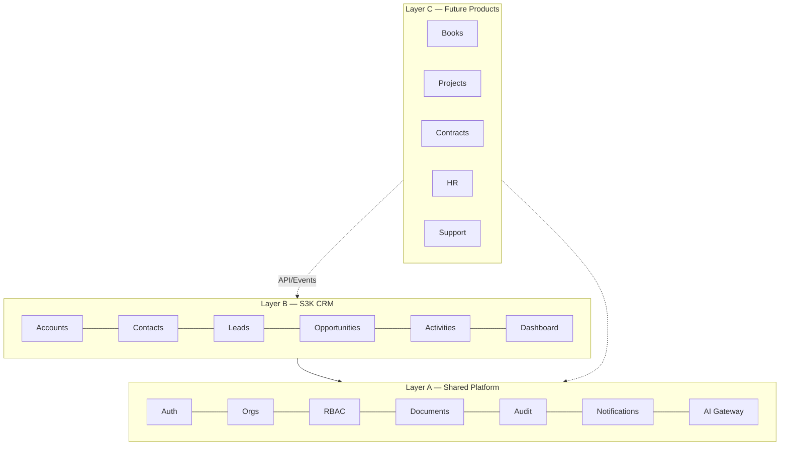

# Product Boundary Documentation

---

## Shared Platform

| Aspect | Detail |
|--------|--------|
| **Purpose** | Common identity, tenancy, authorization, and infrastructure for all S3K products |
| **Owned entities** | User, Organization, Membership, Team, Department, Role, Permission, Product, ProductEntitlement, Document, AuditLog, Notification, Integration, Webhook, AIUsageLog |
| **Shared entities consumed** | None (is the foundation) |
| **APIs exposed** | `/api/v1/auth/*`, `/api/v1/users/*`, `/api/v1/organizations/*`, `/api/v1/documents/*`, `/api/v1/notifications/*`, `/api/v1/audit/*` |
| **Events published** | UserCreated, OrganizationCreated, ProductAccessGranted, DocumentUploaded |
| **Permissions** | Platform admin, org admin |
| **Product access** | Controls which products an org/user can access |
| **Database** | `platform` PostgreSQL schema |
| **Deployment** | Part of modular monolith (extractable later) |
| **Exclusions** | No CRM, finance, project, or HR business logic |

---

## S3K CRM

| Aspect | Detail |
|--------|--------|
| **Purpose** | Customer relationship management — lead-to-opportunity lifecycle |
| **Owned entities** | Account, Contact, Lead, LeadSource, Campaign, QualificationRecord, Opportunity, Pipeline, Activity, Meeting, Task, Note, CRMTag, CRMCustomField |
| **Shared entities consumed** | User, Organization, Document, Notification, AuditLog |
| **APIs consumed** | Platform auth, users, documents, notifications, audit |
| **APIs exposed** | `/api/v1/crm/*` |
| **Events published** | LeadCreated, LeadConverted, OpportunityStageChanged, OpportunityWon, AccountCreated |
| **Events consumed** | UserDeactivated (reassign records), ProductAccessRevoked |
| **Permissions** | CRM modules per RBAC matrix in `admin/roles/page.tsx` |
| **Product access** | Requires `s3k-crm` entitlement |
| **Database** | `crm` PostgreSQL schema |
| **Exclusions** | No invoicing, projects, contracts, HR, support tickets, payroll |

---

## S3K Books (Future — Architecture Only)

| Aspect | Detail |
|--------|--------|
| **Purpose** | Accounting, invoicing, payments |
| **Owned entities** | LedgerAccount, JournalEntry, Invoice, Payment, Tax, Expense, FinancialPeriod |
| **Consumes** | Organization, User, Account (CRM), Contact, Document, Audit |
| **APIs consumed** | `GET /crm/accounts/{id}`, Platform documents |
| **APIs exposed** | `/api/v1/books/*` |
| **Events consumed** | `crm.account.created`, `crm.account.archived` |
| **Events published** | `books.invoice.created`, `books.payment.received` |
| **Exclusions** | Does not own CRM Account; references via API |

---

## S3K Projects (Future)

| Aspect | Detail |
|--------|--------|
| **Purpose** | Project delivery management |
| **Owned entities** | Project, Milestone, Deliverable, ProjectTask, Resource, Risk, Issue, TimeEntry |
| **Consumes** | Organization, User, Team, Account, Contact, Opportunity, Document |
| **Events consumed** | `crm.opportunity.won` |
| **Events published** | `projects.project.created`, `projects.milestone.completed` |
| **Exclusions** | No opportunity/project fields in CRM tables |

---

## S3K Contracts (Future)

| Aspect | Detail |
|--------|--------|
| **Purpose** | Contract lifecycle management |
| **Owned entities** | Contract, ContractVersion, Clause, Approval, Obligation, Renewal, Signature |
| **Consumes** | Account, Contact, Opportunity, Document, Audit |
| **Events consumed** | `crm.opportunity.stage_changed` (Contract Review stage) |
| **Exclusions** | No contract data in CRM Account/Opportunity |

---

## S3K HR (Future)

| Aspect | Detail |
|--------|--------|
| **Purpose** | Human resources management |
| **Owned entities** | Employee, EmploymentRecord, Leave, Attendance, Performance, Recruitment |
| **Consumes** | Organization, User, Department, Team, Document |
| **Events consumed** | `platform.user.created` |
| **Exclusions** | Employee ≠ CRM Contact |

---

## S3K Support (Future)

| Aspect | Detail |
|--------|--------|
| **Purpose** | Customer support ticketing |
| **Owned entities** | Ticket, Queue, SLA, Comment, Escalation, SupportKnowledge |
| **Consumes** | Account, Contact, Document, Notifications |
| **APIs consumed** | CRM Account/Contact lookup |
| **Exclusions** | Tickets not stored in CRM |

---

## S3K AI (Future)

| Aspect | Detail |
|--------|--------|
| **Purpose** | Cross-product AI capabilities |
| **Owned entities** | PromptRegistry, AgentConfig, KnowledgeSource (platform-level) |
| **Consumes** | Authorized data from all products via APIs |
| **Access control** | Tenant + product + user permissions |
| **Exclusions** | No direct database access to product schemas |

---

## Product Boundary Rules

### Shared Platform Rules

Entity belongs in Platform when:
- Needed by multiple products
- Represents identity or tenant ownership
- Controls platform access
- Provides cross-product infrastructure

### CRM Rules

Entity belongs in CRM when:
- Supports customer relationship management specifically
- Lifecycle owned by CRM
- Other products reference via API/events

### Future Product Rules

- Own domain entities independently
- Use Platform identities
- Never write to another product's tables
- Publish events for cross-product updates

---

## Module Boundary Diagram

