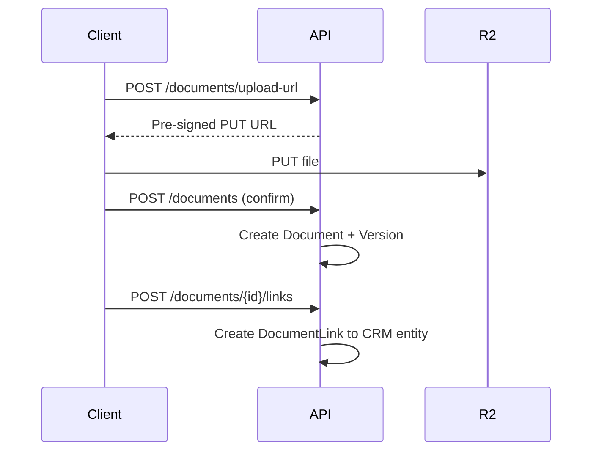
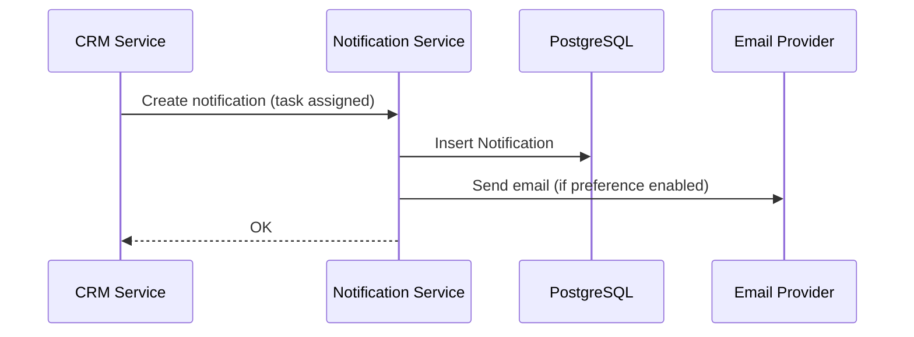
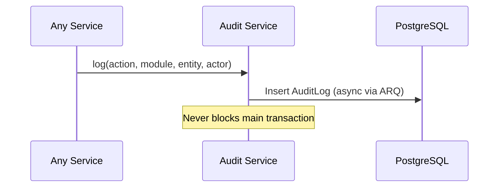

# Shared Services Documentation

---

## Authentication

| Aspect | Detail |
|--------|--------|
| **Purpose** | Verify identity, issue tokens, manage sessions |
| **Consumers** | All products |
| **API** | `POST /auth/login`, `POST /auth/refresh`, `POST /auth/logout`, `POST /auth/forgot-password` |
| **Data model** | User, Session (see `04-SHARED-PRISMA-SCHEMA.md`) |
| **Authorization** | Public endpoints for login; authenticated for refresh/logout |
| **Events** | `platform.user.login`, `platform.user.login_failed` |
| **Scale** | 10K concurrent sessions |
| **Failure** | Lockout after N failed attempts; audit all failures |
| **Audit** | All auth events logged |

---

## Users

| Aspect | Detail |
|--------|--------|
| **Purpose** | Platform identity management |
| **Consumers** | All products; CRM uses for owner/assignment fields |
| **API** | `GET/POST/PATCH /users`, `GET /users/{id}` |
| **Authorization** | Org admin for CRUD; self-read for profile |
| **Frontend evidence** | `admin/users/page.tsx` — 5 mock users |

---

## Organizations

| Aspect | Detail |
|--------|--------|
| **Purpose** | Tenant boundary |
| **API** | `GET/POST/PATCH /organizations`, `POST /organizations/{id}/switch` |
| **Authorization** | Platform admin creates; org admin manages settings |
| **Tenant rules** | All business data scoped to active organization |

---

## Teams & Departments

| Aspect | Detail |
|--------|--------|
| **Purpose** | Org structure for assignment and visibility |
| **API** | `GET/POST/PATCH /teams`, `/departments` |
| **Frontend evidence** | `admin/teams/page.tsx`, user form department/team fields |

---

## Roles & Permissions

| Aspect | Detail |
|--------|--------|
| **Purpose** | RBAC enforcement |
| **Implementation** | Hand-rolled policy functions |
| **API** | `GET/POST/PATCH /roles`, `GET /permissions` |
| **Modules (CRM)** | dashboard, leads, accounts, contacts, opportunities, meetings, campaigns, qualification, ai_features, reports, admin |
| **Actions** | VIEW, CREATE, EDIT, DELETE, EXPORT, ADMIN |
| **Frontend evidence** | `admin/roles/page.tsx` — V/C/E/D matrix |

---

## Product Access

| Aspect | Detail |
|--------|--------|
| **Purpose** | Control which products an org can use |
| **API** | `GET /organizations/{id}/entitlements`, `POST /entitlements` |
| **Enforcement** | Middleware checks `ProductEntitlement` before product API access |
| **Rule** | CRM user ≠ Books user automatically |

---

## Documents & File Storage

| Aspect | Detail |
|--------|--------|
| **Purpose** | Centralized file management |
| **Storage** | Cloudflare R2 via boto3 |
| **API** | `POST /documents/upload-url`, `POST /documents`, `GET /documents/{id}/download-url`, `POST /documents/{id}/links` |
| **Upload flow** | Pre-signed URL → client upload → confirm → create Document + DocumentLink |
| **Security** | MIME validation, size limits, org-scoped keys, malware scan (Phase 3) |
| **Versioning** | DocumentVersion table |
| **Scale** | Millions of files; R2 prefix per org |

---

## Notifications

| Aspect | Detail |
|--------|--------|
| **Purpose** | In-app and external notifications |
| **API** | `GET /notifications`, `PATCH /notifications/{id}/read` |
| **Channels** | In-app (MVP), Email (Phase 2), SMS/WhatsApp (India market) |
| **Consumers** | CRM task reminders, assignment alerts |

---

## Audit Logs

| Aspect | Detail |
|--------|--------|
| **Purpose** | Compliance and security trail |
| **API** | `GET /audit-logs` (admin only, paginated) |
| **Retention** | 2 years MVP; partitioned by month at scale |
| **Frontend evidence** | `admin/audit-logs/page.tsx` |

---

## Settings & Feature Flags

| Aspect | Detail |
|--------|--------|
| **Purpose** | Org-level configuration and gradual rollout |
| **API** | `GET/PATCH /organizations/{id}/settings`, `GET /feature-flags` |
| **CRM settings** | Pipeline config, lead scoring toggles (future) |

---

## API Gateway

| Aspect | Detail |
|--------|--------|
| **Purpose** | Unified entry point, rate limiting, auth |
| **MVP** | FastAPI app with middleware (no separate gateway service) |
| **Future** | Kong/Envoy when multi-service deployment |

---

## Integrations & Webhooks

| Aspect | Detail |
|--------|--------|
| **Purpose** | External system connectivity |
| **API** | `GET/POST /integrations`, `POST /webhooks` |
| **Phase** | Phase 4 |
| **Frontend evidence** | `admin/integrations/page.tsx` — 6 mock integrations |

---

## Background Jobs

| Aspect | Detail |
|--------|--------|
| **Purpose** | Async processing |
| **Engine** | ARQ + Redis |
| **Jobs** | Email send, import processing, report generation, metric aggregation, webhook delivery |
| **Tenant context** | organizationId in every job payload |

---

## Shared AI Services

| Aspect | Detail |
|--------|--------|
| **Purpose** | Model abstraction, usage tracking, policy enforcement |
| **Phase** | Deferred until CRM core stable |
| **Frontend evidence** | Full AI settings UI (static) — 10 pages under `/ai-settings/` |
| **Components** | AI gateway, prompt registry, usage limits, PII redaction, tenant-isolated retrieval |

---

## Notification Flow

---

## Audit Event Flow

