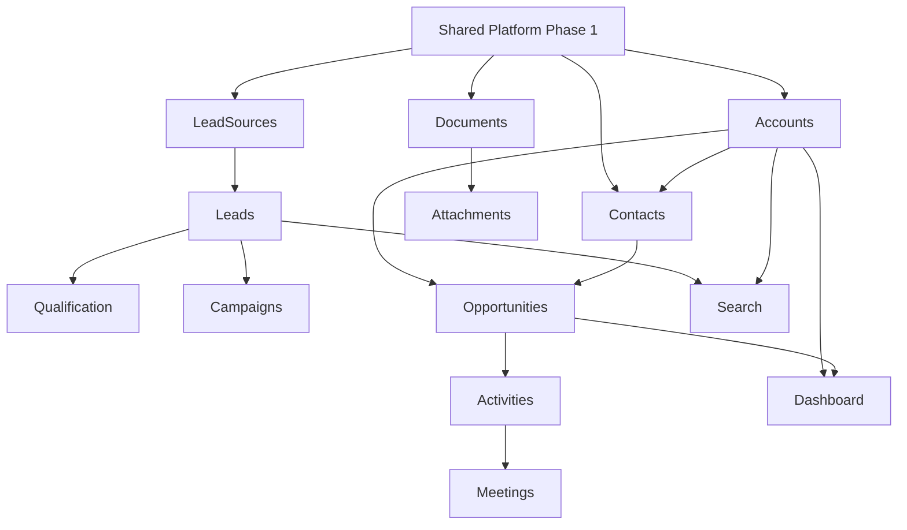

# CRM Module-by-Module Backend Plan

**Format:** Each module follows the 18-section structure from the planning brief.  
**Evidence:** Frontend paths under `frontend/app/(crm)/`.

---

## Module 1 — Accounts (Customers)

### 1. Purpose
Manage B2B customer organizations — the central entity for contacts, opportunities, and pipeline value.

### 2. Frontend Evidence
- List: `frontend/app/(crm)/accounts/page.tsx`
- Detail: `frontend/app/(crm)/accounts/[id]/page.tsx`
- Nav: `config/crm-navigation.ts` → `/accounts`

### 3. Product Ownership
**S3K CRM** — consumed by future Books/Projects/Contracts via API.

### 4. Functional Requirements
- CRUD accounts with tenant scoping
- Search, filter by industry/status
- Assign owner (User FK)
- Track health score, pipeline aggregates
- Archive (soft delete)
- Duplicate detection by name/domain
- Import/export CSV
- Activity timeline on detail page
- Link contacts, opportunities

### 5. Data Model
See `Account` in `05-CRM-PRISMA-SCHEMA.md`.

### 6. Prisma Design
`Account` with `organizationId`, `ownerId`, `AccountStatus` enum.

### 7. API Design

| Method | Path | Permission |
|--------|------|------------|
| GET | `/api/v1/crm/accounts` | accounts:VIEW |
| POST | `/api/v1/crm/accounts` | accounts:CREATE |
| GET | `/api/v1/crm/accounts/{id}` | accounts:VIEW + record access |
| PATCH | `/api/v1/crm/accounts/{id}` | accounts:EDIT |
| DELETE | `/api/v1/crm/accounts/{id}` | accounts:DELETE (soft) |
| GET | `/api/v1/crm/accounts/{id}/timeline` | accounts:VIEW |

**Pagination:** cursor-based, `?cursor=&limit=50`  
**Filters:** `status`, `industry`, `ownerId`, `search`  
**Idempotency:** `Idempotency-Key` header on POST

### 8. Business Rules
- Name required; warn on duplicate name in org
- Cannot hard-delete if open opportunities exist
- Status transitions: Active ↔ At Risk ↔ Onboarding; Active → Churned

### 9. Authorization
- View: role permission + owner/team visibility
- Create/Edit: role permission
- Delete: admin or owner with DELETE permission
- Export: EXPORT permission

### 10. Events
- Publish: `crm.account.created`, `crm.account.updated`, `crm.account.archived`
- Consume: `platform.user.deactivated` (reassign owner)

### 11. Background Jobs
- Aggregate open opportunities / pipeline value (nightly)
- Import batch processing

### 12. Security
- Tenant isolation via RLS
- PII in address fields — mask in audit logs

### 13. Testing
- Unit: validation, status transitions
- Integration: CRUD with RLS
- Auth: permission matrix per role
- Tenant: cross-org access denied

### 14. Frontend Integration
Replace `INITIAL_DATA` in `accounts/page.tsx` with `useAccounts()` hook from generated API client.

### 15. Dependencies
Platform: User, Organization, Audit, Document

### 16. MVP Scope
CRUD, search, filter, owner assignment, soft delete, basic timeline

### 17. Deferred
Merge, duplicate merge UI, hierarchy, territory management

### 18. Acceptance Criteria
- [ ] All CRUD operations persist to PostgreSQL
- [ ] Tenant isolation verified by integration tests
- [ ] Frontend list/detail pages use API
- [ ] `[id]` route loads correct account by ID

---

## Module 2 — Contacts

### 2. Frontend Evidence
- `frontend/app/(crm)/contacts/page.tsx`, `contacts/[id]/page.tsx`

### 4. Functional Requirements
- CRUD with accountId FK (replace string `account` field)
- Primary contact designation per account
- Search by name, email, job title
- Filter by account, status

### 7. Key APIs
`GET/POST/PATCH/DELETE /api/v1/crm/contacts`

### 8. Business Rules
- Email unique per organization (soft warning if duplicate)
- One primary contact per account

### 16. MVP Scope
CRUD, account linking, search, filter

### 17. Deferred
Communication preference automation, LinkedIn sync

---

## Module 3 — Leads

### 2. Frontend Evidence
- `frontend/app/(crm)/leads/page.tsx` — table + kanban views
- `leads/[id]/page.tsx`

### 4. Functional Requirements
- CRUD, kanban by status
- Lead source FK
- Owner assignment
- Conversion workflow → Account + Contact
- AI score field (stored, computed externally later)

### 7. Key APIs
| Method | Path | Notes |
|--------|------|-------|
| POST | `/crm/leads/{id}/convert` | Creates Account + Contact, sets status CONVERTED |

### 8. Business Rules
- Status pipeline: New → Contacted → Qualified → ... → Converted/Lost
- Converted leads are immutable (except notes)

### 10. Events
`crm.lead.created`, `crm.lead.converted`

---

## Module 4 — Lead Sources

### 2. Frontend Evidence
- `frontend/app/(crm)/lead-sources/page.tsx` — 10 mock sources

### 4. Functional Requirements
- CRUD sources with category
- Track lead count (computed)
- Active/inactive status

### 16. MVP Scope
Full CRUD — simple reference entity

---

## Module 5 — Campaigns

### 2. Frontend Evidence
- `frontend/app/(crm)/campaigns/page.tsx` — cards + table views
- `campaigns/[id]/page.tsx` — relationships, AI insights

### 4. Functional Requirements
- CRUD campaigns
- Campaign members (leads/contacts)
- Performance metrics (computed by jobs)
- Attribution to leads

### 16. MVP Scope
CRUD, member linking, basic metrics

### 17. Deferred
ROI calculation automation, multi-touch attribution

---

## Module 6 — Qualification

### 2. Frontend Evidence
- `frontend/app/(crm)/qualification/page.tsx` — queue view
- `qualification/[id]/page.tsx` — BANT/MEDDICC/CHAMP frameworks

### 4. Functional Requirements
- QualificationRecord per Lead
- Framework-specific checklist (JSON)
- Status workflow: Unqualified → In Review → Qualified/Disqualified
- Convert action from qualification workspace

### 8. Business Rules
- One qualification record per lead
- Qualified status triggers `crm.lead.qualified` event

---

## Module 7 — Opportunities

### 2. Frontend Evidence
- `frontend/app/(crm)/opportunities/page.tsx` — 7 stages, kanban
- Pipeline stages differ from dashboard — **normalize to Pipeline/PipelineStage tables**

### 4. Functional Requirements
- CRUD with pipeline stage management
- Stage history tracking
- Win/loss reasons
- Deal value, probability, forecast category
- Link account, primary contact

### 7. Key APIs
| Method | Path |
|--------|------|
| PATCH | `/crm/opportunities/{id}/stage` |
| POST | `/crm/opportunities/{id}/close-won` |
| POST | `/crm/opportunities/{id}/close-lost` |

### 10. Events
`crm.opportunity.stage_changed`, `crm.opportunity.won`, `crm.opportunity.lost`

---

## Module 8 — Activities & Meetings

### 2. Frontend Evidence
- `frontend/app/(crm)/meetings/page.tsx`
- Dashboard `ActivityItem` component

### 4. Functional Requirements
- Unified Activity model with Meeting extension
- Link to account, contact, lead, opportunity
- Participants (users + external contacts)
- Calendar view (deferred — placeholder in frontend)

### 5. Data Model
Activity + Meeting (see `05-CRM-PRISMA-SCHEMA.md`)

### 16. MVP Scope
CRUD activities and meetings, timeline display

### 17. Deferred
Calendar sync (Google/Outlook), email logging

---

## Module 9 — Tasks

### 2. Frontend Evidence
- Dashboard `TaskCard` in `dashboard/page.tsx`
- No dedicated `/tasks` route — **add route in Phase 3**

### 4. Functional Requirements
- CRUD tasks with priority, status, due date
- Assignment to user
- Link to CRM entity
- Completion tracking

### 11. Background Jobs
Due-date reminder notifications via ARQ

---

## Module 10 — Notes

### 4. Functional Requirements
- Plain text notes (rich text deferred)
- Author tracking, visibility (team/private)
- Link to any CRM entity
- Edit history (deferred)

### 16. MVP Scope
Create, read, list by entity

---

## Module 11 — Attachments

### 4. Functional Requirements
Use Shared Platform Document service exclusively.

### 7. Key APIs
Via Platform: upload-url → confirm → link to CRM entity

### 12. Security
Permission check on linked entity before download

---

## Module 12 — Dashboard

### 2. Frontend Evidence
- `frontend/app/(crm)/dashboard/page.tsx`
- Hardcoded KPIs: 42 leads, 18 qualified, 27 opps, $1.74M pipeline

### 4. Functional Requirements
- Aggregated KPIs per org
- Role-based widget visibility
- Pipeline summary by stage
- Today's meetings, due tasks
- Recent activities
- Date/user/team filters

### 7. Key APIs
| Method | Path |
|--------|------|
| GET | `/api/v1/crm/dashboard/summary?period=30d` |
| GET | `/api/v1/crm/dashboard/pipeline` |
| GET | `/api/v1/crm/dashboard/activities?limit=10` |

### 11. Background Jobs
Pre-compute daily aggregates for large tenants (scale trigger: >10K opps)

### 16. MVP Scope
Real-time aggregation queries (no pre-compute at launch)

---

## Module 13 — Reports

### 2. Frontend Evidence
- Referenced in RBAC matrix (`admin/roles/page.tsx`)
- **No `/reports` route exists**

### 16. MVP Scope
Defer — define as Phase 3 deliverable

### 17. Deferred Reports
Standard reports: leads by source, pipeline by stage, activity by rep, win/loss analysis

---

## Module 14 — Search

### 2. Frontend Evidence
- No global CRM search implemented
- `config/site.ts` has ⌘K search for UI starter pages only

### 4. Functional Requirements
- Global search across accounts, contacts, leads, opportunities
- Permission-filtered results
- Postgres FTS + pg_trgm (per foundation plan)

### 7. Key API
`GET /api/v1/crm/search?q={query}&types=account,contact,lead,opportunity`

### 16. MVP Scope
Basic FTS across 4 entity types

### 17. Deferred
Search history, dedicated search engine (Typesense) — trigger: >1M records or <200ms SLA breach

---

## Module Dependency Graph

---

## Effort Summary

| Module | MVP Effort | Phase |
|--------|-----------|-------|
| Accounts | M | Phase 2 |
| Contacts | M | Phase 2 |
| Lead Sources | S | Phase 2 |
| Leads | L | Phase 2 |
| Qualification | M | Phase 2 |
| Campaigns | M | Phase 2 |
| Opportunities | L | Phase 2 |
| Activities/Meetings | L | Phase 2 |
| Tasks | M | Phase 2 |
| Notes | S | Phase 2 |
| Attachments | M | Phase 2 |
| Dashboard | M | Phase 2 |
| Reports | L | Phase 3 |
| Search | M | Phase 3 |
