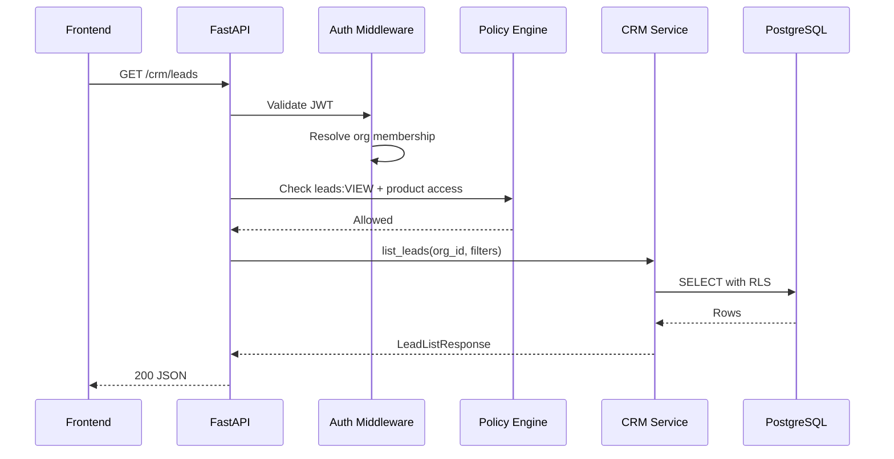
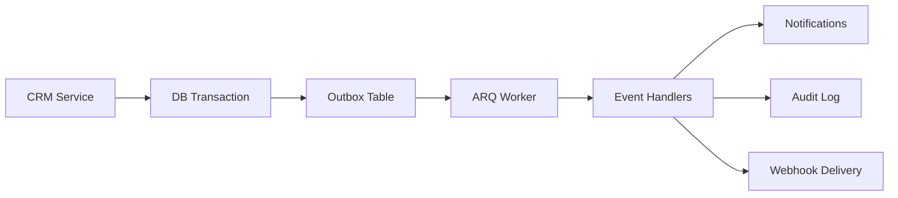

# API and Event Architecture

---

## API Style Recommendation

| Option | Assessment | Decision |
|--------|-----------|----------|
| REST | Matches frontend page-per-resource pattern; OpenAPI auto-gen from FastAPI | **Recommended MVP** |
| GraphQL | Over-engineering for current frontend | Defer |
| RPC | No frontend evidence | Defer |
| Server Actions | Next.js specific; couples frontend to backend | Avoid for CRM API |

**Hybrid:** REST for CRUD + Server-Sent Events for AI streaming (future).

---

## Shared API Conventions

### Base URLs
```
/api/v1/auth/*
/api/v1/platform/*
/api/v1/crm/*
```

### Headers
| Header | Required | Purpose |
|--------|----------|---------|
| `Authorization` | Yes | `Bearer {accessToken}` |
| `X-Organization-Id` | Yes (business APIs) | Active org context |
| `X-Request-Id` | Optional | Tracing |
| `Idempotency-Key` | POST/PATCH (mutations) | Duplicate prevention |

### Pagination
```json
{
  "data": [...],
  "pagination": {
    "nextCursor": "eyJ...",
    "hasMore": true,
    "total": 150
  }
}
```

### Error Format
```json
{
  "error": {
    "code": "VALIDATION_ERROR",
    "message": "Account name is required",
    "details": [{"field": "name", "message": "Required"}],
    "requestId": "req_abc123"
  }
}
```

### Versioning
URL prefix `/api/v1/`. Breaking changes → `/api/v2/`.

---

## CRM API Inventory

### Accounts
| Method | Path | Permission |
|--------|------|------------|
| GET | `/crm/accounts` | accounts:VIEW |
| POST | `/crm/accounts` | accounts:CREATE |
| GET | `/crm/accounts/{id}` | accounts:VIEW |
| PATCH | `/crm/accounts/{id}` | accounts:EDIT |
| DELETE | `/crm/accounts/{id}` | accounts:DELETE |

### Contacts
| Method | Path | Permission |
|--------|------|------------|
| GET | `/crm/contacts` | contacts:VIEW |
| POST | `/crm/contacts` | contacts:CREATE |
| GET | `/crm/contacts/{id}` | contacts:VIEW |
| PATCH | `/crm/contacts/{id}` | contacts:EDIT |
| DELETE | `/crm/contacts/{id}` | contacts:DELETE |

### Leads
| Method | Path | Permission |
|--------|------|------------|
| GET | `/crm/leads` | leads:VIEW |
| POST | `/crm/leads` | leads:CREATE |
| PATCH | `/crm/leads/{id}` | leads:EDIT |
| POST | `/crm/leads/{id}/convert` | leads:EDIT |
| DELETE | `/crm/leads/{id}` | leads:DELETE |

### Lead Sources
| Method | Path | Permission |
|--------|------|------------|
| GET | `/crm/lead-sources` | leads:VIEW |
| POST | `/crm/lead-sources` | leads:CREATE |
| PATCH | `/crm/lead-sources/{id}` | leads:EDIT |

### Campaigns
| Method | Path | Permission |
|--------|------|------------|
| GET | `/crm/campaigns` | campaigns:VIEW |
| POST | `/crm/campaigns` | campaigns:CREATE |
| GET | `/crm/campaigns/{id}` | campaigns:VIEW |
| PATCH | `/crm/campaigns/{id}` | campaigns:EDIT |
| POST | `/crm/campaigns/{id}/members` | campaigns:EDIT |

### Qualification
| Method | Path | Permission |
|--------|------|------------|
| GET | `/crm/qualifications` | qualification:VIEW |
| GET | `/crm/qualifications/{id}` | qualification:VIEW |
| PATCH | `/crm/qualifications/{id}` | qualification:EDIT |

### Opportunities
| Method | Path | Permission |
|--------|------|------------|
| GET | `/crm/opportunities` | opportunities:VIEW |
| POST | `/crm/opportunities` | opportunities:CREATE |
| PATCH | `/crm/opportunities/{id}` | opportunities:EDIT |
| PATCH | `/crm/opportunities/{id}/stage` | opportunities:EDIT |
| POST | `/crm/opportunities/{id}/close-won` | opportunities:EDIT |
| POST | `/crm/opportunities/{id}/close-lost` | opportunities:EDIT |

### Activities & Meetings
| Method | Path | Permission |
|--------|------|------------|
| GET | `/crm/activities` | meetings:VIEW |
| POST | `/crm/activities` | meetings:CREATE |
| POST | `/crm/meetings` | meetings:CREATE |
| PATCH | `/crm/meetings/{id}` | meetings:EDIT |

### Tasks
| Method | Path | Permission |
|--------|------|------------|
| GET | `/crm/tasks` | dashboard:VIEW |
| POST | `/crm/tasks` | dashboard:CREATE |
| PATCH | `/crm/tasks/{id}` | dashboard:EDIT |
| POST | `/crm/tasks/{id}/complete` | dashboard:EDIT |

### Notes
| Method | Path | Permission |
|--------|------|------------|
| GET | `/crm/notes?entityType=&entityId=` | entity:VIEW |
| POST | `/crm/notes` | entity:EDIT |

### Dashboard & Search
| Method | Path | Permission |
|--------|------|------------|
| GET | `/crm/dashboard/summary` | dashboard:VIEW |
| GET | `/crm/dashboard/pipeline` | dashboard:VIEW |
| GET | `/crm/search?q=` | authenticated + entity permissions |

---

## CRM API Request Flow



---

## Event Architecture

### MVP Mechanism
**PostgreSQL outbox table + ARQ worker** — no Kafka at launch.

```prisma
model OutboxEvent {
  id             String @id
  organizationId String
  eventType      String
  payload        Json
  status         OutboxStatus @default(PENDING)
  createdAt      DateTime @default(now())
  processedAt    DateTime?
}
```

### Event Envelope
```json
{
  "eventId": "uuid",
  "eventType": "crm.opportunity.won",
  "eventVersion": "1.0",
  "timestamp": "2026-07-29T10:00:00Z",
  "organizationId": "uuid",
  "correlationId": "uuid",
  "idempotencyKey": "uuid",
  "payload": {
    "opportunityId": "uuid",
    "accountId": "uuid",
    "dealValue": 50000
  }
}
```

### Event Catalog

#### Platform Events
| Event | Producer | Consumers |
|-------|----------|-----------|
| `platform.user.created` | Auth | HR (future), Audit |
| `platform.user.deactivated` | Auth | CRM (reassign), All products |
| `platform.organization.created` | Orgs | Audit |
| `platform.product_access.granted` | Entitlements | Product modules |
| `platform.document.uploaded` | Documents | Search indexer |

#### CRM Events
| Event | Producer | Consumers |
|-------|----------|-----------|
| `crm.account.created` | Accounts | Books (future), Audit |
| `crm.lead.created` | Leads | Audit, AI (future) |
| `crm.lead.qualified` | Qualification | Notifications |
| `crm.lead.converted` | Leads | Audit |
| `crm.opportunity.stage_changed` | Opportunities | Contracts (future) |
| `crm.opportunity.won` | Opportunities | Projects (future) |
| `crm.task.completed` | Tasks | Notifications |

### Delivery Guarantees
- **MVP:** At-least-once delivery with idempotency keys
- **Retry:** 3 attempts with exponential backoff
- **Dead letter:** Failed events → `dead_letter_events` table after 3 retries

### Future Scaling Path
1. MVP: Outbox + ARQ
2. Growth: Redis Streams
3. Scale: Kafka/NATS when >1000 events/sec sustained

---

## Rate Limiting

| Endpoint Class | Limit |
|---------------|-------|
| Auth login | 10/min per IP |
| API reads | 1000/min per user |
| API writes | 100/min per user |
| Search | 60/min per user |
| File upload | 20/min per user |

Implementation: Redis sliding window.

---

## Domain Event Flow



---

## Frontend Client Generation

Per foundation plan: **orval** or **openapi-typescript** generates typed client from FastAPI OpenAPI 3.1 spec.

```
backend/openapi.json → frontend/src/api/generated/
```

Replace all `INITIAL_DATA` patterns with generated hooks.
