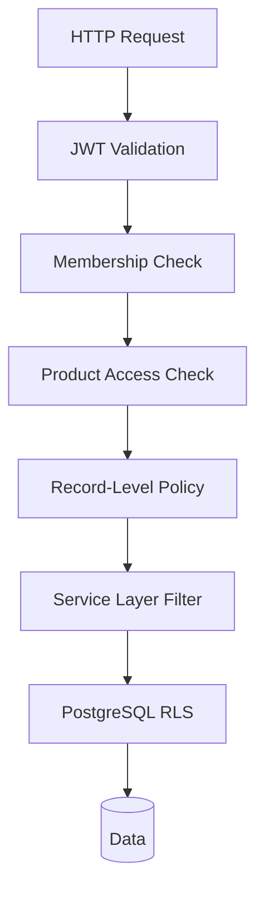
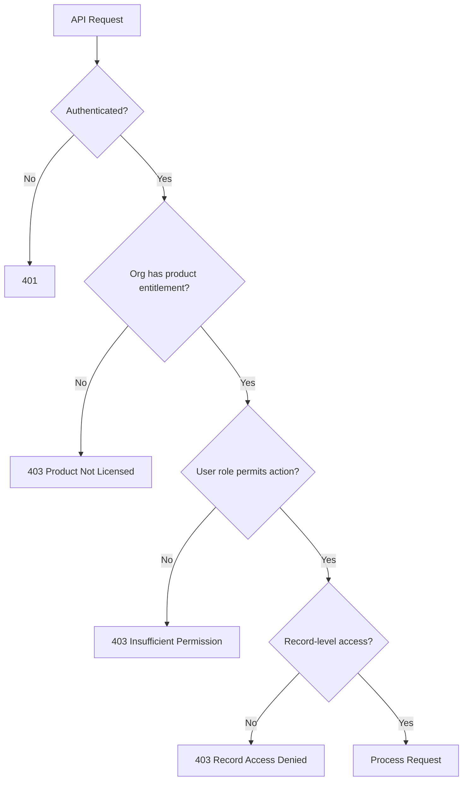
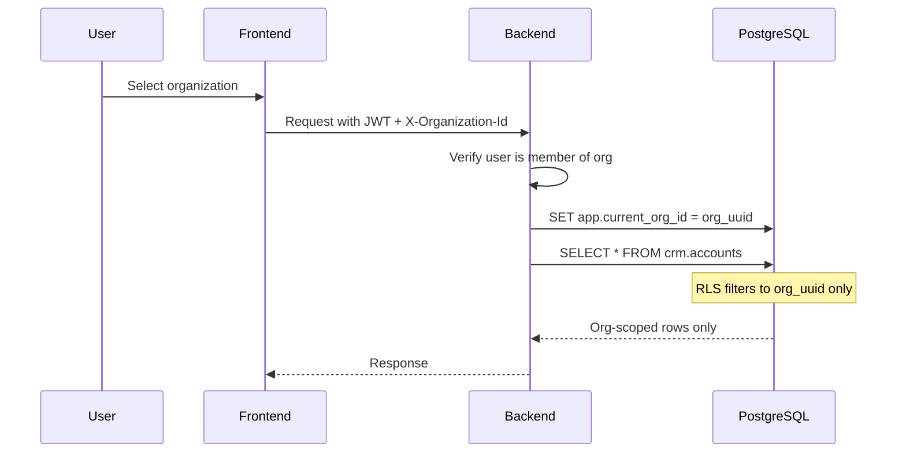

# Security and Tenant Isolation

---

## Threat Model

| Threat | Vector | Mitigation |
|--------|--------|------------|
| Broken tenant isolation | Forged organizationId | Backend validation + RLS |
| Broken object-level auth | Direct API access to other user's records | Policy functions |
| Broken product access | CRM user accessing Books API | ProductEntitlement check |
| Credential theft | Phishing, XSS | httpOnly cookies, CSP, MFA roadmap |
| SQL injection | Malformed input | Parameterized queries (SQLAlchemy) |
| File upload abuse | Malware, oversized files | MIME check, size limits, scan |
| AI data leakage | Over-broad retrieval | Tenant + permission filtered retrieval |
| Prompt injection | User input to AI | Input sanitization, system prompt isolation |

---

## Tenant Isolation Model Comparison

| Model | MVP | Medium SaaS | Enterprise | Regulated |
|-------|-----|-------------|------------|-----------|
| Shared DB + shared schema + organizationId | **Recommended** | Yes | Yes (with RLS) | Base layer |
| Shared DB + separate schemas | Optional | For large tenants | Yes | Yes |
| Separate DB per tenant | No | Hybrid tier | Yes | **Required** |
| Hybrid | No | **Recommended path** | **Recommended** | **Required** |

### Recommendation
- **Launch:** Shared database, shared schema (`platform` + `crm`), `organizationId` on all tenant data, PostgreSQL RLS
- **Enterprise tier:** Dedicated schema or database when contract requires
- **Never trust browser-supplied organizationId** — validate against JWT membership

---

## Tenant Isolation Enforcement Layers

| Layer | Implementation |
|-------|----------------|
| Request context | FastAPI middleware sets `TenantContext(organizationId, userId)` |
| Authorization | Policy functions per module |
| Data access | Repository always includes `organizationId` |
| Database | RLS policy: `organization_id = current_setting('app.current_org_id')::uuid` |
| Cache | Keys prefixed with orgId |
| Jobs | Payload includes organizationId; worker sets RLS context |
| Search | FTS queries filtered by organizationId |
| Object storage | R2 key prefix: `{orgId}/{documentId}` |
| Audit | organizationId on every log entry |

---

## Authentication Security

| Control | MVP | Roadmap |
|---------|-----|---------|
| Password hashing | argon2-cffi | — |
| Access token | JWT EdDSA, 15 min | — |
| Refresh token | Rotating, hashed in DB, reuse detection | — |
| Session invalidation | On password change, admin revoke | — |
| MFA | — | TOTP + recovery codes (Phase 2) |
| SSO | — | WorkOS/Keycloak (enterprise) |
| Brute force | Rate limit login: 10/min/IP, lockout after 5 failures | — |

---

## Authorization (RBAC + Product Access)

### Product Access Flow

**Critical rule:** A user with CRM access must NOT automatically access Books, Projects, Contracts, HR, Support, or AI.

### Frontend vs Backend
- Frontend role visibility (`admin/roles/page.tsx`) = UX only
- Backend policy functions = security enforcement

---

## OWASP Top 10 Mitigations

| Risk | Mitigation |
|------|------------|
| A01 Broken Access Control | RBAC + RLS + record policies |
| A02 Cryptographic Failures | TLS everywhere, argon2, encrypted backups |
| A03 Injection | SQLAlchemy parameterized, input validation (Pydantic) |
| A04 Insecure Design | Tenant context pattern, product boundaries |
| A05 Security Misconfiguration | pydantic-settings, fail on missing secrets |
| A06 Vulnerable Components | Dependabot, `uv` lockfile, regular audits |
| A07 Auth Failures | JWT best practices, refresh rotation |
| A08 Data Integrity | Idempotency keys, audit logs |
| A09 Logging Failures | structlog JSON, Sentry, audit service |
| A10 SSRF | Validate webhook URLs, block internal IPs |

---

## API Security

| Control | Detail |
|---------|--------|
| HTTPS | Required in all environments except local dev |
| CORS | Restrict to frontend origin |
| Rate limiting | Redis sliding window (see API doc) |
| CSRF | SameSite cookies for refresh tokens |
| Secure headers | HSTS, X-Content-Type-Options, X-Frame-Options |
| CSP | Strict policy on frontend |
| Input validation | Pydantic v2 on all endpoints |

---

## Document & File Security

| Control | Detail |
|---------|--------|
| Upload | Pre-signed URLs, MIME whitelist, max size (50MB MVP) |
| Storage | Org-prefixed R2 keys, encryption at rest (R2 default) |
| Download | Pre-signed URLs with short TTL (15 min) |
| Access | Permission check on linked entity before URL generation |
| Malware scan | ClamAV integration (Phase 3) |
| Deletion | Soft delete + 30-day retention before R2 purge |

---

## AI Security

| Control | Detail |
|---------|--------|
| Data access | API-only retrieval, never direct DB |
| Tenant filter | organizationId on all retrieval queries |
| Product filter | Product entitlement before cross-product data |
| PII redaction | Before model call |
| Prompt injection | System/user prompt separation, input length limits |
| Audit | Every AI call logged in AIUsageLog |
| Usage limits | Per-org token limits |

---

## PII Protection

| Data | Classification | Handling |
|------|---------------|----------|
| Email, phone | PII | Encrypted at rest, masked in audit logs |
| Address | PII | Same |
| AI scores | Business | Not PII but org-scoped |
| Audit IP | PII | Retention policy applies |

---

## Security Testing

| Test Type | When |
|-----------|------|
| Unit tests for policy functions | Every PR |
| Integration tests with RLS | Phase 1 gate |
| Tenant isolation tests | Phase 1 gate — **mandatory** (foundation plan) |
| OWASP ZAP scan | Pre-production |
| Penetration test | Before enterprise customers |
| Dependency scan | CI on every PR |

---

## Incident Response

| Phase | Action |
|-------|--------|
| Detection | Sentry alerts, audit log anomalies |
| Containment | Revoke sessions, disable org |
| Investigation | Audit log analysis, correlation IDs |
| Recovery | Restore from backup if needed |
| Post-mortem | ADR update, test addition |

---

## Compliance Roadmap

| Standard | Phase |
|----------|-------|
| GDPR basics (consent, deletion) | Phase 2 |
| SOC 2 Type I | Phase 4+ |
| ISO 27001 | Enterprise tier |
| India DPDP Act | Phase 2 (if India customers) |

---

## Organization & Tenant Isolation Flow

---

## Cross-Product Authorization

When S3K Books requests CRM Account data:
1. Verify Books service account or user has Books entitlement
2. Verify user has permission to read accounts in CRM
3. Return only authorized fields
4. Log access in audit trail

Never allow Books to write CRM Account data directly.
