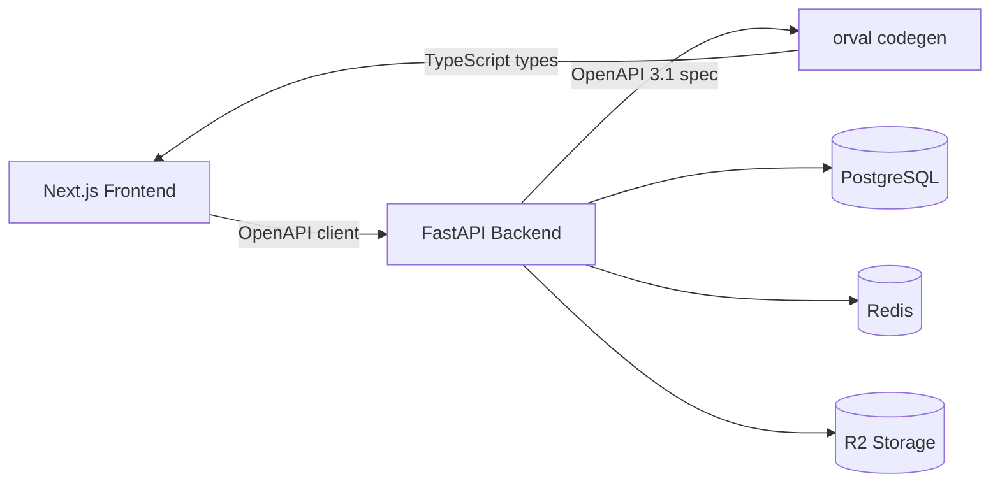

# Technical Stack Assessment

**Sources:** `S3K_Technical_Foundation_Plan 1.pdf` + current repository state.

---

## Critical Finding: Backend Stack Mismatch

| Aspect | Foundation Plan | Current Repository |
|--------|----------------|-------------------|
| Language | Python 3.13 | TypeScript (Express stub) |
| Framework | FastAPI | Express 4 |
| ORM | SQLAlchemy 2.0 async | None |
| Migrations | Alembic | None |
| Validation | Pydantic v2 | None |

**Recommendation:** Replace Express stub with Python/FastAPI per foundation plan. Retire `backend/src/index.ts`.

---

## Decision Matrix

| Category | Planned (PDF) | Current Usage | Strengths | Limitations | Alternatives | Recommendation | Revisit Trigger |
|----------|--------------|---------------|-----------|-------------|--------------|----------------|-----------------|
| **Frontend** | Next.js | Next.js 16 ✅ | SSR, React 19, Turbopack, team knows it | Monorepo hoisting complexity | Remix, Vite SPA | **Keep Next.js** | Performance ceiling |
| **Backend framework** | FastAPI | Express stub | Async, OpenAPI auto, Pydantic native | New scaffold needed | NestJS, Django | **Adopt FastAPI** | Team lacks Python skills |
| **Language** | Python 3.13 | TypeScript | AI ecosystem, foundation plan alignment | Split language from frontend | TypeScript full-stack | **Python backend** | Strong TS-only team mandate |
| **API approach** | REST + OpenAPI 3.1 | None | Frontend client generation | — | GraphQL | **REST** | Complex client needs |
| **PostgreSQL** | PG 18 | None | RLS, FTS, pgvector, JSONB | Ops complexity | MySQL | **PostgreSQL 18** | — |
| **ORM** | SQLAlchemy 2.0 | None (Prisma in docs) | Async, RLS raw connection, mature | Verbose vs Prisma | Prisma (TS), SQLModel | **SQLAlchemy 2.0** | Switch to TS backend |
| **Migrations** | Alembic | None | RLS policy migrations | Manual effort | Prisma Migrate | **Alembic** | — |
| **Package manager** | uv | npm | Lockfile-first, fast Docker builds | New tooling | Poetry, pip | **uv workspaces** | — |
| **Auth** | JWT EdDSA + refresh | None | Stateless, standard | Token management | Session cookies only | **JWT + httpOnly refresh** | SSO requirement |
| **Password hash** | argon2-cffi | None | Modern, secure | — | bcrypt | **argon2-cffi** | — |
| **Authorization** | Hand-rolled policies | Frontend UI only | Readable, testable at MVP scale | Manual maintenance | Casbin, Oso | **Policy functions** | >50 permission rules |
| **Redis** | Redis 7+ | None | Cache, rate limits, ARQ queue | Another service to ops | Memcached | **Redis 7+** | — |
| **Job queue** | ARQ | None | Async-native, cron built-in | Less known than Celery | Celery, BullMQ | **ARQ** | Team knows Celery |
| **Object storage** | Cloudflare R2 | None | S3-compatible, zero egress | Vendor dependency | AWS S3, B2 | **R2** | AWS mandate |
| **Search** | Postgres FTS + pg_trgm | None | No extra service, respects RLS | Limited at scale | Typesense, OpenSearch | **Postgres FTS (MVP)** | >1M records, slow search |
| **Vector DB** | pgvector | None | Same DB, tenant isolation free | Performance ceiling | Qdrant | **pgvector (defer)** | >10M vectors |
| **AI gateway** | Custom abstraction | Static UI only | Provider flexibility | Build effort | LiteLLM | **Custom gateway (Phase 5)** | — |
| **Frontend client** | orval / openapi-typescript | None | Type-safe, auto-generated | Build step | Hand-written | **orval** | — |
| **Testing (backend)** | pytest + testcontainers | None | Real Postgres for RLS tests | Slower CI | Mock DB | **pytest + testcontainers** | — |
| **Testing (frontend)** | Playwright | None | E2E coverage | CI time | Cypress | **Playwright** | — |
| **Logging** | structlog JSON | None | Structured, queryable | — | stdlib logging | **structlog** | — |
| **Tracing** | OpenTelemetry | None | Standard, vendor-neutral | Setup complexity | Datadog only | **OTel → Grafana Cloud** | Scale/compliance |
| **Errors** | Sentry | None | Proven, good DX | Cost at scale | Rollbar | **Sentry** | — |
| **Deployment** | Not specified | None | — | — | Railway, AWS ECS, Fly | **TBD (Phase 0)** | Enterprise SLA |
| **CI/CD** | Not specified | None | — | — | GitHub Actions | **GitHub Actions** | — |
| **Secrets** | pydantic-settings | None | Validated at boot | — | Vault | **Env vars + pydantic-settings** | Enterprise secrets |
| **IaC** | Not specified | None | — | — | Terraform, Pulumi | **Defer** | Multi-env complexity |
| **Email** | Resend/SES | None | — | — | Postmark | **Resend (MVP), SES (scale)** | Volume >10K/day |
| **SMS** | MSG91 | None | India-native, DLT | Region-specific | Twilio | **MSG91 (India)** | Non-India market |
| **PDF** | WeasyPrint | None | Pure Python | CSS limitations | Gotenberg | **WeasyPrint** | Complex PDF needs |
| **Lint/format** | Ruff | ESLint (frontend) | Fast, replaces multiple tools | Python only | black+isort | **Ruff** | — |

---

## Architecture Style Assessment

| Style | Fit | Decision |
|-------|-----|----------|
| Modular monolith | **Best fit** — small team, multiple products planned | **Recommended** |
| Modular monolith + shared platform modules | **Best fit** | **Recommended structure** |
| Microservices | Premature — ops overhead | **Avoid until extraction trigger** |
| Product-oriented services | Future state | Phase 5+ |

---

## Technologies to Avoid Initially

| Technology | Why Avoid |
|-----------|-----------|
| Kafka | Over-engineering for MVP event volume |
| GraphQL | No frontend evidence of need |
| Separate search engine | Postgres FTS sufficient at launch |
| Qdrant/separate vector DB | pgvector sufficient until >10M vectors |
| Microservices | Team size and ops complexity |
| Casbin/Oso | Policy functions sufficient at MVP |
| NestJS/Prisma (unless TS mandate) | Conflicts with foundation plan |

---

## MVP Stack Summary

```
Frontend:  Next.js 16 + React 19 + Tailwind + orval-generated client
Backend:   Python 3.13 + FastAPI + SQLAlchemy 2.0 + Alembic + uv
Database:  PostgreSQL 18 with RLS
Cache/Jobs: Redis 7+ + ARQ
Storage:   Cloudflare R2
Search:    Postgres FTS + pg_trgm
Auth:      JWT EdDSA + argon2 + refresh tokens
Testing:   pytest + testcontainers + Playwright
Observability: structlog + Sentry + OpenTelemetry
```

---

## Revisit Triggers Summary

| Trigger | Action |
|---------|--------|
| Team mandates TypeScript-only | Re-evaluate NestJS + Prisma |
| >1000 events/sec sustained | Redis Streams or Kafka |
| Search p95 > 200ms | Typesense/OpenSearch |
| >10M vectors | Qdrant |
| >50 permission rules | Casbin/Oso |
| Enterprise SSO required | WorkOS/Keycloak |
| CRM schema > 500GB | Extract CRM service |
| Primary DB CPU > 70% | Read replicas |

---

## Frontend/Backend Integration



Current Express stub at `backend/src/index.ts` should be replaced, not extended.
