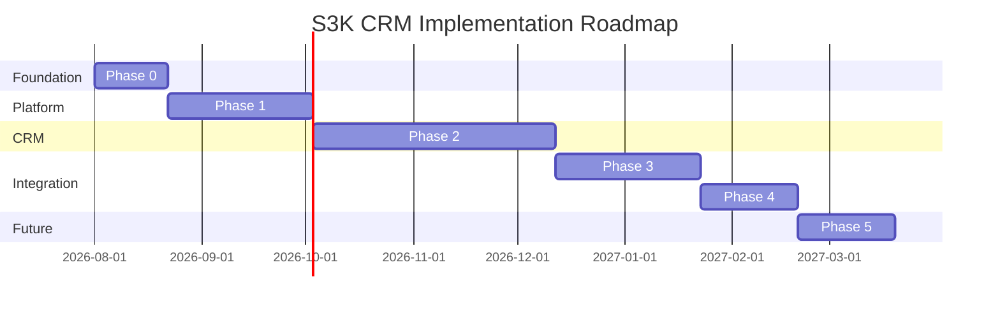
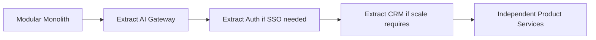

# Implementation Roadmap

**Effort scale:** XS (<1 week), S (1-2 weeks), M (2-4 weeks), L (4-8 weeks), XL (8+ weeks)  
**Team roles:** Architect, Backend Lead, Backend Engineer, Frontend Engineer, DevOps, QA

---

## Phase 0 — Shared Platform Foundation

**Objectives:** Establish architecture, repo structure, tooling, and data model design before business logic.

| Item | Detail |
|------|--------|
| **Scope** | Architecture docs, backend scaffold, PostgreSQL, Alembic, CI, test framework |
| **Modules** | Repo structure, coding standards, tenant context pattern, audit pattern |
| **Dependencies** | Stakeholder approval of architecture decisions |
| **Effort** | M |

### Tasks
1. Confirm ADRs (monolith, Python/FastAPI, RLS tenancy) — **Architect**
2. Replace Express stub with FastAPI + uv workspace — **Backend Lead**
3. Configure PostgreSQL 18 (local + dev) — **DevOps**
4. Initialize Alembic with `platform` and `crm` schemas — **Backend Engineer**
5. Implement tenant context middleware skeleton — **Backend Engineer**
6. Configure structlog, Sentry, pydantic-settings — **Backend Engineer**
7. Set up pytest + testcontainers — **QA/Backend**
8. Configure GitHub Actions CI (lint, test) — **DevOps**
9. Normalize frontend types → `features/shared/types/` — **Frontend Engineer**
10. Generate OpenAPI spec scaffold — **Backend Engineer**

### Deliverables
- [ ] FastAPI project structure under `backend/`
- [ ] PostgreSQL running with schemas
- [ ] Alembic initial migration (empty schemas)
- [ ] CI pipeline green
- [ ] Architecture docs (this folder)
- [ ] ADRs documented

### Risks
- Backend stack change (Express → FastAPI) causes delay
- Team Python skill gap

### Exit Criteria
- FastAPI serves `/health` with structured logging
- testcontainers can spin up Postgres in CI
- Tenant context middleware sets RLS variable in tests

### Security Gate
- Secrets via pydantic-settings; no hardcoded credentials

### Testing Gate
- pytest runs in CI; sample RLS test passes

---

## Phase 1 — Authentication, Organizations, RBAC and Users

**Objectives:** Complete Shared Platform identity layer before any CRM data.

| Item | Detail |
|------|--------|
| **Scope** | Auth, users, orgs, memberships, teams, departments, roles, permissions, product access, audit |
| **Effort** | L |
| **Dependencies** | Phase 0 complete |

### Tasks
1. User + UserProfile models and CRUD — M
2. Password auth (argon2) + JWT + refresh tokens — M
3. Session management + reuse detection — S
4. Organization + Membership models — M
5. Organization switching API — S
6. Team + Department models — S
7. Role + Permission + assignment — M
8. Product + ProductEntitlement (seed `s3k-crm`) — S
9. Policy function framework — M
10. Audit log service — S
11. RLS policies for all platform tables — M
12. Frontend: login page + auth context — M
13. Frontend: wire admin/users to API — M

### Parallel Workstreams
- **Stream A:** Auth + sessions (Backend)
- **Stream B:** Org + RBAC (Backend)
- **Stream C:** Frontend auth integration (Frontend)

### Exit Criteria
- [ ] User can register/login/logout
- [ ] User can belong to multiple orgs and switch
- [ ] RBAC enforced on all platform endpoints
- [ ] Product access blocks CRM API without entitlement
- [ ] Tenant isolation tests pass (mandatory)
- [ ] Admin users page uses real API

### Security Gate
- RLS cannot be tested against mock — testcontainers required
- Brute force protection on login

---

## Phase 2 — S3K CRM Business Data

**Objectives:** Implement all CRM entities and business logic.

| Item | Detail |
|------|--------|
| **Scope** | Accounts, contacts, leads, lead sources, campaigns, qualification, opportunities, activities, meetings, tasks, notes, attachments, dashboard |
| **Effort** | XL |
| **Dependencies** | Phase 1 complete |

### Module Sequence (Sequential with parallel where noted)

| # | Module | Effort | Depends On |
|---|--------|--------|------------|
| 1 | Lead Sources | S | Platform |
| 2 | Accounts | M | Platform |
| 3 | Contacts | M | Accounts |
| 4 | Leads | L | Lead Sources |
| 5 | Qualification | M | Leads |
| 6 | Campaigns | M | Leads |
| 7 | Pipeline + Opportunities | L | Accounts, Contacts |
| 8 | Activities + Meetings | L | All entities |
| 9 | Tasks + Notes | M | All entities |
| 10 | Attachments (via Platform docs) | M | Platform docs, entities |
| 11 | Dashboard aggregations | M | All entities |

### Parallel Workstreams
- **Stream A:** Core entities (Accounts → Contacts → Leads) — Backend
- **Stream B:** Pipeline (Opportunities, Qualification) — Backend
- **Stream C:** Activities/Meetings/Tasks — Backend
- **Stream D:** Frontend mock replacement (per module as API ready) — Frontend

### Exit Criteria
- [ ] All CRM list pages use API data
- [ ] Detail pages load by `[id]` from API
- [ ] Lead conversion creates Account + Contact
- [ ] Opportunity stage changes tracked in history
- [ ] Dashboard shows real aggregated KPIs
- [ ] All CRM tables have RLS policies

### Security Gate
- Record-level authorization on all CRM endpoints
- Product access verified before CRM routes

---

## Phase 3 — CRM APIs and Frontend Integration

**Objectives:** Complete API surface, replace all mock data, add missing features.

| Item | Detail |
|------|--------|
| **Scope** | API conventions, search, reports, import/export, error handling, loading states, E2E tests |
| **Effort** | L |
| **Dependencies** | Phase 2 core entities |

### Tasks
1. Global CRM search (Postgres FTS) — M
2. Reports module (new `/reports` route) — L
3. Import/export CSV for leads, accounts, contacts — M
4. Bulk operations — S
5. Frontend: loading/error states on all pages — M
6. Frontend: authorization-aware UI (hide actions user can't perform) — M
7. OpenAPI documentation (Scalar UI) — S
8. orval client generation in CI — S
9. Playwright E2E test suite — L
10. Normalize pipeline stages (dashboard vs opportunities) — S

### Exit Criteria
- [ ] Zero `INITIAL_DATA` mock arrays in CRM pages
- [ ] Search returns permission-filtered results
- [ ] E2E tests cover login → create lead → convert → create opportunity
- [ ] API documentation published

---

## Phase 4 — Integration Layer

**Objectives:** Prepare platform for future product onboarding.

| Item | Detail |
|------|--------|
| **Scope** | Outbox events, webhooks, integration framework, external IDs |
| **Effort** | L |
| **Dependencies** | Phase 3 |

### Tasks
1. Outbox event table + ARQ worker — M
2. Event handlers (audit, notifications) — M
3. Webhook registration + delivery + retry — M
4. Integration credentials management — M
5. External ID mapping table — S
6. Import/export framework (generic) — M
7. Cross-product API standards documentation — S

### Exit Criteria
- [ ] CRM events published via outbox
- [ ] Webhook delivery with retry and dead letter
- [ ] Integration page in admin connects to real API

---

## Phase 5 — Future Products (Architecture Only)

**No implementation in current phase.**

| Product | Preparation |
|---------|-------------|
| S3K Books | Define API contracts for Account consumption |
| S3K Projects | Subscribe to `crm.opportunity.won` event |
| S3K Contracts | Define opportunity stage trigger |
| S3K HR | Subscribe to `platform.user.created` |
| S3K Support | Define Contact/Account lookup API |
| S3K AI | Build on Shared AI Gateway |

### Extraction Strategy
1. Register product in Platform
2. Implement product module in monolith
3. Extract to separate service when scaling trigger hit

---

## Roadmap Timeline (Relative)

*Dates are illustrative placeholders — use relative effort for planning.*

---

## Team Composition Recommendation

| Role | Phase 0-1 | Phase 2-3 | Phase 4 |
|------|-----------|-----------|---------|
| Architect | 1 | 0.5 | 0.25 |
| Backend Lead | 1 | 1 | 1 |
| Backend Engineer | 1 | 2 | 1 |
| Frontend Engineer | 0.5 | 2 | 1 |
| DevOps | 0.5 | 0.25 | 0.5 |
| QA | 0.25 | 1 | 0.5 |

---

## Product Extraction Roadmap

**Do not reach M5 until scaling triggers are met.**
