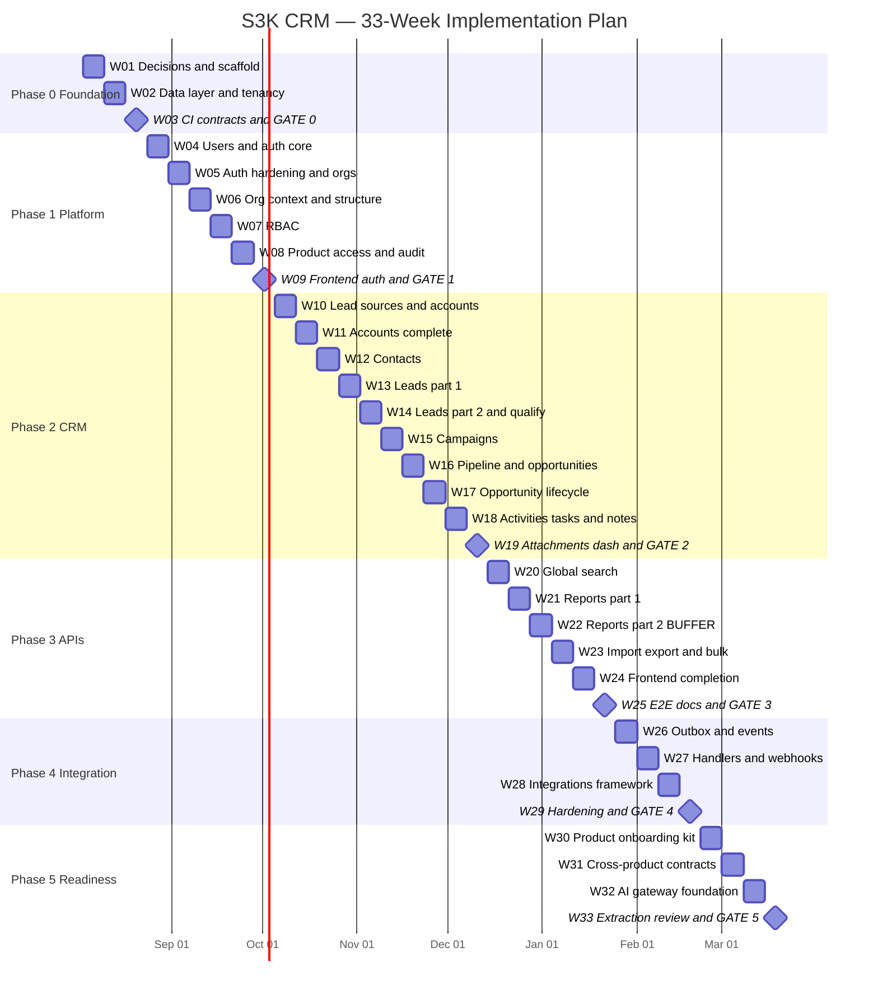
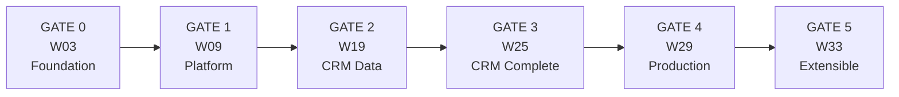

# S3K CRM — Master Implementation Plan (Week-by-Week + Tracking Model)

**Document version:** 1.0
**Created:** 2026-07-31
**Status:** Living document — update weekly
**Consolidates:** `00-EXECUTIVE-SUMMARY.md` through `17-RISKS-OPEN-QUESTIONS-AND-DECISIONS.md`

This is the **single operational plan** for building the S3K Shared Platform and S3K CRM backend, replacing frontend mock data with real APIs. It converts the six-phase roadmap in `15-IMPLEMENTATION-ROADMAP.md` into 33 tracked weeks with explicit task IDs, owners, dependencies, exit gates, and a progress tracking model.

Architecture rationale lives in the numbered documents. This document answers only: **who does what, in which week, and how do we know it is done.**

---


## Table of Contents

1. [How to Use This Document](#1-how-to-use-this-document)
2. [Tracking Model](#2-tracking-model)
3. [Baseline Assumptions](#3-baseline-assumptions)
4. [Master Timeline](#4-master-timeline)
5. [Phase 0 — Foundation (W01–W03)](#5-phase-0--foundation-w01w03)
6. [Phase 1 — Platform: Auth, Orgs, RBAC (W04–W09)](#6-phase-1--platform-auth-orgs-rbac-w04w09)
7. [Phase 2 — S3K CRM Business Data (W10–W19)](#7-phase-2--s3k-crm-business-data-w10w19)
8. [Phase 3 — APIs, Search, Reports, Integration (W20–W25)](#8-phase-3--apis-search-reports-integration-w20w25)
9. [Phase 4 — Integration Layer (W26–W29)](#9-phase-4--integration-layer-w26w29)
10. [Phase 5 — Future Product Readiness (W30–W33)](#10-phase-5--future-product-readiness-w30w33)
11. [Milestone Gates](#11-milestone-gates)
12. [Progress Rollup Dashboards](#12-progress-rollup-dashboards)
13. [Risk Burn-Down Tracker](#13-risk-burn-down-tracker)
14. [Decision Log Tracker](#14-decision-log-tracker)
15. [Change Control](#15-change-control)

---


## 1. How to Use This Document


| Cadence          | Activity                                                                    | Owner        |
| ---------------- | --------------------------------------------------------------------------- | ------------ |
| **Monday**       | Week planning: confirm task list, assign owners, mark `◐ In Progress`       | Backend Lead |
| **Daily**        | Async standup in team channel: yesterday / today / blockers                 | All          |
| **Wednesday**    | Mid-week blocker sweep; escalate anything `⛔ Blocked` > 24h                 | Backend Lead |
| **Friday**       | Demo + update Status columns + fill weekly status report + velocity log     | Backend Lead |
| **End of phase** | Gate review against exit criteria; no phase starts before prior gate passes | Architect    |


**Rules of engagement:**

1. A task cannot move to `☑ Done` until its Definition of Done is met (see §2.4).
2. A week's exit gate is binary. Unmet gates push work to the next week and are logged as carryover, never silently dropped.
3. Any scope change requires an entry in §15 Change Control.
4. Security and tenant-isolation gates are non-negotiable and cannot be deferred to "later hardening".

---


## 2. Tracking Model


### 2.1 Task ID Scheme

```
P{phase}-W{week}-{stream}-{seq}

Example: P1-W07-BE-02
         │  │   │   └── sequence within the week + stream
         │  │   └────── workstream
         │  └────────── week number (01–33)
         └───────────── phase number (0–5)
```

**Workstream codes:**


| Code  | Workstream                      | Primary Role                     |
| ----- | ------------------------------- | -------------------------------- |
| `AR`  | Architecture / design           | Architect                        |
| `BE`  | Backend implementation          | Backend Lead / Backend Engineer  |
| `FE`  | Frontend implementation         | Frontend Engineer                |
| `DO`  | DevOps / infrastructure         | DevOps                           |
| `QA`  | Testing / quality               | QA                               |
| `SEC` | Security                        | Backend Lead + Security reviewer |
| `PM`  | Product / stakeholder decisions | Product                          |


### 2.2 Status Values


| Symbol | Status      | Meaning                                  |
| ------ | ----------- | ---------------------------------------- |
| `☐`    | Not Started | Planned, not begun                       |
| `◐`    | In Progress | Actively being worked                    |
| `⧗`    | In Review   | Code complete, in PR review              |
| `⛔`    | Blocked     | Cannot progress; blocker logged in §12.4 |
| `☑`    | Done        | Definition of Done met                   |
| `⊘`    | Descoped    | Removed via Change Control (§15)         |


### 2.3 Definition of Ready

A task may only enter `◐ In Progress` when all of the following hold:

- [ ] Acceptance criteria written and understood
- [ ] Upstream dependencies are `☑ Done`
- [ ] Data model / API contract decided (or task *is* the decision)
- [ ] Owner assigned and has capacity this week
- [ ] Required credentials / environment access available


### 2.4 Definition of Done

A backend task is `☑ Done` only when:

- [ ] Code merged to `main` via reviewed PR
- [ ] Ruff + mypy strict pass
- [ ] Unit tests cover business rules
- [ ] Integration test against real Postgres (testcontainers) passes
- [ ] **Tenant isolation test** proves cross-organization access is denied
- [ ] Authorization test covers permission matrix for the endpoint
- [ ] Alembic migration written, applied, and reversible
- [ ] OpenAPI schema updated; `orval` client regenerates cleanly
- [ ] Audit log emitted for sensitive actions
- [ ] Structured log + trace span present

A frontend task is `☑ Done` only when:

- [ ] Mock array (`INITIAL_DATA` / `MOCK_*`) removed from the page
- [ ] Data comes from generated API client
- [ ] Loading, empty, and error states implemented
- [ ] Actions hidden or disabled when the user lacks permission
- [ ] Detail routes resolve the real `[id]` from the API


### 2.5 Estimation Unit

Effort is expressed in **person-days (pd)**. Weekly task totals are sized to the available capacity in §3.2 so the plan stays honest rather than aspirational.

### 2.6 Weekly Task Table Format

Every week below uses this table. The `St` (status) column is the field the team edits.


| ID  | Task | Stream | Owner | Est (pd) | Depends On | St  |
| --- | ---- | ------ | ----- | -------- | ---------- | --- |


---


## 3. Baseline Assumptions


### 3.1 Prerequisites Before W01


| Prerequisite                                               | Source                                | Status |
| ---------------------------------------------------------- | ------------------------------------- | ------ |
| ADR-002 approved (Python/FastAPI, retire Express stub)     | `16-ARCHITECTURE-DECISION-RECORDS.md` | ☐      |
| ADR-007 approved (shared schema + RLS tenancy)             | `16-...`                              | ☐      |
| ADR-008 approved (Account is canonical, no Customer table) | `16-...`                              | ☐      |
| ADR-017 resolved (deployment platform)                     | `16-...`                              | ☐      |
| D01 resolved (PostgreSQL 17 stable vs 18)                  | `17-...`                              | ☐      |
| I02 resolved (managed Postgres provider)                   | `17-...`                              | ☐      |


**If ADR-002 is rejected** (team mandates TypeScript-only), this plan's week structure holds but the backend stack becomes NestJS + Prisma; re-baseline all `BE` task estimates by +15% for ORM/RLS rework and update `14-TECH-STACK-ASSESSMENT.md`.

### 3.2 Team Capacity

Derived from the team composition table in `15-IMPLEMENTATION-ROADMAP.md`, assuming 4.5 productive days per FTE per week.


| Phase         | Architect | BE Lead | BE Eng | FE Eng | DevOps | QA   | Total FTE | Capacity (pd/wk) |
| ------------- | --------- | ------- | ------ | ------ | ------ | ---- | --------- | ---------------- |
| 0–1 (W01–W09) | 1.0       | 1.0     | 1.0    | 0.5    | 0.5    | 0.25 | 4.25      | ~19              |
| 2–3 (W10–W25) | 0.5       | 1.0     | 2.0    | 2.0    | 0.25   | 1.0  | 6.75      | ~30              |
| 4–5 (W26–W33) | 0.25      | 1.0     | 1.0    | 1.0    | 0.5    | 0.5  | 4.25      | ~19              |


### 3.3 Calendar

W01 begins **Monday 2026-08-03**. Each week is Monday–Friday.


| Capacity Note     | Weeks                      | Action                                                                            |
| ----------------- | -------------------------- | --------------------------------------------------------------------------------- |
| Year-end holidays | W21 (Dec 21), W22 (Dec 28) | Treat W22 as a **buffer week**; plan ~50% capacity and use it to absorb carryover |
| Gate weeks        | W03, W09, W19, W25, W29    | Reserve ~1 pd for gate review and documentation                                   |


### 3.4 Scope Boundaries (Non-Negotiable)

**In scope:** Shared Platform (identity, orgs, RBAC, product access, documents, audit, notifications, jobs) + S3K CRM (accounts, contacts, leads, lead sources, campaigns, qualification, opportunities, activities, meetings, tasks, notes, attachments, dashboard, reports, search).

**Out of scope:** S3K Books, Projects, Contracts, HR, Support, and AI product features. Phase 5 delivers only the integration seams described in `07-FUTURE-PRODUCT-INTEGRATION-STRATEGY.md`.

---


## 4. Master Timeline




### 4.1 Week Index


| Week | Dates (Mon) | Phase | Theme                              | Gate       |
| ---- | ----------- | ----- | ---------------------------------- | ---------- |
| W01  | 2026-08-03  | 0     | Decisions, backend scaffold        |            |
| W02  | 2026-08-10  | 0     | Data layer, tenant context         |            |
| W03  | 2026-08-17  | 0     | CI, API contracts                  | **GATE 0** |
| W04  | 2026-08-24  | 1     | Users, password auth, JWT          |            |
| W05  | 2026-08-31  | 1     | Auth hardening, organizations      |            |
| W06  | 2026-09-07  | 1     | Org switching, teams, RLS          |            |
| W07  | 2026-09-14  | 1     | Roles, permissions, policies       |            |
| W08  | 2026-09-21  | 1     | Product access, audit, jobs        |            |
| W09  | 2026-09-28  | 1     | Frontend auth, admin wiring        | **GATE 1** |
| W10  | 2026-10-05  | 2     | Lead sources, account model        |            |
| W11  | 2026-10-12  | 2     | Accounts API + UI                  |            |
| W12  | 2026-10-19  | 2     | Contacts                           |            |
| W13  | 2026-10-26  | 2     | Leads CRUD + kanban                |            |
| W14  | 2026-11-02  | 2     | Lead conversion, qualification     |            |
| W15  | 2026-11-09  | 2     | Campaigns                          |            |
| W16  | 2026-11-16  | 2     | Pipeline, opportunities CRUD       |            |
| W17  | 2026-11-23  | 2     | Stage history, win/loss            |            |
| W18  | 2026-11-30  | 2     | Activities, meetings, tasks, notes |            |
| W19  | 2026-12-07  | 2     | Documents, attachments, dashboard  | **GATE 2** |
| W20  | 2026-12-14  | 3     | Global CRM search                  |            |
| W21  | 2026-12-21  | 3     | Reports engine                     |            |
| W22  | 2026-12-28  | 3     | Report export (buffer week)        |            |
| W23  | 2027-01-04  | 3     | Import/export, bulk ops            |            |
| W24  | 2027-01-11  | 3     | Frontend completion, a11y, states  |            |
| W25  | 2027-01-18  | 3     | E2E, performance, API docs         | **GATE 3** |
| W26  | 2027-01-25  | 4     | Transactional outbox               |            |
| W27  | 2027-02-01  | 4     | Event handlers, webhooks           |            |
| W28  | 2027-02-08  | 4     | Integration framework              |            |
| W29  | 2027-02-15  | 4     | Security hardening, DR drill       | **GATE 4** |
| W30  | 2027-02-22  | 5     | Product onboarding framework       |            |
| W31  | 2027-03-01  | 5     | Cross-product API contracts        |            |
| W32  | 2027-03-08  | 5     | AI gateway foundation              |            |
| W33  | 2027-03-15  | 5     | Extraction readiness review        | **GATE 5** |


---


## 5. Phase 0 — Foundation (W01–W03)

**Objective:** Replace the Express stub with a production-shaped FastAPI backend, establish the tenant-context pattern, and prove tenant isolation is testable — before any business logic exists.

**Reference docs:** `02`, `04`, `14`, `16`

---


### W01 — Decisions and Backend Scaffold

**Objective:** Close the P0 architecture decisions and stand up a runnable Python backend.


| ID           | Task                                                                                                                                                                             | Stream | Owner            | Est (pd) | Depends On   | St  |
| ------------ | -------------------------------------------------------------------------------------------------------------------------------------------------------------------------------- | ------ | ---------------- | -------- | ------------ | --- |
| P0-W01-AR-01 | Ratify ADR-001/002/005/006/007/008 in a written decision meeting                                                                                                                 | AR     | Architect        | 1.0      | —            | ☐   |
| P0-W01-PM-01 | Resolve open questions D01 (PG version), D02 (UUID v7), I01 (deploy target), I02 (Postgres provider), P04 (region)                                                               | PM     | Product + DevOps | 1.0      | —            | ☐   |
| P0-W01-BE-01 | Create `backend/` Python package with `uv` workspace, Ruff, mypy strict; remove `backend/src/index.ts` and Express deps                                                          | BE     | Backend Lead     | 2.0      | P0-W01-AR-01 | ☐   |
| P0-W01-BE-02 | FastAPI app factory, `/health`, `pydantic-settings` config that fails fast on missing secrets                                                                                    | BE     | Backend Eng      | 1.5      | P0-W01-BE-01 | ☐   |
| P0-W01-BE-03 | Module skeleton: `platform/{auth,organizations,authorization,documents,audit,notifications}` and `products/crm/*` with `router/service/repository/schemas/policies/events` stubs | BE     | Backend Lead     | 1.5      | P0-W01-BE-01 | ☐   |
| P0-W01-DO-01 | `docker-compose` for local PostgreSQL + Redis; document `.env.example` (no secrets committed)                                                                                    | DO     | DevOps           | 1.5      | P0-W01-PM-01 | ☐   |
| P0-W01-FE-01 | Inventory duplicate entity types across the 10 CRM page files; produce extraction map to `features/shared/types/`                                                                | FE     | Frontend Eng     | 2.0      | —            | ☐   |
| P0-W01-AR-02 | Write module-boundary rules (Platform must not import CRM; CRM imports Platform via service interfaces only)                                                                     | AR     | Architect        | 1.0      | P0-W01-BE-03 | ☐   |


**Week total:** 11.5 pd against ~19 pd capacity (buffer absorbs decision-meeting overruns).

**Deliverables**

- [ ] `backend/` runs `uv run uvicorn` and serves `/health`
- [ ] Express stub deleted; root `package.json` workspace scripts updated
- [ ] Signed-off ADR set with statuses moved from Proposed to Accepted
- [ ] Local Postgres + Redis reachable from the backend

**Exit criteria:** All P0 decisions in §3.1 are resolved and recorded. No task remains `⛔ Blocked` on a stakeholder answer.

---


### W02 — Data Layer and Tenant Context

**Objective:** Establish the schema separation, shared model mixins, and the tenant-context mechanism that every later query depends on.


| ID           | Task                                                                                                                                                | Stream | Owner        | Est (pd) | Depends On                 | St  |
| ------------ | --------------------------------------------------------------------------------------------------------------------------------------------------- | ------ | ------------ | -------- | -------------------------- | --- |
| P0-W02-BE-01 | Alembic init; migration creating `platform` and `crm` PostgreSQL schemas + `pgcrypto`/`pg_trgm` extensions                                          | BE     | Backend Eng  | 1.5      | P0-W01-DO-01               | ☐   |
| P0-W02-BE-02 | SQLAlchemy 2.0 async engine, session factory, asyncpg pool config (min 5 / max 20)                                                                  | BE     | Backend Lead | 1.5      | P0-W02-BE-01               | ☐   |
| P0-W02-BE-03 | Declarative base + mixins: UUID v7 PK, `createdAt`/`updatedAt`, `createdById`/`updatedById`, `deletedAt` soft delete, `organizationId` tenant mixin | BE     | Backend Lead | 2.0      | P0-W02-BE-02               | ☐   |
| P0-W02-BE-04 | `TenantContext` middleware: resolve org from request, `SET LOCAL app.current_org_id`, reject browser-supplied org without membership validation     | BE     | Backend Lead | 2.5      | P0-W02-BE-03               | ☐   |
| P0-W02-BE-05 | RLS policy helper for Alembic (`enable_rls(table)`), applied to a throwaway probe table                                                             | BE     | Backend Eng  | 1.5      | P0-W02-BE-04               | ☐   |
| P0-W02-BE-06 | Observability: structlog JSON with `tenant_id`/`user_id`/`trace_id` binding, Sentry SDK, OTel FastAPI + SQLAlchemy + asyncpg instrumentors          | BE     | Backend Eng  | 2.0      | P0-W01-BE-02               | ☐   |
| P0-W02-QA-01 | pytest + pytest-asyncio + testcontainers harness spinning real Postgres; fixture factory via polyfactory                                            | QA     | QA + Backend | 2.0      | P0-W02-BE-02               | ☐   |
| P0-W02-QA-02 | First tenant-isolation test on the probe table: org A cannot read org B rows                                                                        | QA     | QA           | 1.0      | P0-W02-BE-05, P0-W02-QA-01 | ☐   |
| P0-W02-FE-01 | Extract shared CRM types into `features/shared/types/`; normalize status enums to a single source                                                   | FE     | Frontend Eng | 2.5      | P0-W01-FE-01               | ☐   |


**Week total:** 16.5 pd.

**Deliverables**

- [ ] Migration creates both schemas and is reversible
- [ ] Tenant context set per request and visible in logs
- [ ] Failing tenant-isolation test turns green with RLS enabled
- [ ] `features/shared/types/` is the single definition site for CRM entity types

**Exit criteria:** RLS is proven with a real Postgres integration test, not a mock. This is the mandatory gate from `13-SECURITY-AND-TENANT-ISOLATION.md`.

---


### W03 — CI, API Contracts, and GATE 0

**Objective:** Lock the API conventions and automate quality checks so every later week inherits them.


| ID           | Task                                                                                                                           | Stream | Owner        | Est (pd) | Depends On   | St  |
| ------------ | ------------------------------------------------------------------------------------------------------------------------------ | ------ | ------------ | -------- | ------------ | --- |
| P0-W03-DO-01 | GitHub Actions CI: Ruff, mypy strict, pytest with testcontainers, dependency audit                                             | DO     | DevOps       | 2.0      | P0-W02-QA-01 | ☐   |
| P0-W03-BE-01 | Error envelope middleware matching `11-API-AND-EVENT-ARCHITECTURE.md` (`code`, `message`, `details`, `requestId`)              | BE     | Backend Eng  | 1.5      | P0-W01-BE-02 | ☐   |
| P0-W03-BE-02 | Cursor pagination helper + standard list-response envelope                                                                     | BE     | Backend Eng  | 1.5      | P0-W03-BE-01 | ☐   |
| P0-W03-BE-03 | `Idempotency-Key` middleware backed by Redis for POST/PATCH                                                                    | BE     | Backend Lead | 1.5      | P0-W01-DO-01 | ☐   |
| P0-W03-BE-04 | Redis sliding-window rate limiter with per-endpoint-class limits                                                               | BE     | Backend Lead | 1.5      | P0-W01-DO-01 | ☐   |
| P0-W03-BE-05 | OpenAPI 3.1 metadata, tags per module, Scalar docs UI at `/docs`                                                               | BE     | Backend Eng  | 1.0      | P0-W03-BE-02 | ☐   |
| P0-W03-FE-01 | `orval` config generating a typed client from `openapi.json` into `frontend/features/shared/services/generated/`; wire into CI | FE     | Frontend Eng | 2.0      | P0-W03-BE-05 | ☐   |
| P0-W03-DO-02 | Import-boundary linter enforcing P0-W01-AR-02 rules; fails CI on violation                                                     | DO     | DevOps       | 1.5      | P0-W01-AR-02 | ☐   |
| P0-W03-AR-01 | **GATE 0 review** — sign off Phase 0 exit criteria, publish week-1 baseline of §12 rollups                                     | AR     | Architect    | 1.0      | all above    | ☐   |


**Week total:** 14.5 pd.

**GATE 0 exit criteria**

- [ ] CI green on `main`: lint, types, tests, dependency scan
- [ ] FastAPI serves `/health` with structured JSON logs and trace IDs
- [ ] testcontainers spins real Postgres in CI
- [ ] Tenant-context middleware sets the RLS variable and is covered by a passing isolation test
- [ ] Error, pagination, idempotency, and rate-limit conventions implemented once and reusable
- [ ] `orval` produces a compiling TypeScript client
- [ ] Boundary linter blocks Platform→CRM imports
- [ ] No secrets in the repository; `pydantic-settings` fails fast on missing config

**Risks addressed this phase:** R02, R08, R17, R22 (see §13).

---


## 6. Phase 1 — Platform: Auth, Orgs, RBAC (W04–W09)

**Objective:** Deliver the complete Shared Platform identity and authorization layer. **No CRM business table is created until GATE 1 passes.**

**Reference docs:** `02`, `04`, `09`, `13`

---


### W04 — Users and Authentication Core


| ID           | Task                                                                                               | Stream | Owner        | Est (pd) | Depends On                 | St  |
| ------------ | -------------------------------------------------------------------------------------------------- | ------ | ------------ | -------- | -------------------------- | --- |
| P1-W04-BE-01 | `User` + `UserProfile` models, migration, RLS-exempt (global identity)                             | BE     | Backend Eng  | 2.0      | GATE 0                     | ☐   |
| P1-W04-BE-02 | argon2-cffi password hashing service + password policy validator (min 12 chars, mixed case, digit) | BE     | Backend Lead | 1.5      | P1-W04-BE-01               | ☐   |
| P1-W04-BE-03 | `Session` model storing hashed refresh tokens with `expiresAt`/`revokedAt`                         | BE     | Backend Eng  | 1.5      | P1-W04-BE-01               | ☐   |
| P1-W04-BE-04 | JWT EdDSA issuance (15-min access), key management via settings, `POST /auth/login`                | BE     | Backend Lead | 2.5      | P1-W04-BE-02, P1-W04-BE-03 | ☐   |
| P1-W04-BE-05 | `POST /auth/refresh` + `POST /auth/logout`; refresh token rotation                                 | BE     | Backend Lead | 2.0      | P1-W04-BE-04               | ☐   |
| P1-W04-BE-06 | `GET /auth/me` returning user, profile, memberships, effective permissions                         | BE     | Backend Eng  | 1.5      | P1-W04-BE-04               | ☐   |
| P1-W04-QA-01 | Auth unit + integration tests: login success/failure, token expiry, logout revocation              | QA     | QA           | 2.0      | P1-W04-BE-05               | ☐   |
| P1-W04-DO-01 | Provision managed Postgres + Redis for the `dev` environment                                       | DO     | DevOps       | 1.5      | P0-W01-PM-01               | ☐   |


**Week total:** 14.5 pd.

**Exit criteria:** A seeded user can log in, receive an access token, refresh it, and log out. Tokens are EdDSA-signed; refresh tokens are stored only as hashes.

---


### W05 — Auth Hardening and Organizations


| ID            | Task                                                                                                    | Stream | Owner        | Est (pd) | Depends On    | St  |
| ------------- | ------------------------------------------------------------------------------------------------------- | ------ | ------------ | -------- | ------------- | --- |
| P1-W05-SEC-01 | Refresh-token reuse detection: replay revokes the entire token family                                   | SEC    | Backend Lead | 2.0      | P1-W04-BE-05  | ☐   |
| P1-W05-SEC-02 | Brute-force protection: 10 logins/min per IP, lockout after 5 consecutive failures, audit every failure | SEC    | Backend Lead | 1.5      | P0-W03-BE-04  | ☐   |
| P1-W05-SEC-03 | Refresh token in httpOnly + SameSite cookie; access token in memory only (resolves SEC01)               | SEC    | Backend Lead | 1.5      | P1-W04-BE-05  | ☐   |
| P1-W05-BE-01  | Password reset + email verification flows with single-use expiring tokens                               | BE     | Backend Eng  | 2.5      | P1-W04-BE-02  | ☐   |
| P1-W05-BE-02  | Email transport adapter (Resend) + Jinja2 templates; queued, not inline                                 | BE     | Backend Eng  | 1.5      | P1-W05-BE-01  | ☐   |
| P1-W05-BE-03  | `Organization` + `OrganizationMembership` models and migration                                          | BE     | Backend Lead | 2.0      | P1-W04-BE-01  | ☐   |
| P1-W05-QA-01  | Security test suite: reuse detection, lockout, reset-token single use                                   | QA     | QA           | 2.0      | P1-W05-SEC-01 | ☐   |
| P1-W05-PM-01  | Resolve S01 (self-registration vs admin-provisioned) and S03 (MFA at launch)                            | PM     | Product      | 0.5      | —             | ☐   |


**Week total:** 13.5 pd.

**Exit criteria:** Stolen-refresh-token replay is detected and neutralized. Organizations and memberships exist in the schema.

---


### W06 — Organization Context, Teams, and RLS


| ID           | Task                                                                                               | Stream | Owner        | Est (pd) | Depends On   | St  |
| ------------ | -------------------------------------------------------------------------------------------------- | ------ | ------------ | -------- | ------------ | --- |
| P1-W06-BE-01 | Organization CRUD + settings JSON; slug uniqueness                                                 | BE     | Backend Eng  | 2.0      | P1-W05-BE-03 | ☐   |
| P1-W06-BE-02 | Membership CRUD: invite, activate, deactivate, set default org                                     | BE     | Backend Eng  | 2.0      | P1-W06-BE-01 | ☐   |
| P1-W06-BE-03 | `POST /organizations/{id}/switch` — validates membership, rebinds session org context              | BE     | Backend Lead | 2.0      | P1-W06-BE-02 | ☐   |
| P1-W06-BE-04 | `Department`, `Team`, `TeamMembership` models + CRUD                                               | BE     | Backend Eng  | 2.0      | P1-W06-BE-01 | ☐   |
| P1-W06-BE-05 | RLS policies on every tenant-scoped `platform` table; Alembic migration                            | BE     | Backend Lead | 2.5      | P1-W06-BE-04 | ☐   |
| P1-W06-QA-01 | Tenant-isolation matrix test across all platform tables (member, non-member, deactivated member)   | QA     | QA           | 2.5      | P1-W06-BE-05 | ☐   |
| P1-W06-QA-02 | Negative test: forged `X-Organization-Id` for a non-member org returns 403 and logs an audit event | QA     | QA           | 1.0      | P1-W06-BE-03 | ☐   |


**Week total:** 14 pd.

**Exit criteria:** A user in two organizations sees strictly disjoint data. A forged organization header is rejected, never honored.

---


### W07 — Roles, Permissions, and Policy Framework


| ID           | Task                                                                                                                       | Stream | Owner        | Est (pd) | Depends On   | St  |
| ------------ | -------------------------------------------------------------------------------------------------------------------------- | ------ | ------------ | -------- | ------------ | --- |
| P1-W07-BE-01 | `Role`, `Permission`, `RolePermission`, `MembershipRole` models + migration                                                | BE     | Backend Eng  | 2.0      | P1-W06-BE-02 | ☐   |
| P1-W07-BE-02 | Permission seed for 11 CRM modules × 6 actions (VIEW/CREATE/EDIT/DELETE/EXPORT/ADMIN), sourced from `admin/roles/page.tsx` | BE     | Backend Eng  | 1.5      | P1-W07-BE-01 | ☐   |
| P1-W07-BE-03 | System role templates: Admin, Sales Manager, Sales Rep, Marketing, Support (resolves S02)                                  | BE     | Backend Eng  | 1.5      | P1-W07-BE-02 | ☐   |
| P1-W07-BE-04 | Policy function framework: `require_permission(module, action)` dependency + record-level owner/team predicate hooks       | BE     | Backend Lead | 3.0      | P1-W07-BE-02 | ◐   |
| P1-W07-BE-05 | Effective-permission resolver with Redis cache (5-min TTL, org-prefixed keys)                                              | BE     | Backend Lead | 2.0      | P1-W07-BE-04 | ☐   |
| P1-W07-BE-06 | Role, permission and team management APIs                                                                                  | BE     | Backend Eng  | 1.5      | P1-W07-BE-04 | ☑   |
| P1-W07-QA-01 | Authorization matrix tests: each role × each module × each action, positive and negative                                   | QA     | QA           | 2.5      | P1-W07-BE-04 | ◐   |


**Week total:** 14 pd.

**Exit criteria:** Every protected endpoint declares its required permission. Authorization is enforced in the backend, independent of any frontend state.

---


### W08 — Product Access, Audit, and Background Jobs


| ID           | Task                                                                                                      | Stream | Owner        | Est (pd) | Depends On                 | St  |
| ------------ | --------------------------------------------------------------------------------------------------------- | ------ | ------------ | -------- | -------------------------- | --- |
| P1-W08-BE-01 | `Product` + `ProductEntitlement` models; seed `s3k-crm`                                                   | BE     | Backend Eng  | 1.5      | P1-W07-BE-01               | ☐   |
| P1-W08-BE-02 | Product-access middleware: 403 "product not licensed" before any `/crm/*` handler runs                    | BE     | Backend Lead | 2.0      | P1-W08-BE-01               | ☐   |
| P1-W08-BE-03 | `AuditLog` model + audit service; PII masking in metadata (see CR10 on the decorator)                     | BE     | Backend Eng  | 2.5      | P1-W07-BE-04               | ☑   |
| P1-W08-BE-04 | ARQ worker bootstrap + Redis queue; tenant-aware job payload contract (org ID mandatory, worker sets RLS) | BE     | Backend Lead | 2.5      | P1-W04-DO-01               | ☐   |
| P1-W08-BE-05 | Route audit writes through ARQ so they never block the request transaction                                | BE     | Backend Eng  | 1.0      | P1-W08-BE-03, P1-W08-BE-04 | ☐ (blocked on BE-04; writes are synchronous and transactional meanwhile — CR11) |
| P1-W08-BE-06 | `Notification` model + list/mark-read APIs + notification preferences                                     | BE     | Backend Eng  | 2.0      | P1-W08-BE-04               | ☐   |
| P1-W08-BE-07 | `GET /audit-logs` with filters and pagination, admin permission only                                      | BE     | Backend Eng  | 1.0      | P1-W08-BE-03               | ☑   |
| P1-W08-QA-01 | Product-access denial tests; audit-completeness test for every sensitive action                           | QA     | QA           | 2.0      | P1-W08-BE-02               | ☐   |


**Week total:** 14.5 pd.

**Exit criteria:** An organization without the `s3k-crm` entitlement receives 403 on all CRM routes. Every sensitive action produces an audit record asynchronously.

---


### W09 — Frontend Auth Integration and GATE 1


| ID           | Task                                                                                        | Stream | Owner        | Est (pd) | Depends On    | St  |
| ------------ | ------------------------------------------------------------------------------------------- | ------ | ------------ | -------- | ------------- | --- |
| P1-W09-FE-01 | Login page, auth context, silent token refresh, logout                                      | FE     | Frontend Eng | 2.5      | P1-W05-SEC-03 | ☐   |
| P1-W09-FE-02 | `middleware.ts` route protection for the `(crm)` group; redirect unauthenticated users      | FE     | Frontend Eng | 1.5      | P1-W09-FE-01  | ☐   |
| P1-W09-FE-03 | Organization switcher in `CrmTopbar`; replace the placeholder "U" avatar with the real user | FE     | Frontend Eng | 2.0      | P1-W06-BE-03  | ☐   |
| P1-W09-FE-04 | Wire `admin/users` to the real API (remove `INITIAL_DATA`)                                  | FE     | Frontend Eng | 2.0      | P1-W06-BE-02  | ☑   |
| P1-W09-FE-05 | Wire `admin/roles` matrix and `admin/teams` to real APIs                                    | FE     | Frontend Eng | 2.5      | P1-W07-BE-06  | ☑   |
| P1-W09-FE-06 | Wire `admin/audit-logs` to the real API                                                     | FE     | Frontend Eng | 1.0      | P1-W08-BE-07  | ☑   |
| P1-W09-FE-07 | `usePermissions()` hook; hide or disable actions the user cannot perform (UX layer only)    | FE     | Frontend Eng | 1.5      | P1-W04-BE-06  | ☐   |
| P1-W09-QA-01 | Full tenant-isolation regression suite — **GATE 1 blocker**                                 | QA     | QA           | 2.0      | P1-W06-QA-01  | ☐   |
| P1-W09-AR-01 | **GATE 1 review**                                                                           | AR     | Architect    | 1.0      | all above     | ☐   |


**Week total:** 16 pd.

**GATE 1 exit criteria**

- [ ] User can log in, log out, and refresh without re-authenticating
- [ ] User belonging to multiple organizations can switch; data scope changes accordingly
- [ ] RBAC enforced on every platform endpoint
- [ ] Product access blocks CRM routes without the `s3k-crm` entitlement
- [ ] **Tenant-isolation test suite passes** (mandatory, non-waivable)
- [ ] Brute-force protection and refresh-reuse detection verified by tests
- [ ] `admin/users`, `admin/roles`, `admin/teams`, `admin/audit-logs` all use real APIs
- [ ] Audit log captures auth events, permission changes, and membership changes

**Risks addressed:** R01, R04, R09, R10, R21.

---


## 7. Phase 2 — S3K CRM Business Data (W10–W19)

**Objective:** Implement every CRM entity with tenant isolation and record-level authorization, and replace mock data page by page as each API lands.

**Reference docs:** `03`, `05`, `10`

**Per-module rhythm:** model + migration + RLS → repository with mandatory org filter → service with business rules → router with permissions → tests (unit, integration, authorization, tenant) → frontend swap.

---


### W10 — Lead Sources and Account Model


| ID           | Task                                                                                                          | Stream | Owner          | Est (pd) | Depends On   | St  |
| ------------ | ------------------------------------------------------------------------------------------------------------- | ------ | -------------- | -------- | ------------ | --- |
| P2-W10-BE-01 | `LeadSource` model + migration + RLS                                                                          | BE     | Backend Eng A  | 1.0      | GATE 1       | ☐   |
| P2-W10-BE-02 | Lead source CRUD API with category and active/inactive status                                                 | BE     | Backend Eng A  | 1.5      | P2-W10-BE-01 | ☐   |
| P2-W10-BE-03 | Seed the 10 lead sources currently mocked in `lead-sources/page.tsx`                                          | BE     | Backend Eng A  | 0.5      | P2-W10-BE-02 | ☐   |
| P2-W10-BE-04 | `Account` model + migration + RLS + composite indexes `(organizationId, status)`, `(organizationId, ownerId)` | BE     | Backend Lead   | 2.0      | GATE 1       | ☐   |
| P2-W10-BE-05 | Account repository + service: create, update, get, soft delete, org-scoped always                             | BE     | Backend Lead   | 2.5      | P2-W10-BE-04 | ☐   |
| P2-W10-BE-06 | Record-level visibility predicate: owner, team, org-wide by role                                              | BE     | Backend Lead   | 2.0      | P1-W07-BE-04 | ◐   |
| P2-W10-FE-01 | Wire `lead-sources/page.tsx` to the API; add loading/error/empty states                                       | FE     | Frontend Eng A | 2.0      | P2-W10-BE-02 | ☐   |
| P2-W10-FE-02 | Shared data-fetching layer: query client, error boundary, toast conventions                                   | FE     | Frontend Eng B | 3.0      | P0-W03-FE-01 | ☐   |
| P2-W10-QA-01 | Reusable CRM test template: CRUD + auth matrix + tenant isolation per entity                                  | QA     | QA             | 2.5      | P2-W10-BE-02 | ☐   |
| P2-W10-PM-01 | Resolve C02 (lead conversion: new vs existing account) and C03 (duplicate block vs warn)                      | PM     | Product        | 0.5      | —            | ☐   |


**Week total:** 19.5 pd (capacity ~30).

**Exit criteria:** Lead Sources is the first fully end-to-end module — real database, real API, real UI, zero mock data. It becomes the reference pattern for the remaining nine modules.

---


### W11 — Accounts API and UI


| ID           | Task                                                                                                                       | Stream | Owner          | Est (pd) | Depends On   | St  |
| ------------ | -------------------------------------------------------------------------------------------------------------------------- | ------ | -------------- | -------- | ------------ | --- |
| P2-W11-BE-01 | Account list endpoint: cursor pagination, filters (status, industry, ownerId, search), sorting                             | BE     | Backend Lead   | 2.5      | P2-W10-BE-05 | ☐   |
| P2-W11-BE-02 | Account detail, create, update, soft-delete endpoints with permission checks                                               | BE     | Backend Lead   | 2.0      | P2-W11-BE-01 | ☐   |
| P2-W11-BE-03 | Duplicate detection on name and website domain; warn-with-override per C03                                                 | BE     | Backend Eng A  | 1.5      | P2-W11-BE-02 | ☐   |
| P2-W11-BE-04 | Status transition rules (Active ↔ At Risk ↔ Onboarding; Active → Churned); block hard delete when open opportunities exist | BE     | Backend Eng A  | 1.5      | P2-W11-BE-02 | ☐   |
| P2-W11-BE-05 | `GET /accounts/{id}/timeline` skeleton returning an empty, correctly shaped payload until activities land in W18           | BE     | Backend Eng B  | 1.0      | P2-W11-BE-02 | ☐   |
| P2-W11-BE-06 | Nightly ARQ job aggregating open opportunity count and pipeline value per account                                          | BE     | Backend Eng B  | 1.5      | P1-W08-BE-04 | ☐   |
| P2-W11-FE-01 | Wire `accounts/page.tsx` list, filters, search, and drawer forms to the API                                                | FE     | Frontend Eng A | 3.0      | P2-W11-BE-01 | ☐   |
| P2-W11-FE-02 | Wire `accounts/[id]/page.tsx` to load the real account by route ID (fixes R24 for this module)                             | FE     | Frontend Eng B | 2.5      | P2-W11-BE-02 | ☐   |
| P2-W11-QA-01 | Account test suite from the W10 template                                                                                   | QA     | QA             | 2.5      | P2-W11-BE-02 | ☐   |
| P2-W11-AR-01 | Schema review gate: confirm no finance, project, or contract fields entered `crm.accounts`                                 | AR     | Architect      | 0.5      | P2-W11-BE-02 | ☐   |


**Week total:** 20 pd.

**Exit criteria:** Accounts is fully live. `accounts/[id]` resolves the real record from the URL parameter.

---


### W12 — Contacts


| ID           | Task                                                                                            | Stream | Owner          | Est (pd) | Depends On   | St  |
| ------------ | ----------------------------------------------------------------------------------------------- | ------ | -------------- | -------- | ------------ | --- |
| P2-W12-BE-01 | `Contact` model + migration + RLS; `accountId` FK replacing the string `account` field          | BE     | Backend Eng A  | 2.0      | P2-W10-BE-04 | ☐   |
| P2-W12-BE-02 | Contact CRUD with list filters (account, status), search by name/email/job title                | BE     | Backend Eng A  | 2.5      | P2-W12-BE-01 | ☐   |
| P2-W12-BE-03 | Primary-contact rule: exactly one per account; setting a new one demotes the previous           | BE     | Backend Eng B  | 1.5      | P2-W12-BE-02 | ☐   |
| P2-W12-BE-04 | Duplicate email warning scoped to the organization                                              | BE     | Backend Eng B  | 1.0      | P2-W12-BE-02 | ☐   |
| P2-W12-BE-05 | `GET /accounts/{id}/contacts` nested listing                                                    | BE     | Backend Eng B  | 1.0      | P2-W12-BE-02 | ☐   |
| P2-W12-FE-01 | Wire `contacts/page.tsx` to the API; replace the free-text account field with an account picker | FE     | Frontend Eng A | 3.0      | P2-W12-BE-02 | ☐   |
| P2-W12-FE-02 | Wire `contacts/[id]/page.tsx` to the API                                                        | FE     | Frontend Eng B | 2.0      | P2-W12-BE-02 | ☐   |
| P2-W12-FE-03 | Reusable entity-picker component (account, contact, owner) backed by search endpoints           | FE     | Frontend Eng B | 2.5      | P2-W11-BE-01 | ☐   |
| P2-W12-QA-01 | Contact test suite + primary-contact invariant test                                             | QA     | QA             | 2.5      | P2-W12-BE-03 | ☐   |


**Week total:** 18 pd.

**Exit criteria:** Contacts link to accounts by ID. The string-based relationship anti-pattern is eliminated for this module.

---


### W13 — Leads: CRUD and Kanban


| ID           | Task                                                                                                                               | Stream | Owner          | Est (pd) | Depends On   | St  |
| ------------ | ---------------------------------------------------------------------------------------------------------------------------------- | ------ | -------------- | -------- | ------------ | --- |
| P2-W13-BE-01 | `Lead` model + migration + RLS + indexes on `(organizationId, status)`, `(organizationId, ownerId)`, `(organizationId, createdAt)` | BE     | Backend Lead   | 2.0      | P2-W10-BE-01 | ☐   |
| P2-W13-BE-02 | Lead CRUD with filters (status, source, owner, priority) and search                                                                | BE     | Backend Lead   | 2.5      | P2-W13-BE-01 | ☐   |
| P2-W13-BE-03 | Status-transition state machine: New → Contacted → Qualified → Proposal Sent → Negotiation → Converted/Lost                        | BE     | Backend Eng A  | 2.0      | P2-W13-BE-02 | ☐   |
| P2-W13-BE-04 | Kanban grouping endpoint returning leads bucketed by status with per-column counts                                                 | BE     | Backend Eng A  | 1.5      | P2-W13-BE-02 | ☐   |
| P2-W13-BE-05 | Owner assignment + reassignment with audit trail                                                                                   | BE     | Backend Eng B  | 1.5      | P2-W13-BE-02 | ☐   |
| P2-W13-BE-06 | `aiScore` persisted as a plain nullable integer — no computation (resolves A01)                                                    | BE     | Backend Eng B  | 0.5      | P2-W13-BE-01 | ☐   |
| P2-W13-FE-01 | Wire `leads/page.tsx` table view to the API                                                                                        | FE     | Frontend Eng A | 3.0      | P2-W13-BE-02 | ☐   |
| P2-W13-FE-02 | Wire the kanban view with optimistic drag-and-drop status updates                                                                  | FE     | Frontend Eng B | 3.0      | P2-W13-BE-04 | ☐   |
| P2-W13-QA-01 | Lead test suite + state-machine transition tests (valid and invalid)                                                               | QA     | QA             | 2.5      | P2-W13-BE-03 | ☐   |


**Week total:** 20.5 pd.

**Exit criteria:** Leads list and kanban are API-driven. Invalid status transitions are rejected by the backend.

---


### W14 — Lead Conversion and Qualification


| ID           | Task                                                                                                                                                      | Stream | Owner          | Est (pd) | Depends On                 | St  |
| ------------ | --------------------------------------------------------------------------------------------------------------------------------------------------------- | ------ | -------------- | -------- | -------------------------- | --- |
| P2-W14-BE-01 | `POST /leads/{id}/convert` — transactional creation of Account + Contact, links back via `convertedAccountId`/`convertedContactId`, sets status CONVERTED | BE     | Backend Lead   | 3.0      | P2-W12-BE-02, P2-W13-BE-03 | ☐   |
| P2-W14-BE-02 | Conversion supports linking to an existing account per the C02 decision                                                                                   | BE     | Backend Lead   | 1.5      | P2-W14-BE-01               | ☐   |
| P2-W14-BE-03 | Converted leads become immutable except notes                                                                                                             | BE     | Backend Eng A  | 1.0      | P2-W14-BE-01               | ☐   |
| P2-W14-BE-04 | `QualificationRecord` model + migration + RLS; one-per-lead unique constraint                                                                             | BE     | Backend Eng A  | 2.0      | P2-W13-BE-01               | ☐   |
| P2-W14-BE-05 | Qualification API with BANT / MEDDICC / CHAMP framework checklist stored as JSON                                                                          | BE     | Backend Eng A  | 2.5      | P2-W14-BE-04               | ☐   |
| P2-W14-BE-06 | Qualification queue endpoint sorted by priority and score                                                                                                 | BE     | Backend Eng B  | 1.5      | P2-W14-BE-05               | ☐   |
| P2-W14-FE-01 | Wire `leads/[id]/page.tsx` detail + conversion drawer to the API                                                                                          | FE     | Frontend Eng A | 3.0      | P2-W14-BE-01               | ☐   |
| P2-W14-FE-02 | Wire `qualification/page.tsx` queue and table views to the API                                                                                            | FE     | Frontend Eng B | 2.5      | P2-W14-BE-06               | ◐   |
| P2-W14-FE-03 | Wire `qualification/[id]/page.tsx` framework switcher and checklist to the API                                                                            | FE     | Frontend Eng B | 2.5      | P2-W14-BE-05               | ◐   |
| P2-W14-QA-01 | Conversion transaction tests including rollback on partial failure                                                                                        | QA     | QA             | 2.0      | P2-W14-BE-01               | ☐   |


**Week total:** 21.5 pd.

**Exit criteria:** Converting a lead atomically produces an account and a contact, or nothing at all. Qualification records are one-per-lead and framework-aware.

---


### W15 — Campaigns


| ID           | Task                                                                                          | Stream | Owner          | Est (pd) | Depends On   | St  |
| ------------ | --------------------------------------------------------------------------------------------- | ------ | -------------- | -------- | ------------ | --- |
| P2-W15-BE-01 | `Campaign` model + migration + RLS                                                            | BE     | Backend Eng A  | 1.5      | P2-W10-BE-01 | ☐   |
| P2-W15-BE-02 | Campaign CRUD with type and status enums, budget, and date range                              | BE     | Backend Eng A  | 2.0      | P2-W15-BE-01 | ☐   |
| P2-W15-BE-03 | `CampaignMember` model + add/remove member endpoints for leads and contacts                   | BE     | Backend Eng A  | 2.0      | P2-W15-BE-02 | ☐   |
| P2-W15-BE-04 | Lead attribution: `campaignId` on Lead + campaign-sourced lead listing                        | BE     | Backend Eng B  | 1.5      | P2-W15-BE-02 | ☐   |
| P2-W15-BE-05 | ARQ job computing `leadsGenerated`, `opportunitiesGenerated`, `conversionRate` (ROI deferred) | BE     | Backend Eng B  | 2.0      | P2-W15-BE-04 | ☐   |
| P2-W15-FE-01 | Wire `campaigns/page.tsx` cards and table views to the API                                    | FE     | Frontend Eng A | 3.0      | P2-W15-BE-02 | ☑   |
| P2-W15-FE-02 | Wire `campaigns/[id]/page.tsx` detail and relationships to the API                            | FE     | Frontend Eng B | 2.5      | P2-W15-BE-03 | ☑   |
| P2-W15-FE-03 | Remove `MOCK_AI_DATA` from `AICampaignInsights`; render an explicit "AI not configured" state | FE     | Frontend Eng B | 1.0      | —            | ☑   |
| P2-W15-QA-01 | Campaign test suite + member-uniqueness tests                                                 | QA     | QA             | 2.0      | P2-W15-BE-03 | ☐   |


**Week total:** 17.5 pd.

**Exit criteria:** Campaigns and members persist. Metrics are computed by a job, not hardcoded. AI panels honestly reflect that no AI backend exists yet.

---


### W16 — Pipeline and Opportunities CRUD


| ID           | Task                                                                                                                                                 | Stream | Owner          | Est (pd) | Depends On   | St  |
| ------------ | ---------------------------------------------------------------------------------------------------------------------------------------------------- | ------ | -------------- | -------- | ------------ | --- |
| P2-W16-BE-01 | `Pipeline` + `PipelineStage` models + migration; seed the default 7 stages from `opportunities/page.tsx`                                             | BE     | Backend Lead   | 2.0      | GATE 1       | ☐   |
| P2-W16-BE-02 | Pipeline and stage management APIs (rename, reorder, probability)                                                                                    | BE     | Backend Eng A  | 2.0      | P2-W16-BE-01 | ☐   |
| P2-W16-BE-03 | `Opportunity` model + migration + RLS + indexes on `(organizationId, stageId)`, `(organizationId, accountId)`, `(organizationId, expectedCloseDate)` | BE     | Backend Lead   | 2.5      | P2-W16-BE-01 | ☐   |
| P2-W16-BE-04 | Opportunity CRUD with account and primary-contact links, deal value, currency, probability, forecast category                                        | BE     | Backend Lead   | 2.5      | P2-W16-BE-03 | ☐   |
| P2-W16-BE-05 | Opportunity list filters (stage, account, owner, close-date range) + kanban grouping                                                                 | BE     | Backend Eng A  | 2.0      | P2-W16-BE-04 | ☐   |
| P2-W16-FE-01 | Wire `opportunities/page.tsx` table view to the API                                                                                                  | FE     | Frontend Eng A | 3.0      | P2-W16-BE-05 | ☐   |
| P2-W16-FE-02 | Wire the opportunity kanban with stage drag-and-drop                                                                                                 | FE     | Frontend Eng B | 3.0      | P2-W16-BE-05 | ☐   |
| P2-W16-QA-01 | Opportunity test suite                                                                                                                               | QA     | QA             | 2.5      | P2-W16-BE-04 | ☐   |
| P2-W16-AR-01 | Confirm dashboard and opportunity stage vocabularies now share one source of truth (resolves R23)                                                    | AR     | Architect      | 0.5      | P2-W16-BE-01 | ☐   |


**Week total:** 20 pd.

**Exit criteria:** Pipeline stages are database-driven, not hardcoded per page. The dashboard/opportunity stage mismatch is structurally resolved.

---


### W17 — Opportunity Lifecycle


| ID           | Task                                                                                                             | Stream | Owner          | Est (pd) | Depends On   | St  |
| ------------ | ---------------------------------------------------------------------------------------------------------------- | ------ | -------------- | -------- | ------------ | --- |
| P2-W17-BE-01 | `OpportunityStageHistory` model + migration                                                                      | BE     | Backend Eng A  | 1.0      | P2-W16-BE-03 | ☐   |
| P2-W17-BE-02 | `PATCH /opportunities/{id}/stage` writing history atomically with the stage change                               | BE     | Backend Lead   | 2.0      | P2-W17-BE-01 | ☐   |
| P2-W17-BE-03 | `close-won` and `close-lost` endpoints with required win/loss reason and closed-stage validation                 | BE     | Backend Lead   | 2.0      | P2-W17-BE-02 | ☐   |
| P2-W17-BE-04 | `GET /opportunities/{id}/stage-history` timeline endpoint                                                        | BE     | Backend Eng A  | 1.0      | P2-W17-BE-01 | ☐   |
| P2-W17-BE-05 | Forecast rollup endpoint: weighted pipeline value by stage probability                                           | BE     | Backend Eng B  | 2.0      | P2-W16-BE-04 | ☐   |
| P2-W17-BE-06 | Emit `crm.opportunity.stage_changed` / `.won` / `.lost` to an interim in-process dispatcher (outbox arrives W26) | BE     | Backend Eng B  | 1.5      | P2-W17-BE-03 | ☐   |
| P2-W17-FE-01 | Wire `opportunities/[id]/page.tsx` detail, stage control, and close actions to the API                           | FE     | Frontend Eng A | 3.0      | P2-W17-BE-03 | ☐   |
| P2-W17-FE-02 | Stage-history timeline UI on the opportunity detail page                                                         | FE     | Frontend Eng B | 2.0      | P2-W17-BE-04 | ☐   |
| P2-W17-QA-01 | Lifecycle tests: stage history completeness, closed-state immutability, reason enforcement                       | QA     | QA             | 2.5      | P2-W17-BE-03 | ☐   |


**Week total:** 17 pd.

**Exit criteria:** Every stage change is recorded with actor and timestamp. Closing requires a reason.

---


### W18 — Activities, Meetings, Tasks, and Notes


| ID           | Task                                                                                                      | Stream | Owner          | Est (pd) | Depends On                 | St  |
| ------------ | --------------------------------------------------------------------------------------------------------- | ------ | -------------- | -------- | -------------------------- | --- |
| P2-W18-BE-01 | `Activity` model + migration + RLS; validated polymorphic `relatedEntityType`/`relatedEntityId`           | BE     | Backend Lead   | 2.5      | P2-W16-BE-03               | ☐   |
| P2-W18-BE-02 | `Meeting` extension model (1:1 with Activity) + meeting CRUD with participants                            | BE     | Backend Lead   | 2.5      | P2-W18-BE-01               | ☐   |
| P2-W18-BE-03 | Entity timeline service powering `/accounts/{id}/timeline` and equivalents for contact, lead, opportunity | BE     | Backend Eng A  | 2.0      | P2-W18-BE-01               | ☐   |
| P2-W18-BE-04 | `Task` model + CRUD with priority, status, due date, assignment                                           | BE     | Backend Eng A  | 2.0      | P2-W18-BE-01               | ☐   |
| P2-W18-BE-05 | ARQ scheduled job sending task due-date reminder notifications                                            | BE     | Backend Eng B  | 1.5      | P2-W18-BE-04, P1-W08-BE-06 | ☐   |
| P2-W18-BE-06 | `Note` model + CRUD with author, team/private visibility, entity linkage                                  | BE     | Backend Eng B  | 1.5      | P2-W18-BE-01               | ☐   |
| P2-W18-FE-01 | Wire `meetings/page.tsx` and `meetings/[id]/page.tsx` to the API                                          | FE     | Frontend Eng A | 3.0      | P2-W18-BE-02               | ☑   |
| P2-W18-FE-02 | New `/tasks` route with list, filters, and completion actions                                             | FE     | Frontend Eng B | 3.0      | P2-W18-BE-04               | ☑   |
| P2-W18-FE-03 | Reusable notes and activity-timeline panels for all CRM detail pages                                      | FE     | Frontend Eng B | 2.5      | P2-W18-BE-03, P2-W18-BE-06 | ☑   |
| P2-W18-QA-01 | Polymorphic-link validation tests: rejects cross-organization and non-existent targets                    | QA     | QA             | 2.5      | P2-W18-BE-01               | ☐   |


**Week total:** 23 pd.

**Exit criteria:** Activity timelines render real data on every CRM detail page. Polymorphic links cannot point across organizations.

---


### W19 — Documents, Attachments, Dashboard, and GATE 2


| ID           | Task                                                                                                              | Stream | Owner          | Est (pd) | Depends On   | St  |
| ------------ | ----------------------------------------------------------------------------------------------------------------- | ------ | -------------- | -------- | ------------ | --- |
| P2-W19-BE-01 | `Document`, `DocumentVersion`, `DocumentLink` models + migration + RLS                                            | BE     | Backend Lead   | 2.0      | GATE 1       | ☐   |
| P2-W19-BE-02 | R2 adapter via boto3; org-prefixed keys `{orgId}/{documentId}`                                                    | BE     | Backend Lead   | 2.0      | P2-W19-BE-01 | ☑   |
| P2-W19-BE-03 | Pre-signed upload URL → confirm flow; MIME whitelist and 50 MB cap (no separate link step — CR13)                  | BE     | Backend Lead   | 2.5      | P2-W19-BE-02 | ☑   |
| P2-W19-BE-04 | Pre-signed download with 15-minute TTL, gated on permission for the linked entity                                 | BE     | Backend Eng A  | 2.0      | P2-W19-BE-03 | ☑   |
| P2-W19-BE-05 | Dashboard summary endpoint: lead, qualified, opportunity, pipeline, meeting, and task counts with a period filter | BE     | Backend Eng A  | 2.5      | P2-W18-BE-04 | ☑   |
| P2-W19-BE-06 | Dashboard pipeline and recent-activity endpoints, collapsed into `/crm/dashboard/summary` (CR14)                   | BE     | Backend Eng B  | 2.0      | P2-W19-BE-05 | ☑   |
| P2-W19-FE-01 | Replace hardcoded dashboard KPIs (42 / 18 / 27 / $1.74M) with API data                                            | FE     | Frontend Eng A | 3.0      | P2-W19-BE-05 | ☑   |
| P2-W19-FE-02 | Attachment upload and list component on all CRM detail pages                                                      | FE     | Frontend Eng B | 3.0      | P2-W19-BE-04 | ☑   |
| P2-W19-QA-01 | Document security tests: cross-org download denied, MIME rejection, size rejection, expired URL                   | QA     | QA             | 2.5      | P2-W19-BE-04 | ☑   |
| P2-W19-AR-01 | **GATE 2 review**                                                                                                 | AR     | Architect      | 1.0      | all above    | ☐   |


**Week total:** 24.5 pd.

**GATE 2 exit criteria**

- [x] All CRM list pages read from the API
- [x] All CRM detail pages resolve the record from the route `[id]`
- [x] Lead conversion atomically creates Account + Contact
- [x] Opportunity stage changes are recorded in stage history
- [x] Dashboard shows real aggregated values
- [x] RLS policies exist on every `crm` table (verified by an automated schema audit — `app/core/schema_audit.py`, asserted by `tests/integration/test_crm_rls.py` including its own negative controls. `P4-W29-SEC-04` remains open: the audit runs in the suite, not yet as a dedicated CI gate)
- [x] Record-level authorization enforced on every CRM endpoint
- [x] Attachments use Platform documents; no file bytes in CRM tables
- [x] No `INITIAL_DATA` remains in any `(crm)` list page

**Risks addressed:** R03, R12, R15, R23, R24.

---


## 8. Phase 3 — APIs, Search, Reports, Integration (W20–W25)

**Objective:** Complete the API surface, deliver the two modules with no existing frontend (search, reports), and finish the mock-data removal.

**Reference docs:** `10` (Modules 13–14), `11`, `12`

---


### W20 — Global CRM Search


| ID           | Task                                                                                                      | Stream | Owner          | Est (pd) | Depends On   | St  |
| ------------ | --------------------------------------------------------------------------------------------------------- | ------ | -------------- | -------- | ------------ | --- |
| P3-W20-BE-01 | Add `search_vector tsvector` to accounts, contacts, leads, opportunities; maintain via triggers           | BE     | Backend Lead   | 2.5      | GATE 2       | ☐   |
| P3-W20-BE-02 | GIN indexes on search vectors + `pg_trgm` indexes for fuzzy name matching                                 | BE     | Backend Lead   | 1.5      | P3-W20-BE-01 | ☐   |
| P3-W20-BE-03 | `GET /crm/search` with entity-type selection, ranking, and result grouping                                | BE     | Backend Eng A  | 2.5      | P3-W20-BE-02 | ☐   |
| P3-W20-BE-04 | Permission filtering inside the search query — never post-filter after ranking (addresses R14)            | BE     | Backend Lead   | 2.5      | P3-W20-BE-03 | ☐   |
| P3-W20-BE-05 | Backfill migration populating search vectors for existing rows                                            | BE     | Backend Eng A  | 1.0      | P3-W20-BE-01 | ☐   |
| P3-W20-FE-01 | CRM-wide command palette (⌘K) wired to `/crm/search`, replacing the UI-starter search in `config/site.ts` | FE     | Frontend Eng A | 3.5      | P3-W20-BE-03 | ☐   |
| P3-W20-FE-02 | Retire the dual navigation config: make `crm-navigation.ts` authoritative for the `(crm)` group           | FE     | Frontend Eng B | 2.0      | —            | ☐   |
| P3-W20-QA-01 | Search permission-leakage tests: unauthorized records never appear, including partial-term matches        | QA     | QA             | 3.0      | P3-W20-BE-04 | ☐   |
| P3-W20-QA-02 | Search latency benchmark; record p95 against the 200 ms revisit trigger                                   | QA     | QA             | 1.0      | P3-W20-BE-03 | ☐   |


**Week total:** 19.5 pd.

**Exit criteria:** Search returns only records the caller is authorized to see, proven by tests that attempt leakage. Baseline p95 recorded.

---


### W21 — Reports Engine


| ID           | Task                                                                                    | Stream | Owner          | Est (pd) | Depends On   | St  |
| ------------ | --------------------------------------------------------------------------------------- | ------ | -------------- | -------- | ------------ | --- |
| P3-W21-BE-01 | Report query service: parameterized, org-scoped, permission-gated aggregation framework | BE     | Backend Lead   | 3.0      | GATE 2       | ☐   |
| P3-W21-BE-02 | Standard report — Leads by Source with conversion rates                                 | BE     | Backend Eng A  | 1.5      | P3-W21-BE-01 | ☐   |
| P3-W21-BE-03 | Standard report — Pipeline by Stage with weighted forecast                              | BE     | Backend Eng A  | 1.5      | P3-W21-BE-01 | ☐   |
| P3-W21-BE-04 | Standard report — Activity by Representative                                            | BE     | Backend Eng B  | 1.5      | P3-W21-BE-01 | ☐   |
| P3-W21-BE-05 | Standard report — Win/Loss Analysis with reason breakdown                               | BE     | Backend Eng B  | 1.5      | P3-W21-BE-01 | ☐   |
| P3-W21-BE-06 | Report permissions using the `reports` module already present in the RBAC matrix        | BE     | Backend Lead   | 1.0      | P3-W21-BE-01 | ☐   |
| P3-W21-FE-01 | New `/reports` route: report catalog, filter panel, results table, chart rendering      | FE     | Frontend Eng A | 4.0      | P3-W21-BE-02 | ☐   |
| P3-W21-FE-02 | Add Reports to `crm-navigation.ts` and breadcrumb labels                                | FE     | Frontend Eng B | 0.5      | P3-W21-FE-01 | ☐   |
| P3-W21-QA-01 | Report correctness tests against seeded fixtures; report permission tests               | QA     | QA             | 2.5      | P3-W21-BE-06 | ☐   |


**Week total:** 18.5 pd.

**Exit criteria:** The `/reports` route exists and is permission-gated, closing the gap where reports appeared in the RBAC matrix with no implementation.

---


### W22 — Report Export (Buffer Week)

**Reduced-capacity week (year-end holidays). Plan ~50% and absorb carryover from W20–W21.**


| ID           | Task                                                                               | Stream | Owner          | Est (pd) | Depends On   | St  |
| ------------ | ---------------------------------------------------------------------------------- | ------ | -------------- | -------- | ------------ | --- |
| P3-W22-BE-01 | CSV export for all four standard reports, streamed for large result sets           | BE     | Backend Eng A  | 2.0      | P3-W21-BE-05 | ☐   |
| P3-W22-BE-02 | PDF export via WeasyPrint with branded templates, generated in ARQ                 | BE     | Backend Eng A  | 2.5      | P3-W22-BE-01 | ☐   |
| P3-W22-BE-03 | Export audit logging (who exported what, when) and `EXPORT` permission enforcement | BE     | Backend Lead   | 1.0      | P3-W22-BE-01 | ☐   |
| P3-W22-FE-01 | Export buttons with async job progress and download handling                       | FE     | Frontend Eng A | 2.0      | P3-W22-BE-02 | ☐   |
| P3-W22-PM-01 | Carryover triage: reconcile the W20–W21 backlog against remaining Phase 3 capacity | PM     | Backend Lead   | 0.5      | —            | ☐   |


**Week total:** 8 pd (deliberately light).

**Exit criteria:** Reports export to CSV and PDF, and every export is audited.

---


### W23 — Import/Export and Bulk Operations


| ID           | Task                                                                                       | Stream | Owner          | Est (pd) | Depends On   | St  |
| ------------ | ------------------------------------------------------------------------------------------ | ------ | -------------- | -------- | ------------ | --- |
| P3-W23-BE-01 | CSV import framework: upload, column mapping, dry-run validation, row-level error report   | BE     | Backend Lead   | 3.5      | P2-W19-BE-03 | ☐   |
| P3-W23-BE-02 | ARQ batch import worker with progress tracking and partial-failure reporting               | BE     | Backend Lead   | 2.5      | P3-W23-BE-01 | ☐   |
| P3-W23-BE-03 | Import adapters for leads, accounts, and contacts including duplicate handling             | BE     | Backend Eng A  | 2.5      | P3-W23-BE-02 | ☐   |
| P3-W23-BE-04 | Entity CSV export endpoints with the caller's active filters applied                       | BE     | Backend Eng A  | 1.5      | P3-W22-BE-03 | ☐   |
| P3-W23-BE-05 | Bulk operations: assign owner, change status, soft delete — with per-row permission checks | BE     | Backend Eng B  | 2.5      | GATE 2       | ☐   |
| P3-W23-FE-01 | Import wizard: upload, map columns, preview, review errors, confirm                        | FE     | Frontend Eng A | 4.0      | P3-W23-BE-03 | ☐   |
| P3-W23-FE-02 | Wire the existing Import/Export toolbar buttons on list pages to real endpoints            | FE     | Frontend Eng B | 2.0      | P3-W23-BE-04 | ☐   |
| P3-W23-FE-03 | Multi-select and bulk-action bar on list pages                                             | FE     | Frontend Eng B | 2.5      | P3-W23-BE-05 | ☐   |
| P3-W23-QA-01 | Import tests: malformed CSV, injection attempts, cross-org rejection, partial failure      | QA     | QA             | 3.0      | P3-W23-BE-03 | ☐   |


**Week total:** 24 pd.

**Exit criteria:** The Import and Export buttons that currently do nothing are fully functional and permission-gated.

---


### W24 — Frontend Completion


| ID           | Task                                                                                                          | Stream | Owner          | Est (pd) | Depends On   | St  |
| ------------ | ------------------------------------------------------------------------------------------------------------- | ------ | -------------- | -------- | ------------ | --- |
| P3-W24-FE-01 | Mock-data audit: grep for `INITIAL_DATA` and `MOCK_` across `frontend/`; drive the count to zero in CRM pages | FE     | Frontend Eng A | 2.0      | GATE 2       | ☐   |
| P3-W24-FE-02 | Consistent loading skeletons, empty states, and error retry on all CRM pages                                  | FE     | Frontend Eng A | 3.5      | P3-W24-FE-01 | ☐   |
| P3-W24-FE-03 | Authorization-aware UI everywhere: hide or disable unavailable actions using `usePermissions()`               | FE     | Frontend Eng B | 3.0      | P1-W09-FE-07 | ☐   |
| P3-W24-FE-04 | Wire `admin/crm-settings` to real pipeline, stage, and lead-source configuration APIs                         | FE     | Frontend Eng B | 2.5      | P2-W16-BE-02 | ◐   |
| P3-W24-FE-05 | Mark AI Settings pages as unconfigured until the AI gateway exists; remove misleading static metrics          | FE     | Frontend Eng A | 2.0      | —            | ☑   |
| P3-W24-FE-06 | Decide and act on the legacy `(app)` route group: remove or explicitly quarantine as template reference       | FE     | Frontend Eng B | 1.5      | —            | ☐   |
| P3-W24-BE-01 | Add the missing admin routes backing `/admin/notifications`; formally defer workflows and data pages          | BE     | Backend Eng A  | 2.0      | P1-W08-BE-06 | ☐   |
| P3-W24-QA-01 | Accessibility and cross-browser pass on primary CRM flows                                                     | QA     | QA             | 2.5      | P3-W24-FE-02 | ☐   |


**Week total:** 19 pd.

**Exit criteria:** Zero mock arrays in the `(crm)` route group. Every page has real loading, empty, and error states.

---


### W25 — E2E, Performance, and GATE 3


| ID           | Task                                                                                              | Stream | Owner         | Est (pd) | Depends On   | St  |
| ------------ | ------------------------------------------------------------------------------------------------- | ------ | ------------- | -------- | ------------ | --- |
| P3-W25-QA-01 | Playwright E2E: login → create lead → qualify → convert → create opportunity → win                | QA     | QA            | 3.5      | P3-W24-FE-02 | ☐   |
| P3-W25-QA-02 | Playwright E2E: multi-org switching proves no data bleed in the UI                                | QA     | QA            | 2.0      | P1-W09-FE-03 | ☐   |
| P3-W25-QA-03 | Playwright E2E: role-based access — Sales Rep cannot reach admin pages or perform admin actions   | QA     | QA            | 2.0      | P3-W24-FE-03 | ☐   |
| P3-W25-QA-04 | Performance baseline: p95 for list, detail, dashboard, and search endpoints; record against SLOs  | QA     | QA            | 2.0      | GATE 2       | ☐   |
| P3-W25-DO-01 | Wire E2E and performance suites into CI with a nightly full run                                   | DO     | DevOps        | 2.0      | P3-W25-QA-01 | ☐   |
| P3-W25-BE-01 | Publish API documentation (Scalar) with authentication, pagination, error, and idempotency guides | BE     | Backend Eng A | 2.0      | P0-W03-BE-05 | ☐   |
| P3-W25-BE-02 | Index tuning based on W25 performance findings                                                    | BE     | Backend Lead  | 2.0      | P3-W25-QA-04 | ☐   |
| P3-W25-AR-01 | **GATE 3 review**                                                                                 | AR     | Architect     | 1.0      | all above    | ☐   |


**Week total:** 16.5 pd.

**GATE 3 exit criteria**

- [ ] Zero `INITIAL_DATA` / `MOCK_*` arrays in CRM pages
- [ ] Search returns permission-filtered results with a recorded p95
- [ ] E2E suite covers the full lead-to-won-opportunity journey
- [ ] E2E proves multi-org isolation and role-based access in the UI
- [ ] API documentation published and current
- [ ] Import, export, and bulk operations functional and audited
- [ ] Performance baseline recorded for all primary endpoints

**Risks addressed:** R13, R14, R20, R24.

---


## 9. Phase 4 — Integration Layer (W26–W29)

**Objective:** Make domain events durable and reliable, and prepare the seams future products will attach to — without building those products.

**Reference docs:** `07`, `11`, `13`

---


### W26 — Transactional Outbox


| ID           | Task                                                                                                          | Stream | Owner         | Est (pd) | Depends On   | St  |
| ------------ | ------------------------------------------------------------------------------------------------------------- | ------ | ------------- | -------- | ------------ | --- |
| P4-W26-BE-01 | `OutboxEvent` model + migration with `(status, createdAt)` index                                              | BE     | Backend Lead  | 1.5      | GATE 3       | ☐   |
| P4-W26-BE-02 | Outbox writer participating in the caller's transaction — event and state change commit together              | BE     | Backend Lead  | 2.5      | P4-W26-BE-01 | ☐   |
| P4-W26-BE-03 | Event envelope per `11-...`: eventId, type, version, timestamp, organizationId, correlationId, idempotencyKey | BE     | Backend Lead  | 1.5      | P4-W26-BE-02 | ☐   |
| P4-W26-BE-04 | ARQ dispatcher polling the outbox with claim-and-lock semantics                                               | BE     | Backend Eng A | 2.5      | P4-W26-BE-03 | ☐   |
| P4-W26-BE-05 | Retry with exponential backoff (3 attempts) and `dead_letter_events` overflow table                           | BE     | Backend Eng A | 2.0      | P4-W26-BE-04 | ☐   |
| P4-W26-BE-06 | Migrate the W17 interim in-process events to the outbox; add lead, account, and task events                   | BE     | Backend Eng B | 2.5      | P4-W26-BE-04 | ☐   |
| P4-W26-QA-01 | Event reliability tests: crash mid-dispatch, duplicate delivery, DLQ arrival                                  | QA     | QA            | 2.5      | P4-W26-BE-05 | ☐   |


**Week total:** 15.5 pd.

**Exit criteria:** No event can be published without its state change committing, and vice versa. Failures land in the dead-letter table rather than vanishing.

---


### W27 — Event Handlers and Webhooks


| ID           | Task                                                                                       | Stream | Owner          | Est (pd) | Depends On   | St  |
| ------------ | ------------------------------------------------------------------------------------------ | ------ | -------------- | -------- | ------------ | --- |
| P4-W27-BE-01 | Idempotent handler registry keyed on `idempotencyKey`                                      | BE     | Backend Lead   | 2.0      | P4-W26-BE-04 | ☐   |
| P4-W27-BE-02 | Audit handler consuming all platform and CRM events                                        | BE     | Backend Eng A  | 1.5      | P4-W27-BE-01 | ☐   |
| P4-W27-BE-03 | Notification handler: lead qualified, task assigned, task completed, opportunity won       | BE     | Backend Eng A  | 2.0      | P4-W27-BE-01 | ☐   |
| P4-W27-BE-04 | `platform.user.deactivated` handler reassigning CRM record ownership                       | BE     | Backend Eng B  | 2.0      | P4-W27-BE-01 | ☐   |
| P4-W27-BE-05 | `Webhook` + `WebhookDelivery` models; registration API with event subscription             | BE     | Backend Lead   | 2.5      | P4-W26-BE-03 | ☐   |
| P4-W27-BE-06 | Webhook delivery worker with HMAC signing, retry, and SSRF protection (block internal IPs) | BE     | Backend Lead   | 2.5      | P4-W27-BE-05 | ☐   |
| P4-W27-FE-01 | Webhook management UI under admin                                                          | FE     | Frontend Eng A | 2.5      | P4-W27-BE-05 | ☐   |
| P4-W27-QA-01 | Handler idempotency tests; webhook SSRF and signature tests                                | QA     | QA             | 2.0      | P4-W27-BE-06 | ☐   |


**Week total:** 17 pd.

**Exit criteria:** Replaying an event produces no duplicate side effects. Webhooks cannot be pointed at internal infrastructure.

---


### W28 — Integration Framework


| ID           | Task                                                                                                            | Stream | Owner          | Est (pd) | Depends On   | St  |
| ------------ | --------------------------------------------------------------------------------------------------------------- | ------ | -------------- | -------- | ------------ | --- |
| P4-W28-BE-01 | `Integration` + `IntegrationCredential` models with credentials encrypted at rest                               | BE     | Backend Lead   | 2.5      | GATE 3       | ☐   |
| P4-W28-BE-02 | Integration CRUD, connection test, and enable/disable lifecycle                                                 | BE     | Backend Eng A  | 2.0      | P4-W28-BE-01 | ☐   |
| P4-W28-BE-03 | External ID mapping table linking S3K entities to external system records                                       | BE     | Backend Eng A  | 2.0      | P4-W28-BE-01 | ☐   |
| P4-W28-BE-04 | Cross-product API contract layer: versioned read endpoints for Account and Contact intended for future products | BE     | Backend Lead   | 2.5      | GATE 3       | ☐   |
| P4-W28-BE-05 | Service-account and API-key authentication for machine-to-machine calls                                         | BE     | Backend Lead   | 2.5      | P1-W08-BE-02 | ☐   |
| P4-W28-FE-01 | Wire `admin/integrations` to real APIs, replacing the six mock cards                                            | FE     | Frontend Eng A | 2.5      | P4-W28-BE-02 | ☐   |
| P4-W28-QA-01 | Credential encryption tests; API-key scoping and product-entitlement tests                                      | QA     | QA             | 2.0      | P4-W28-BE-05 | ☐   |
| P4-W28-AR-01 | Document the cross-product API contract and consumer expectations                                               | AR     | Architect      | 1.0      | P4-W28-BE-04 | ☐   |


**Week total:** 17 pd.

**Exit criteria:** Integration credentials are never stored or logged in plaintext. A machine consumer can read Accounts only with a valid entitlement.

---


### W29 — Security Hardening and GATE 4


| ID            | Task                                                                                                | Stream | Owner         | Est (pd) | Depends On   | St  |
| ------------- | --------------------------------------------------------------------------------------------------- | ------ | ------------- | -------- | ------------ | --- |
| P4-W29-SEC-01 | OWASP ZAP scan against staging; triage and fix all high and medium findings                         | SEC    | Backend Lead  | 3.0      | GATE 3       | ☐   |
| P4-W29-SEC-02 | ClamAV malware scanning in the document upload pipeline                                             | SEC    | Backend Eng A | 2.5      | P2-W19-BE-03 | ☐   |
| P4-W29-SEC-03 | Security headers and CSP: HSTS, X-Content-Type-Options, X-Frame-Options, strict CSP on the frontend | SEC    | Backend Eng B | 1.5      | —            | ☐   |
| P4-W29-SEC-04 | Automated schema audit asserting RLS is enabled on every tenant-scoped table; fails CI otherwise    | SEC    | Backend Lead  | 2.0      | GATE 2       | ☐   |
| P4-W29-DO-01  | Backup and point-in-time-recovery drill; document measured RPO and RTO against the 1h/4h targets    | DO     | DevOps        | 2.5      | P1-W04-DO-01 | ☐   |
| P4-W29-DO-02  | Operational runbooks: incident response, session revocation, organization suspension, DLQ replay    | DO     | DevOps        | 2.0      | P4-W26-BE-05 | ☐   |
| P4-W29-DO-03  | Production observability: Sentry alerting rules, OTel traces to Grafana Cloud, SLO dashboards       | DO     | DevOps        | 2.0      | P0-W02-BE-06 | ☐   |
| P4-W29-AR-01  | **GATE 4 review**                                                                                   | AR     | Architect     | 1.0      | all above    | ☐   |


**Week total:** 16.5 pd.

**GATE 4 exit criteria**

- [ ] CRM events published through the transactional outbox
- [ ] Webhook delivery with retry, DLQ, HMAC signing, and SSRF protection
- [ ] `admin/integrations` connects to real APIs
- [ ] No high or medium OWASP findings open
- [ ] RLS coverage assertion enforced in CI
- [ ] Restore drill completed with documented RPO/RTO
- [ ] Runbooks published; alerting live

**Risks addressed:** R07, R18, R19, R25.

---


## 10. Phase 5 — Future Product Readiness (W30–W33)

**Objective:** Prove a second product can be onboarded without touching CRM tables. **No Books, Projects, Contracts, HR, or Support features are implemented.**

**Reference docs:** `06`, `07`, `08`

---


### W30 — Product Onboarding Framework


| ID           | Task                                                                                                               | Stream | Owner         | Est (pd) | Depends On   | St  |
| ------------ | ------------------------------------------------------------------------------------------------------------------ | ------ | ------------- | -------- | ------------ | --- |
| P5-W30-BE-01 | Product registration flow: register product, define permission modules, seed role templates                        | BE     | Backend Lead  | 2.5      | GATE 4       | ☐   |
| P5-W30-BE-02 | Entitlement management API: grant, revoke, expire per organization                                                 | BE     | Backend Eng A | 2.0      | P5-W30-BE-01 | ☐   |
| P5-W30-BE-03 | Reference "hello product" module proving a new product mounts under `/api/v1/{product}/` with isolated permissions | BE     | Backend Lead  | 2.5      | P5-W30-BE-01 | ☐   |
| P5-W30-BE-04 | Generalize `DocumentLink` to accept any registered `productCode` with validation                                   | BE     | Backend Eng A | 1.5      | P2-W19-BE-01 | ☐   |
| P5-W30-QA-01 | Prove CRM entitlement does not grant access to the reference product and vice versa                                | QA     | QA            | 2.0      | P5-W30-BE-03 | ☐   |
| P5-W30-AR-01 | Publish the product onboarding checklist from `07-...` as an executable runbook                                    | AR     | Architect     | 1.5      | P5-W30-BE-03 | ☐   |


**Week total:** 12 pd.

**Exit criteria:** A new product can be registered and mounted without a single change to `crm.`* tables.

---


### W31 — Cross-Product API Contracts


| ID           | Task                                                                                                       | Stream | Owner         | Est (pd) | Depends On   | St  |
| ------------ | ---------------------------------------------------------------------------------------------------------- | ------ | ------------- | -------- | ------------ | --- |
| P5-W31-BE-01 | Versioned Account and Contact read contracts with explicit field-level exposure rules                      | BE     | Backend Lead  | 2.5      | P4-W28-BE-04 | ☐   |
| P5-W31-BE-02 | Opportunity read contract for the future Projects consumer                                                 | BE     | Backend Eng A | 1.5      | P5-W31-BE-01 | ☐   |
| P5-W31-BE-03 | Event subscription registry so products declare which events they consume                                  | BE     | Backend Eng A | 2.0      | P4-W27-BE-01 | ☐   |
| P5-W31-BE-04 | Consumer projection pattern reference: cache an Account name locally with a documented 24h staleness bound | BE     | Backend Lead  | 2.5      | P5-W31-BE-01 | ☐   |
| P5-W31-AR-01 | Document consistency requirements and failure behavior per shared entity                                   | AR     | Architect     | 1.5      | P5-W31-BE-04 | ☐   |
| P5-W31-QA-01 | Contract tests asserting cross-product reads never bypass entitlement or tenant checks                     | QA     | QA            | 2.0      | P5-W31-BE-02 | ☐   |


**Week total:** 12 pd.

**Exit criteria:** A future product can read CRM data only through versioned, entitlement-checked APIs. No direct database path exists.

---


### W32 — AI Gateway Foundation

**Conditional week.** Proceed only if A02 is resolved in favor of building the gateway now; otherwise re-purpose this week as Phase 3/4 carryover and technical debt reduction.


| ID           | Task                                                                                                  | Stream | Owner         | Est (pd) | Depends On   | St  |
| ------------ | ----------------------------------------------------------------------------------------------------- | ------ | ------------- | -------- | ------------ | --- |
| P5-W32-PM-01 | Confirm A02: build the AI gateway now or defer                                                        | PM     | Product       | 0.5      | —            | ☐   |
| P5-W32-BE-01 | AI gateway skeleton with a provider abstraction interface                                             | BE     | Backend Lead  | 2.5      | P5-W32-PM-01 | ☐   |
| P5-W32-BE-02 | `AIUsageLog` model with token and cost tracking plus per-org usage limits                             | BE     | Backend Eng A | 2.0      | P5-W32-BE-01 | ☐   |
| P5-W32-BE-03 | Retrieval authorization layer: tenant filter, product filter, permission filter before any model call | BE     | Backend Lead  | 3.0      | P5-W32-BE-01 | ☐   |
| P5-W32-BE-04 | PII redaction pass and prompt-injection guards (system/user prompt separation, input caps)            | BE     | Backend Eng A | 2.5      | P5-W32-BE-03 | ☐   |
| P5-W32-QA-01 | AI isolation tests: retrieval cannot cross organizations or products                                  | QA     | QA            | 2.0      | P5-W32-BE-03 | ☐   |


**Week total:** 12.5 pd.

**Exit criteria:** No AI retrieval path can read data the requesting user could not read through the normal API.

---


### W33 — Extraction Readiness Review and GATE 5


| ID           | Task                                                                                         | Stream | Owner        | Est (pd) | Depends On   | St  |
| ------------ | -------------------------------------------------------------------------------------------- | ------ | ------------ | -------- | ------------ | --- |
| P5-W33-AR-01 | Boundary audit: verify no Platform module imports CRM and no CRM module owns Platform data   | AR     | Architect    | 2.0      | GATE 4       | ☐   |
| P5-W33-AR-02 | Measure current scale against every revisit trigger in `12-...` and `14-...`; record actuals | AR     | Architect    | 1.5      | P3-W25-QA-04 | ☐   |
| P5-W33-AR-03 | Update all ADR statuses from Proposed to Accepted/Superseded with outcome notes              | AR     | Architect    | 1.5      | —            | ☐   |
| P5-W33-BE-01 | Retire technical debt logged during Phases 2–4                                               | BE     | Backend Lead | 3.0      | —            | ☐   |
| P5-W33-PM-01 | Resolve F01: select the next product and produce its Phase 0 equivalent plan                 | PM     | Product      | 1.5      | P5-W30-AR-01 | ☐   |
| P5-W33-QA-01 | Full regression: unit, integration, tenant isolation, authorization, E2E, performance        | QA     | QA           | 3.0      | —            | ☐   |
| P5-W33-AR-04 | **GATE 5 review** and roadmap refresh for the next product                                   | AR     | Architect    | 1.5      | all above    | ☐   |


**Week total:** 14 pd.

**GATE 5 exit criteria**

- [ ] Product boundary audit clean — no Platform→CRM imports, no cross-product DB writes
- [ ] Scale metrics recorded against every documented revisit trigger
- [ ] All ADRs moved out of Proposed status
- [ ] Onboarding runbook validated by the reference product
- [ ] Next product selected with a written plan
- [ ] Full regression suite green

---


## 11. Milestone Gates


| Gate       | Week | Name                | Blocking Condition                                                                                     |
| ---------- | ---- | ------------------- | ------------------------------------------------------------------------------------------------------ |
| **GATE 0** | W03  | Foundation ready    | RLS proven with a real-Postgres integration test; CI green; API conventions in place                   |
| **GATE 1** | W09  | Platform ready      | Tenant-isolation suite passes; RBAC and product access enforced server-side; admin pages on real APIs  |
| **GATE 2** | W19  | CRM data ready      | All CRM entities persisted with RLS and record-level authorization; dashboard real; no list-page mocks |
| **GATE 3** | W25  | CRM complete        | Zero mock data; search permission-safe; E2E covers the full journey; performance baseline recorded     |
| **GATE 4** | W29  | Production ready    | Outbox durable; webhooks safe; no high/medium OWASP findings; restore drill passed                     |
| **GATE 5** | W33  | Platform extensible | Boundaries clean; second product onboardable without CRM changes                                       |


**Gate discipline:** A failed gate does not roll forward silently. The Architect either grants a written, time-boxed conditional pass with a named remediation owner, or the next phase start slips. Record the outcome in §15.




---


## 12. Progress Rollup Dashboards

Update these tables every Friday. They are the single source of project truth for stakeholders.

### 12.1 Phase Progress


| Phase           | Weeks       | Tasks Total | Done  | In Progress | Blocked | % Complete | RAG |
| --------------- | ----------- | ----------- | ----- | ----------- | ------- | ---------- | --- |
| 0 — Foundation  | W01–W03     | 26          | 0     | 0           | 0       | 0%         | ⬜   |
| 1 — Platform    | W04–W09     | 51          | 0     | 0           | 0       | 0%         | ⬜   |
| 2 — CRM         | W10–W19     | 97          | 0     | 0           | 0       | 0%         | ⬜   |
| 3 — APIs        | W20–W25     | 51          | 0     | 0           | 0       | 0%         | ⬜   |
| 4 — Integration | W26–W29     | 31          | 0     | 0           | 0       | 0%         | ⬜   |
| 5 — Readiness   | W30–W33     | 25          | 0     | 0           | 0       | 0%         | ⬜   |
| **Total**       | **W01–W33** | **281**     | **0** | **0**       | **0**   | **0%**     | ⬜   |


**RAG definitions:** 🟢 on track · 🟡 at risk, mitigation in flight · 🔴 gate slip likely · ⬜ not started

**Why this table still reads 0% while §12.3 is largely green (2026-08-20).**

The per-task `St` columns in §5–§10 were never maintained: 256 of 272 rows say
`☐ Not Started` for work that demonstrably shipped. They have deliberately
**not** been mass-ticked, for two reasons.

1. Ticking a row from inference is the failure this document exists to prevent.
   Only rows with direct, named evidence have been changed.
2. More substantively, §2.4 makes "audit log emitted for sensitive actions" part
   of the backend Definition of Done. The `audit` module defines no tables and
   nothing writes to it (blocker **B03**), so on a strict reading *no* backend
   task yet meets its own DoD — and quietly ticking 200 of them would bury that.

Read §12.3 (module tracker), §12.4 (blockers) and §15 (change control) as the
current source of truth on status. Reconciling the per-task rows is itself a
piece of work, and it should follow B03 rather than precede it.

### 12.2 Weekly Velocity Log


| Week | Planned (pd) | Completed (pd) | Carryover (pd) | Variance | Notes              |
| ---- | ------------ | -------------- | -------------- | -------- | ------------------ |
| W01  | 11.5         |                |                |          |                    |
| W02  | 16.5         |                |                |          |                    |
| W03  | 14.5         |                |                |          |                    |
| W04  | 14.5         |                |                |          |                    |
| W05  | 13.5         |                |                |          |                    |
| W06  | 14.0         |                |                |          |                    |
| W07  | 14.0         |                |                |          |                    |
| W08  | 14.5         |                |                |          |                    |
| W09  | 16.0         |                |                |          |                    |
| W10  | 19.5         |                |                |          |                    |
| W11  | 20.0         |                |                |          |                    |
| W12  | 18.0         |                |                |          |                    |
| W13  | 20.5         |                |                |          |                    |
| W14  | 21.5         |                |                |          |                    |
| W15  | 17.5         |                |                |          |                    |
| W16  | 20.0         |                |                |          |                    |
| W17  | 17.0         |                |                |          |                    |
| W18  | 23.0         |                |                |          |                    |
| W19  | 24.5         |                |                |          |                    |
| W20  | 19.5         |                |                |          |                    |
| W21  | 18.5         |                |                |          |                    |
| W22  | 8.0          |                |                |          | Buffer week        |
| W23  | 24.0         |                |                |          |                    |
| W24  | 19.0         |                |                |          |                    |
| W25  | 16.5         |                |                |          |                    |
| W26  | 15.5         |                |                |          |                    |
| W27  | 17.0         |                |                |          |                    |
| W28  | 17.0         |                |                |          |                    |
| W29  | 16.5         |                |                |          |                    |
| W30  | 12.0         |                |                |          |                    |
| W31  | 12.0         |                |                |          |                    |
| W32  | 12.5         |                |                |          | Conditional on A02 |
| W33  | 14.0         |                |                |          |                    |


**Interpretation:** Two consecutive weeks with completed below 80% of planned means the phase end date is at risk. Raise it at the next gate rather than absorbing it silently.

### 12.3 Module Completion Tracker


| Module            | Model | API | RLS | Auth Tests | Tenant Tests | Frontend Wired | Mock Removed | Done |
| ----------------- | ----- | --- | --- | ---------- | ------------ | -------------- | ------------ | ---- |
| Lead Sources      | ☑     | ☑   | ☑   | ☑          | ☑            | ☑              | ☑            | ☑    |
| Accounts          | ☑     | ☑   | ☑   | ☑          | ☑            | ☑              | ☑            | ☑    |
| Contacts          | ☑     | ☑   | ☑   | ☑          | ☑            | ☑              | ☑            | ☑    |
| Leads             | ☑     | ☑   | ☑   | ☑          | ☑            | ☑              | ☑            | ☑    |
| Qualification     | ⊘     | ◐   | n/a | ☑          | ☑            | ◐              | ☑            | ◐    |
| Campaigns         | ☑     | ☑   | ☑   | ☑          | ☑            | ☑              | ☑            | ☑    |
| Pipeline / Stages | ☑     | ☑   | ☑   | ☑          | ☑            | ☑              | ☑            | ☑    |
| Opportunities     | ☑     | ☑   | ☑   | ☑          | ☑            | ☑              | ☑            | ☑    |
| Activities        | ☑     | ☑   | ☑   | ☑          | ☑            | ☑              | ☑            | ☑    |
| Meetings          | ☑     | ☑   | n/a | ☑          | ☑            | ☑              | ☑            | ☑    |
| Tasks             | ☑     | ☑   | ☑   | ☑          | ☑            | ☑              | ☑            | ☑    |
| Notes             | ☑     | ☑   | ☑   | ☑          | ☑            | ☑              | ☑            | ☑    |
| Attachments       | ☑     | ☑   | ☑   | ☑          | ☑            | ☑              | n/a          | ☑    |
| Audit             | ☑     | ☑   | ☑   | ☑          | ☑            | ☑              | ☑            | ☑    |
| Teams             | ☑     | ☑   | ☑   | ☑          | ☑            | ☑              | ☑            | ☑    |
| Dashboard         | n/a   | ☑   | n/a | ☑          | ☑            | ☑              | ☑            | ☑    |
| Reports           | ☐     | ☐   | n/a | ☐          | ☐            | ☐              | n/a          | ☐    |
| Search            | ☐     | ☐   | n/a | ☐          | ☐            | ☐              | n/a          | ☐    |

**Evidence for this table (2026-08-20):** 466 backend tests pass against real
PostgreSQL; 13 CRM routers registered in `app/api/router.py`; RLS enabled and
FORCEd on all 13 tenant-scoped `crm` tables; `grep -rE 'INITIAL_DATA|MOCK_'` over
`frontend/app/(crm)/` returns zero mock arrays.

Rows that are **not** ticked, and why:

* **Qualification** — no `QualificationRecord` model exists (`P2-W14-BE-04/05`),
  so the BANT/MEDDICC scorecard has nowhere to persist. The queue itself is real
  (derived from lead status) and the scorecard reports itself unavailable on
  screen rather than being mocked. See CR05.
* **Reports / Search** — Phase 3 (W20–W21), not started.


### 12.4 Blocker Log


| ID  | Opened | Week | Blocked Task | Description | Owner | Needed From | Age (days) | Resolved |
| --- | ------ | ---- | ------------ | ----------- | ----- | ----------- | ---------- | -------- |
| B01 | 2026-08-20 | W19 | `P2-W19-BE-02/03/04`, `P2-W19-FE-02`, `P2-W19-QA-01` | Documents/attachments cannot be built: no object-storage provider, bucket or credentials exist, and `boto3` is not a dependency. Writing a stub storage adapter to make the tasks look done would put an untested, unusable upload path in front of users. **Sole remaining GATE 2 blocker.** | Backend Lead | DevOps / I02 (managed object storage decision) | **resolved 2026-08-21** | ☑ |
| | | | | **Resolution.** ADR-014 is implemented as written: `boto3` against an S3-compatible endpoint, org-prefixed keys, pre-signed PUT to upload and pre-signed GET (15-minute TTL) to download, so file bytes never pass through the API. The provider gap is closed **without** guessing at I02: the adapter is endpoint-configured, so Cloudflare R2 needs only `STORAGE_*` values, and local development and the integration suite run against **MinIO** from `docker-compose` — a real S3 implementation, so the same boto3 path is exercised rather than a stub. `Settings` refuses to start staging or production with storage unconfigured; in development the endpoints report 503 rather than accepting uploads that cannot land. Authorization composes the `documents` permission with the CRM record's own record-level visibility, inverted behind a Platform-owned Protocol so no Platform module imports a product. 40 integration tests run against real storage, alongside 70 unit tests covering validation and the storage failure paths. | | | | |
| B02 | 2026-08-20 | W07 | `P1-W07-BE-06`, `P1-W09-FE-05` (teams half) | No `Team` model exists, so `admin/teams` has no backend to wire and the *team* dimension of record-level visibility cannot be resolved. See CR07. | Backend Lead | Product decision on team structure | **resolved 2026-08-24** | ☑ |
| | | | | **Resolution.** The "product decision on team structure" turned out to be **already made and documented**: `04-SHARED-PRISMA-SCHEMA.md` §"Team & Department" specifies `Department`, `Team` and `TeamMembership`, so nothing had to be invented. Revision `20260824_0100` ships all three in `platform`, tenant-scoped with RLS enabled *and* FORCEd — `team_memberships` carries no `organization_id` and is isolated through its team by an `EXISTS` policy, rather than duplicating the discriminator on the join. `VIEW_TEAM` is added as the middle rung between `VIEW` and `VIEW_ALL` and is granted to **no** system role: auto-granting it would have widened every rep's reach as a migration side effect rather than an administrator's decision. Peers are resolved once per request beside the permission snapshot, so all 29 existing `RecordVisibility.for_module` call sites gained the team dimension without change — and `VIEW_ALL` still wins outright over `VIEW_TEAM`. A `VIEW_TEAM` holder on no team degrades to owner-only, never to organization-wide. 29 integration tests, each visibility positive paired with its negative. | | | | |
| B03 | 2026-08-20 | W08 | `P1-W08-BE-01`…`BE-07`, `P1-W09-FE-06` | The `audit` module is a placeholder — `models.py` defines no tables and nothing anywhere writes an audit entry. The backend Definition of Done (§2.4) requires "audit log emitted for sensitive actions", so **no backend task strictly meets its own DoD** until this lands. `admin/audit-logs` is `⛔` for the same reason. | Backend Eng | — (unstarted, not externally blocked) | **resolved 2026-08-21** | ☑ |
| | | | | **Resolution.** `platform.audit_logs` ships in revision `20260821_0100`: tenant-scoped with RLS enabled *and* FORCEd, and append-only via a `BEFORE UPDATE OR DELETE OR TRUNCATE` trigger that binds every role, superusers included. Writes are emitted from the service layer — `TenantScopedService` covers all nine CRM entities in one place, and auth, RBAC and membership events from their own services. `GET /audit-logs` is gated on `audit.VIEW`, which only *Admin* holds among the seeded roles. `P1-W08-BE-01/02` (product entitlements) are **not** part of this and remain open under their own row. | | | | |


**Escalation:** Any blocker older than 2 working days goes to the Architect. Older than 5 goes to the stakeholder group.

### 12.5 Mock-Data Burn-Down

The headline signal that the backend is actually landing. Count occurrences of `INITIAL_DATA` and `MOCK_` under `frontend/app/(crm)/`.


| Week           | Mock Arrays Remaining | Target |
| -------------- | --------------------- | ------ |
| W09 (baseline) | 20                    | —      |
| W11            |                       | 18     |
| W13            |                       | 15     |
| W15            |                       | 11     |
| W17            |                       | 8      |
| W19            | **0**                 | 4      |
| W24            |                       | 0      |

Measured 2026-08-20: `grep -rE "INITIAL_DATA|MOCK_[A-Z_]+" frontend/app/(crm)/`
returns one hit, and it is a comment describing a mock that was removed — no
declared mock array survives. The W24 target is met five weeks early.

Two caveats this number does **not** cover, kept here so it is not read as more
than it is:

* `frontend/features/ai/**/mock-data.ts` still exists on disk. No page imports
  it — the AI screens render an explicit "not configured" state (CR06) — so it
  is dead code rather than rendered mock data, but it has not been deleted.
* A page reading no mock data is not the same as a page backed by an API. The
  16 screens listed in CR06 are honest about having no backend; they are not
  counted as wired in §12.3.


### 12.6 Tool Mapping (GitHub Projects)

If tracking in GitHub Projects rather than this file, create these custom fields so the board stays reconcilable with this plan:


| Field         | Type          | Values                                                       |
| ------------- | ------------- | ------------------------------------------------------------ |
| Task ID       | Text          | `P{n}-W{nn}-{XX}-{nn}`                                       |
| Phase         | Single select | 0, 1, 2, 3, 4, 5                                             |
| Week          | Number        | 1–33                                                         |
| Stream        | Single select | AR, BE, FE, DO, QA, SEC, PM                                  |
| Estimate (pd) | Number        | —                                                            |
| Status        | Single select | Not Started, In Progress, In Review, Blocked, Done, Descoped |
| Gate          | Single select | GATE 0–5                                                     |
| Risk Link     | Text          | R01–R25                                                      |


### 12.7 Weekly Status Report Template

```markdown
## S3K CRM — Week {NN} Status ({date})

**Phase:** {n} · **Gate target:** GATE {n} in {x} weeks · **RAG:** 🟢/🟡/🔴

### Completed
- {P{n}-W{nn}-XX-nn} — {task} ({actual pd} vs {est pd})

### In Progress
- {ID} — {task} — )
- Mock arrays remaining: {n}
- Test coverage: {n}% · Tenant-isolation tests: {n} passing
- CI status: {green/red}

### Decisions Needed
- {question ID} — {question} — needed by {date} from {owner}

### Risks Changed
- {risk ID} — {new status / new mitigation}
```

---


## 13. Risk Burn-Down Tracker

Sourced from `17-RISKS-OPEN-QUESTIONS-AND-DECISIONS.md`, mapped to the week where the mitigation actually lands.


| ID  | Risk                                      | Mitigating Tasks                                           | Target Week | Status |
| --- | ----------------------------------------- | ---------------------------------------------------------- | ----------- | ------ |
| R01 | Weak tenant isolation                     | P0-W02-BE-04/05, P1-W06-BE-05, P1-W09-QA-01, P4-W29-SEC-04 | W09         | ☐      |
| R02 | Product boundary leakage                  | P0-W01-AR-02, P0-W03-DO-02, P5-W33-AR-01                   | W03         | ☐      |
| R03 | CRM as system of record for other domains | P2-W11-AR-01 schema review gate                            | W11         | ☐      |
| R04 | Duplicate user systems                    | P1-W04-BE-01 single User entity                            | W04         | ☐      |
| R05 | Account/Customer naming ambiguity         | P0-W01-AR-01 (ADR-008)                                     | W01         | ☐      |
| R06 | Product-specific fields in shared tables  | P2-W11-AR-01 recurring review                              | ongoing     | ☐      |
| R07 | Direct cross-product DB writes            | P4-W28-BE-04, P5-W31-BE-01                                 | W28         | ☐      |
| R08 | Premature microservices                   | P0-W01-AR-01 (ADR-001)                                     | W01         | ☐      |
| R09 | Authorization frontend-only               | P1-W07-BE-04, P1-W07-QA-01                                 | W07         | ☑      |
| R10 | Missing product-access controls           | P1-W08-BE-02, P1-W08-QA-01                                 | W08         | ☐      |
| R11 | Schema migration failures                 | P0-W02-BE-01 reversible migrations, staging rehearsal      | W02         | ☐      |
| R12 | Large activity table growth               | P2-W18-BE-01 indexes; partitioning trigger monitored       | W18         | ☐      |
| R13 | Dashboard query performance               | P2-W19-BE-05, P3-W25-QA-04, P3-W25-BE-02                   | W25         | ☐      |
| R14 | Search permission leakage                 | P3-W20-BE-04, P3-W20-QA-01                                 | W20         | ☐      |
| R15 | File storage security                     | P2-W19-BE-03/04, P2-W19-QA-01, P4-W29-SEC-02               | W19         | ☑ (malware scanning still open — P4-W29-SEC-02) |
| R16 | AI data leakage                           | P5-W32-BE-03/04, P5-W32-QA-01                              | W32         | ☐      |
| R17 | Backend stack drift                       | P0-W01-BE-01 Express retired                               | W01         | ☐      |
| R18 | Integration event failure                 | P4-W26-BE-05 retry + DLQ                                   | W26         | ☐      |
| R19 | Event duplication                         | P4-W26-BE-03, P4-W27-BE-01 idempotency                     | W27         | ☐      |
| R20 | Uncontrolled custom fields                | Custom fields deferred; validated model when built         | W24         | ☐      |
| R21 | Inadequate audit logging                  | P1-W08-BE-03/05, P1-W08-QA-01                              | W08         | ☑ (trail lands 2026-08-21; async delivery still open — CR11) |
| R22 | Frontend type fragmentation               | P0-W01-FE-01, P0-W02-FE-01                                 | W02         | ☐      |
| R23 | Pipeline stage inconsistency              | P2-W16-BE-01, P2-W16-AR-01                                 | W16         | ☐      |
| R24 | Detail pages ignore URL id                | P2-W11-FE-02 onward, per module                            | W19         | ☐      |
| R25 | Vendor lock-in                            | S3-compatible R2 adapter, OTel standard                    | ongoing     | ☐      |


---


## 14. Decision Log Tracker


### 14.1 ADR Status


| ADR | Topic                    | Ratify By | Status     |
| --- | ------------------------ | --------- | ---------- |
| 001 | Modular monolith         | W01       | ☐ Proposed |
| 002 | Python/FastAPI           | W01       | ☐ Proposed |
| 003 | Platform boundaries      | W01       | ☐ Proposed |
| 004 | CRM boundaries           | W01       | ☐ Proposed |
| 005 | PostgreSQL               | W01       | ☐ Proposed |
| 006 | SQLAlchemy               | W01       | ☐ Proposed |
| 007 | RLS multi-tenancy        | W01       | ☐ Proposed |
| 008 | Account canonical naming | W01       | ☐ Proposed |
| 009 | JWT auth                 | W04       | ☐ Proposed |
| 010 | Policy functions         | W07       | ☐ Proposed |
| 011 | Product access           | W08       | ☐ Proposed |
| 012 | REST API                 | W03       | ☐ Proposed |
| 013 | Outbox events            | W26       | ☐ Proposed |
| 014 | R2 storage               | W19       | ☐ Proposed |
| 015 | Postgres FTS             | W20       | ☐ Proposed |
| 016 | AI gateway deferral      | W32       | ☐ Proposed |
| 017 | Deployment platform      | W01       | ☐ **Open** |
| 018 | Observability            | W02       | ☐ Proposed |


### 14.2 Open Question Resolution Schedule


| ID    | Question                               | Owner     | Needed By | Blocks               | Status |
| ----- | -------------------------------------- | --------- | --------- | -------------------- | ------ |
| P02   | Account vs Customer in external API    | Product   | W01       | ADR-008              | ☐      |
| P04   | India-first vs global                  | Product   | W01       | Region, SMS provider | ☐      |
| D01   | PostgreSQL 17 vs 18                    | DevOps    | W01       | P0-W01-DO-01         | ☐      |
| D02   | UUID v4 vs v7                          | Architect | W01       | P0-W02-BE-03         | ☐      |
| I01   | Deployment platform                    | DevOps    | W01       | P1-W04-DO-01         | ☐      |
| I02   | Managed Postgres provider              | DevOps    | W01       | P1-W04-DO-01         | ☐      |
| P01   | Multi-org per user at launch           | Product   | W05       | P1-W06-BE-03         | ☐      |
| S01   | Self-registration vs admin-provisioned | Product   | W05       | P1-W05-BE-01         | ☐      |
| S03   | MFA at launch                          | Security  | W05       | Phase 1 scope        | ☐      |
| SEC01 | Cookie vs localStorage for tokens      | Security  | W05       | P1-W05-SEC-03        | ☐      |
| SEC02 | Password complexity policy             | Security  | W04       | P1-W04-BE-02         | ☐      |
| S02   | Default roles at org creation          | Product   | W07       | P1-W07-BE-03         | ☐      |
| C02   | Lead conversion account behavior       | Product   | W10       | P2-W14-BE-02         | ☐      |
| C03   | Duplicate detection: block vs warn     | Product   | W10       | P2-W11-BE-03         | ☐      |
| C01   | Meeting as Activity subtype            | Architect | W18       | P2-W18-BE-02         | ☐      |
| A01   | AI features in CRM MVP                 | Product   | W13       | P2-W13-BE-06         | ☐      |
| P03   | Reports in MVP scope                   | Product   | W19       | W21 planning         | ☐      |
| C04   | Custom fields in MVP                   | Product   | W23       | W24 scope            | ☐      |
| A02   | AI providers / build gateway now       | Product   | W31       | W32 go/no-go         | ☐      |
| F02   | Event bus at scale                     | Architect | W26       | ADR-013              | ☐      |
| F01   | Next product after CRM                 | Product   | W33       | Post-CRM roadmap     | ☐      |


**Rule:** An unresolved question blocking a current-week task becomes a `⛔ Blocked` entry in §12.4 immediately — never a silent assumption baked into code.

---


## 15. Change Control

Any change to scope, sequence, or gate criteria is recorded here. No exceptions.


| ID   | Date | Week | Change | Reason | Impact (weeks / pd) | Approved By |
| ---- | ---- | ---- | ------ | ------ | ------------------- | ----------- |
| CR01 | 2026-08-18 | — | Offset pagination shipped instead of the cursor scheme in doc 11 (`P0-W03-BE-02`) | CRM list screens are page-numbered with a total count, which a cursor cannot supply. Cursor pagination can be added alongside for exports without changing existing responses. | None | *pending* |
| CR02 | 2026-08-18 | — | Three system roles seeded (Admin / Manager / User) instead of the five named in `P1-W07-BE-03` | The five-role split (Sales Manager, Sales Rep, Marketing, Support) was drawn from the mock `admin/roles` page, not from a stated requirement. Adding roles is a data change, not a schema change. | None | *pending* |
| CR03 | 2026-08-18 | — | No `POST /organizations/{id}/switch` endpoint (`P1-W06-BE-03`) | Switching is done by sending a different `X-Organization-Id`; the middleware re-verifies membership on **every** request, so no server-side session rebinding is needed. Functionally equivalent and fails closed. | None | *pending* |
| CR04 | 2026-08-18 | — | API client is hand-written, not `orval`-generated (`P0-W03-FE-01`) | The generator was never wired up. `features/shared/types/api.ts` is the single description of the envelope and is the file generation will replace. | Carries a drift risk until generation lands | *pending* |
| CR05 | 2026-08-18 | — | Qualification screens ship **without** the BANT / MEDDICC scorecard | `QualificationRecord` (`P2-W14-BE-04/05`) does not exist, so there is nowhere to persist budget/authority/need/timeline. The queue itself is real; the scorecard is reported as unavailable on-screen rather than mocked. | `P2-W14-FE-02/03` remain `◐` until the table lands | *pending* |
| CR06 | 2026-08-18 | — | Screens with no backend now render an explicit "not configured" state instead of sample data: `admin/teams`, `admin/audit-logs`, `admin/integrations`, `admin/security` (billing), 9× `ai-settings`, `ai/insights`, `ai/next-best-action` | Executes `P2-W15-FE-03` and `P3-W24-FE-05`. Fabricated metrics rendered beside real CRM data are indistinguishable from measurements and get acted on. Pages, routes and navigation are unchanged — only the invented figures are gone. | None; each page names the backend it waits on | *pending* |
| CR07 | 2026-08-20 | W07 / W10 | Record-level visibility ships as **owner vs organization-wide** only. The *team* dimension named in `P1-W07-BE-04` and `P2-W10-BE-06` is deferred | There is no `Team` model anywhere in the schema (`P1-W07-BE-06` never landed), so there is nothing for a team predicate to resolve against. Building one would have meant inventing a membership concept mid-workstream. | Both tasks stay `◐` until a `Team` model exists; the owner dimension is complete and enforced | **closed 2026-08-24 — superseded by B02's resolution.** `VIEW_TEAM` now resolves against real `platform.team_memberships` rows, so visibility reads as three rungs (owner → team → organization). Nothing was invented: doc 04 already specified the model. |
| CR08 | 2026-08-20 | W07 | New permission action `VIEW_ALL`, seeded per module and granted to Admin (wildcard) and Manager; **not** to User | `VIEW` alone could not express "may read records somebody else owns", so every role that could read a module could read all of it. Expressing it as a catalogue action keeps the rule data rather than a role name compiled into a query, and a custom role can hold it per module. | Behaviour change: a plain `User` now lists only records they own. Migration `20260819_0200`. Tenant-defined roles are untouched, so no organization's access silently widens | *pending* |
| CR09 | 2026-08-20 | W14 | Lead conversion continues to match an existing Account **organization-wide**, so a rep can convert onto an account they cannot then open | Narrowing the match to the converter's own records would manufacture duplicate accounts — the exact defect the duplicate-prevention work removed. Keeping the org-wide match preserves "one company, one account". | The converting rep owns the contact and the opportunity but the account link is a dead end for them. Pinned by `test_conversion_reuses_an_account_the_converter_cannot_see`. **Decision needed:** should the parent of a record you own become readable (one-hop implicit sharing)? | *pending* |
| CR10 | 2026-08-21 | W08 | Audit emission lives in the **service layer**, not in a "sensitive-action decorator" over route handlers (`P1-W08-BE-03`) | A decorator records what a *route* did and has to be remembered on every new one. All nine CRM entity services already funnel create/update/delete through `TenantScopedService`, so hooking it there audits every existing module and every future one with nothing to remember. Auth, RBAC and membership events attach to their own services for the same reason — role assignment alone has four call sites. | None; strictly wider coverage than the decorator would have given | *pending* |
| CR11 | 2026-08-21 | W08 | Audit records are written **synchronously, in the transaction that performs the audited action**, rather than through ARQ (`P1-W08-BE-05`) | No ARQ worker exists (`P1-W08-BE-04` is unstarted), so the queue is not available to route through. The synchronous path is also the stronger guarantee: a record committed with its change cannot describe a rolled-back transaction and cannot be lost to an unavailable queue. Failure paths (rejected sign-ins) commit through an independent session, because the request transaction is about to roll back. | One INSERT on an append-only table per audited action. `P1-W08-BE-05` stays open as a throughput optimisation and must preserve failure-path delivery when it lands | *pending* |
| CR12 | 2026-08-21 | W19 | Deleting an attachment removes the object from storage **immediately**, rather than doc 13's "soft delete + 30-day retention before R2 purge" | The retention window presumes a scheduled purge worker, and none exists (`P1-W08-BE-04` is unstarted), so retaining objects would leak them indefinitely with nothing to collect them. There is also no restore endpoint, so the window would protect nothing that anyone could actually recover. The metadata row *is* soft-deleted, so the audit trail's `entity_id` still resolves and the record of what was attached survives the file. | Deletion is irreversible. Revisit when a worker exists: retention then becomes a `purge_after` column plus a scheduled job | *pending* |
| CR13 | 2026-08-21 | W19 | One `Attachment` table with inline `entity_type`/`entity_id`, instead of doc 09's `Document` + `DocumentVersion` + `DocumentLink` and its separate `POST /documents/{id}/links` step | The single-table shape shipped with `P2-W19-BE-01` and is what exists in the database. Building the richer model now would have meant migrating a table that already carries RLS, for versioning and many-to-many linking that nothing in the CRM asks for yet. Upload-url and link collapse into one call, which also removes a state where a document exists attached to nothing. | Endpoints are `/attachments/*` rather than `/documents/*`. Versioning is deferred; adding it later is a new table plus a foreign key, not a rewrite | *pending* |
| CR14 | 2026-08-24 | W19 | The dashboard ships as **one** `/crm/dashboard/summary` endpoint rather than the separate summary, pipeline and recent-activity endpoints of `P2-W19-BE-05/06` | Every widget on the screen is rendered from one page load, so three endpoints would have meant three round trips and three chances for the KPI above a list to disagree with the list itself. One response resolves each owner-scoped module's visibility separately (`DashboardScope`), which is what keeps each count equal to the rows behind it. | The *team* filter named in `BE-06` is served by `VIEW_TEAM` (B02) rather than by a query parameter: scope follows the caller's permissions, not a client-supplied argument, so a rep cannot request a wider view than they hold | *pending* |
| CR15 | 2026-08-24 | W07 | `VIEW_TEAM` is granted to **Admin only** by the B02 migration — not to Manager, not to User | Granting it to *User* would widen every rep's reach the moment the migration ran; a change of that consequence must be an administrator's decision, not a side effect of deploying. Manager already holds `VIEW_ALL`, which is strictly wider, so it would be redundant there. Admin is the exception for a **structural** reason rather than a permissions one: `SYSTEM_ROLES` expresses Admin as a wildcard precisely so a newly added permission cannot silently leave administrators without it, and `test_the_admin_role_grants_the_whole_catalogue` pins that invariant. Granting it to Admin widens nothing, since Admin already holds `VIEW_ALL` everywhere. | Team visibility is inert for ordinary users until an administrator grants `<module>.VIEW_TEAM` on the Roles screen. The tables, the predicate and the audit trail are all in place waiting for it | *pending* |


**Change classes:**


| Class       | Definition                                      | Approver            |
| ----------- | ----------------------------------------------- | ------------------- |
| **Class A** | No change to gates or end date                  | Backend Lead        |
| **Class B** | Shifts work between weeks within a phase        | Architect           |
| **Class C** | Changes gate criteria, phase scope, or end date | Architect + Product |
| **Class D** | Changes an accepted ADR                         | Architect + CTO     |


**Descoping rule:** Work may be descoped to `⊘` only via a Class C change. Security, tenant-isolation, and authorization tasks are **not descopable** — they may be resequenced but never removed.

---


## Appendix A — Document Cross-Reference


| This Plan Section                  | Detailed Design Reference                                                           |
| ---------------------------------- | ----------------------------------------------------------------------------------- |
| §3.4 Scope boundaries              | `03-S3K-CRM-ARCHITECTURE.md`, `08-PRODUCT-BOUNDARY-DOCUMENTATION.md`                |
| Phase 0 data layer                 | `04-SHARED-PRISMA-SCHEMA.md`                                                        |
| Phase 1 platform modules           | `02-SHARED-PLATFORM-ARCHITECTURE.md`, `09-SHARED-SERVICES-DOCUMENTATION.md`         |
| Phase 2 CRM models                 | `05-CRM-PRISMA-SCHEMA.md`, `10-CRM-MODULE-BY-MODULE-BACKEND-PLAN.md`                |
| API conventions and events         | `11-API-AND-EVENT-ARCHITECTURE.md`                                                  |
| Index, partition, scale decisions  | `12-DATABASE-GROWTH-STRATEGY.md`                                                    |
| Security and tenancy gates         | `13-SECURITY-AND-TENANT-ISOLATION.md`                                               |
| Stack choices and revisit triggers | `14-TECH-STACK-ASSESSMENT.md`                                                       |
| Phase objectives and team model    | `15-IMPLEMENTATION-ROADMAP.md`                                                      |
| Decisions                          | `16-ARCHITECTURE-DECISION-RECORDS.md`                                               |
| Risks and open questions           | `17-RISKS-OPEN-QUESTIONS-AND-DECISIONS.md`                                          |
| Current frontend state             | `01-CURRENT-STATE-FRONTEND-ASSESSMENT.md`                                           |
| Cross-product integration          | `06-...ENTITY-RELATIONSHIP-DIAGRAM.md`, `07-FUTURE-PRODUCT-INTEGRATION-STRATEGY.md` |


## Appendix B — Frontend Page Wiring Checklist

Every page in the `(crm)` route group and the week its mock data is removed.


| Page                        | File                                             | Week                      | St  |
| --------------------------- | ------------------------------------------------ | ------------------------- | --- |
| Lead Sources                | `frontend/app/(crm)/lead-sources/page.tsx`       | W10                       | ☐   |
| Accounts list               | `frontend/app/(crm)/accounts/page.tsx`           | W11                       | ☐   |
| Account detail              | `frontend/app/(crm)/accounts/[id]/page.tsx`      | W11                       | ☐   |
| Contacts list               | `frontend/app/(crm)/contacts/page.tsx`           | W12                       | ☐   |
| Contact detail              | `frontend/app/(crm)/contacts/[id]/page.tsx`      | W12                       | ☐   |
| Leads list + kanban         | `frontend/app/(crm)/leads/page.tsx`              | W13                       | ☐   |
| Lead detail                 | `frontend/app/(crm)/leads/[id]/page.tsx`         | W14                       | ☐   |
| Qualification queue         | `frontend/app/(crm)/qualification/page.tsx`      | W14                       | ☐   |
| Qualification workspace     | `frontend/app/(crm)/qualification/[id]/page.tsx` | W14                       | ☐   |
| Campaigns list              | `frontend/app/(crm)/campaigns/page.tsx`          | W15                       | ☐   |
| Campaign detail             | `frontend/app/(crm)/campaigns/[id]/page.tsx`     | W15                       | ☐   |
| Opportunities list + kanban | `frontend/app/(crm)/opportunities/page.tsx`      | W16                       | ☐   |
| Opportunity detail          | `frontend/app/(crm)/opportunities/[id]/page.tsx` | W17                       | ☐   |
| Meetings list               | `frontend/app/(crm)/meetings/page.tsx`           | W18                       | ☐   |
| Meeting detail              | `frontend/app/(crm)/meetings/[id]/page.tsx`      | W18                       | ☐   |
| Tasks (new route)           | `frontend/app/(crm)/tasks/page.tsx`              | W18                       | ☐   |
| Dashboard                   | `frontend/app/(crm)/dashboard/page.tsx`          | W19                       | ☑   |
| Admin users                 | `frontend/app/(crm)/admin/users/page.tsx`        | W09                       | ☐   |
| Admin roles                 | `frontend/app/(crm)/admin/roles/page.tsx`        | W09                       | ☐   |
| Admin teams                 | `frontend/app/(crm)/admin/teams/page.tsx`        | W09                       | ☐   |
| Admin audit logs            | `frontend/app/(crm)/admin/audit-logs/page.tsx`   | W09                       | ☑   |
| Admin CRM settings          | `frontend/app/(crm)/admin/crm-settings/page.tsx` | W24                       | ☐   |
| Admin integrations          | `frontend/app/(crm)/admin/integrations/page.tsx` | W28                       | ☐   |
| Admin security              | `frontend/app/(crm)/admin/security/page.tsx`     | W24                       | ☐   |
| Reports (new route)         | `frontend/app/(crm)/reports/page.tsx`            | W21                       | ☐   |
| AI Settings (10 pages)      | `frontend/app/(crm)/ai-settings/**`              | W24 (marked unconfigured) | ☐   |


